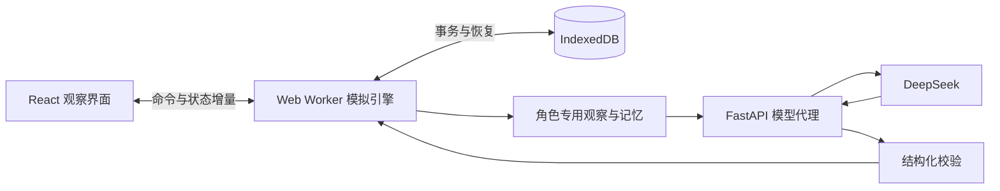

# 自主演化 Agent 世界：MVP 理解与实施方案

版本：2026-09-09。依据：[PROJECT_DOC.md](./PROJECT_DOC.md)。

本文将原始设想细化为可实施方案。标为“原始要求”的内容沿用项目文档；其余机制、数值和技术选型是建议默认方案，用于建立第一版可运行基线。本文阶段只交付设计，不代表相关代码或模型接口已经实现、验证。

## 1. 对项目的理解

这是一个由 LLM Agent 驱动的社会模拟实验，也是一款以观察、探索历史为主要体验的游戏。玩家提供世界和初始条件，观察角色如何求生、交流、争夺资源、合作生产以及传授知识，从具体事件中发现故事。

核心设计原则是：**引擎维护物理事实，Agent 持有社会解释。**

例如，某人在一块农田上劳动、留下食物、后来有人拿走了食物，这些由引擎记录。农田是否属于劳动者、拿走食物是否构成偷窃、谁有资格惩罚谁，则由 Agent 的认知和行动决定。同一事件可以有多个互相冲突的解释。

因此，MVP 应首先验证三个问题：

1. Agent 能否在资源和行动预算限制下持续行动，形成可理解的行为链？
2. 信息能否通过有限观察、交流和记忆传播，并形成合作、冲突或共同主张？
3. 玩家能否从记录中追溯一个行为的经历依据，辨认真实发生的事和角色的说法？

“文明自然形成”是长期研究目标。第一版成功的标准是机制可靠、过程可观察，并能出现有证据的社会互动；100 天内是否形成制度，应作为实验结果记录。

### 1.1 固定保留的原始要求

| 范围 | 原始要求 |
| --- | --- |
| 世界 | 64×64 网格；地形、资源、多人同格；野生食物消耗与恢复；平原可改为农田 |
| 人口 | 随机生成 20 个 Agent；姓名可重复，整数 ID 唯一且递增；二元生物学性别 |
| 生存 | 血量、饱食度、进食、饥饿死亡；有限携带量；地上物品可被他人拿取 |
| 行为 | 移动、对话、攻击、采集、制造、改造、建造；结构化动作输出 |
| 感知 | 以自身为中心的 3×3 地块内的可见角色、物品、环境和行动 |
| 认知 | 性格影响提示词；社会认知存在于角色上下文；合成方式需要探索 |
| 繁衍 | 异性双方通过对话协商共同执行；子代具有独立身份和基础提示词，通过父母学习 |
| 时间 | 1 tick = 1 天；按 Agent ID 顺序执行；基准实验运行 100 ticks |
| 模型 | 用户指定 DeepSeek v4 flash，关闭 reasoning |
| 工程 | 前端承担主体；uv 管理的 Python 后端转发 LLM 请求；密钥留在后端；动态交互 UI、可靠日志和统计 |

### 1.2 MVP 的玩家身份与范围

默认采用观察者模式。玩家可以设定 seed、启动、暂停、单步、调整墙钟播放速度、选中角色/地块、筛选事件、查看统计和历史回放。播放速度不会改变一天的规则或 Agent 的决策预算。

第一版实现一张地图上的完整生存—交流—生产—繁衍循环。天气、宗教仪式、复杂武器、疾病、正式贸易撮合、强制产权、组织管理面板和任务系统留到后续。Agent 在对话中仍可自行提出法律、宗教或组织观念，也可按这些观念行动。

## 2. 必须守住的世界边界

### 2.1 物理持有与社会所有权

物品有唯一的物理位置：角色库存或某个地块。引擎可判断“食物在 A 的背包中”，并限制其他角色直接操作 A 的背包。地面物品没有自动生效的私人所有权，任何在同格且有携带空间的角色都可以拿取。

日志采用 `item_taken` 等中性事件。只有角色说“B 偷了我的粮食”时，才产生带说话者和来源的主张。农田、建筑的建造者可以作为物理历史记录，但不会自动获得排他使用权。

### 2.2 事实、观察、记忆与主张分开存储

| 层级 | 示例 | 维护方式 |
| --- | --- | --- |
| 物理事实 | 第 8 天，B 从某格取走 2 份食物 | 引擎事件及世界状态 |
| 个体观察 | A 在附近看见 B 取走食物 | 引擎按事件发生时的可见范围投递 |
| 个体记忆 | A 记得 B 曾拿走食物 | Agent 私有记忆库，带来源与时间 |
| 社会主张 | A 认为“这块田属于我” | Agent 私有自由文本，可通过 chat 传播 |

角色的社会认知以结构化容器保存，选取后注入提示词；容器只约束来源、时间、主体等元数据，认知内容保持开放文本。引擎不裁定主张真假，也不将某人的主张复制给所有人。

观察者 UI 可以显示全图和 Agent 私有状态，但这些数据不能通过提示词意外暴露给其他 Agent。每次请求只使用该角色专用的 `Observation` 和记忆视图。

### 2.3 “自主”具体指什么

引擎预置物理动作、资源规律和配方约束；Agent 选择目标、行动顺序、交流内容以及是否合作、遵守约定。引擎不会替角色维持承诺或强制其服从“领袖”。

每个角色的提示词包含生存需求、感知与动作说明、性格、个人经历和当前打算，不预置“建立国家”“发展文明”等统一终局目标。运行失败、无人合作、全部死亡都可以是有效实验结果。

## 3. 世界与生存规则

以下数值均集中在版本化的 `WorldConfig` 中，先用脚本 Agent 校准，再通过真实 LLM 小规模试跑调整。

### 3.1 地图与初始投放

- 用 seed 驱动的噪声场生成连续地形，初始目标比例为平原 55%、丘陵 30%、高山 15%。全图可通行，地图边缘不循环。
- 初始资源为食物、木材、石材、矿石；可制造基础工具、高级工具和简易棚屋。水、燃料、货币暂不单独建模。
- 每格分别记录地形、资源存量、资源恢复计时、农田状态、地面物品及建筑。地形天然存在的资源与玩家放在地上的物品是不同存储。
- 20 人随机分配到 4 个可达的出生区域，每区半径约 3 格、约 5 人；区域中心相距约 6–12 格，均包含平原和可采集食物。区域标签不进入 Agent 上下文，不构成阵营。
- 默认采用上述分区随机，增加 64×64 地图上早期相遇的机会；保留全图均匀随机投放作为实验参数。
- 每人初始携带 3 份食物；初始人口均为成年人；随机生成姓名、二元性别和性格。默认两种性别各 10 人并打乱，避免极端抽样破坏繁衍测试。

地图生成完成后检查出生点资源和区域可达性。20 人每天基准需要 20 份食物，初始库存提供约 3 天缓冲；通过采集能力、恢复速度和初始区域分布创造局部稀缺，而不是依赖全图资源总量判断平衡。

### 3.2 生存与携带

| 参数 | 建议默认值 |
| --- | --- |
| HP / 饱食度 | 上限均为 100，初始均为 100 |
| 每日代谢 | 日末饱食度减少 20；若结算后为 0，损失 20 HP |
| 食物 | 每份恢复 20 饱食度，上限截断；进食由 Agent 主动选择 |
| 自然恢复 | 日末代谢后饱食度 ≥ 60，恢复 5 HP |
| 死亡 | HP ≤ 0 立即死亡；背包物品掉落原地，停止后续决策 |
| 携带容量 | 12 重量单位；食物/木材/石材/矿石每单位重 1，工具每件重 2 |
| 地面存储 | MVP 无容量上限、无食物腐败；因此可形成被他人取用的公共或私人主张中的储备 |

无自动进食和系统救援。UI 显示饥饿风险，Agent 能在自己的观察中看到准确的身体数值。

### 3.3 采集、农田、工具与建筑

- 野生食物最大储量：平原 6、丘陵 3、高山 0。一次采集最多获得 2 份，受剩余量和库存容量限制；被采集后连续两天未再被采集，从第二个休养日日末开始每天恢复 1，直至上限。
- 木材主要在平原、丘陵出现；石材主要在丘陵、高山出现；矿石在部分高山出现。MVP 中这些材料不自然再生。具体存量由地图生成器给出。
- 徒手可采食物、木材；基础工具可以采石材；高级工具可以采矿石。工具暂不磨损；只在真实配方允许时影响效率，角色不能凭文本声明创造能力。
- 平原改造为农田需要基础工具和累计 3 次劳动。每次劳动消耗 1 AP，多人可贡献，劳动进度附着地块。完成后替代野生食物池，初始产量为 0。
- 农田日末恢复 3 份食物，上限 12；一次收获最多 4 份。任何同格角色可收获，不检查社会归属。MVP 无播种季节和额外维护成本。
- 棚屋通过已知建造配方施工，允许多人贡献材料和劳动。建议配方为 6 木材 + 2 石材 + 4 次劳动；每格最多一座。完工后，同格角色日末代谢后饱食度 ≥ 40 时恢复 8 HP，替代普通恢复，不叠加。棚屋没有自动权限或住户名额。
- 攻击需要同格，每次造成固定 20 点伤害，消耗 1 AP；工具不提供战斗加成，受击者即时获得事件通知，并在自己的下一个决策机会响应。MVP 不自动反击。

这些规则给采集、生产、集中储存、保护资源提供动机。具体工具和棚屋配方保存在引擎规则中，对未知配方的 Agent 隐藏。

## 4. 一天怎样执行

### 4.1 使用日内微回合，保留 ID 顺序

一天只有一个动作会挤占交流、生产和探索空间；一次输出整天计划又会使后续动作基于过时信息。建议每天为每个成年 Agent 提供 **3 AP**，执行 3 个微回合。

每个微回合按照 ID 升序访问当日存活且有 AP 的角色。轮到某人时，重新生成观察、请求一次决策、验证并立即结算一个动作，然后轮到下一个 ID。下个微回合再次从最小 ID 开始。每次最多 1 次成功结算、消耗 1 AP；`wait` 同样消耗 AP。

这保留“按 ID 顺序执行”的要求，并明确为“日内每轮按 ID 顺序”，是对原文时间规则的补充。先行动者会有稳定优势，必须在实验说明中记录；随机轮序作为后续对照模式。

### 4.2 Tick 流程

1. 打开新一天，记录当日角色列表；成年人分配 3 AP，幼年角色分配 1 AP。
2. 执行 3 个微回合；每次动作前持久化决策请求，收到结果后提交对应物理事件。
3. 出生、怀孕等跨日状态在日末更新；日内死亡立即生效，新生角色从下一天起参与决策。
4. 日末依次执行资源恢复、代谢与生命结算、年龄/妊娠/冷却计时和出生；死亡者先退出后续处理。妊娠和冷却从设置后的下一天开始递减，出生当天不计成长天数且免代谢。各子阶段的顺序固定并写入规则版本。
5. 执行到期的记忆整理，计算统计，提交 tick 完成标记；每 5 天保存一个完整快照。

主动作请求串行执行，因为后一个角色可能观察到前一个角色的动作。UI 渲染和历史统计可以并行，不提前并发生成依赖未来状态的决策。

### 4.3 原子结算与失败处理

所有动作都经由同一个引擎校验器执行：类型、AP、距离、目标存活、资源、容量、工具和共同动作条件。先完整验证，再一次性写入状态和事件；失败不能部分扣材料。

输出无法解析或不满足 schema 时允许 1 次格式修复请求，不额外消耗 AP；仍失败则落为 `wait`。JSON 合法但物理动作无效时，消耗此次 1 AP，记录明确失败原因，在下一次观察中反馈，不立即重问。

网络超时、429、5xx 按最多两次退避重试处理，耗尽后记录技术故障并 `wait`。连续 5 个角色请求技术失败时自动暂停，避免持续故障把整群角色消耗至死亡；401/403、模型不存在或配置错误立即暂停。暂停不推进模拟时间。

## 5. Agent 决策接口与动作集合

### 5.1 每次输入和输出

请求上下文由固定规则、性格、当前观察、近期事件、相关记忆、当前短期目标组成。默认输出如下：

```json
{
  "intent": "今天先补充食物，之后找附近的人交流",
  "action": {
    "type": "gather",
    "resource": "food"
  },
  "memory_note": "这里的食物正在减少"
}
```

`intent` 是最多约 100 字的可选行为说明，不要求模型输出推理过程；`memory_note` 是最多约 200 字的候选记忆，仅写入该 Agent 私有状态，不更改世界。动作使用判别联合 schema，每一种类型只有自己的合法字段，不接受任意代码或新增物品属性。

### 5.2 最小动作表

| 动作 | 范围、条件及结算 |
| --- | --- |
| `move` | 移至上下左右相邻一格，1 AP；所有地形暂时同价 |
| `look` | 更新当前 3×3 观察，1 AP，适合等待观察其他人的变化 |
| `gather` / `harvest` | 获取当前地块自然资源/农田食物，受工具、容量和数量约束 |
| `eat` | 消耗背包 1–3 份食物，恢复对应饱食度 |
| `take` / `drop` | 操作同格地面物品与自己的库存；数量须为正整数 |
| `give` | 将自己物品交给同格目标，检查目标携带容量；无需系统交易合约 |
| `feed` | 消耗自己 1 份食物，为同格目标恢复 20 饱食度，用于照料幼年角色等 |
| `chat` | 向当前 3×3 范围内一个角色或范围内所有角色说话，最多约 200 字 |
| `experiment` | 在当前格尝试明确的输入材料与加工方式，引擎匹配隐藏配方 |
| `craft` | 执行已知且有效的物品配方；扣除材料，生成物品，检查容量 |
| `terraform` | 当前平原的开垦劳动，贡献 1 次进度，需要基础工具 |
| `build` | 对当前地块已知建筑配方贡献材料或 1 次劳动；阶段与消耗由引擎检查 |
| `attack` | 对同格存活目标造成伤害，可攻击幼年角色；无阵营免伤规则 |
| `reproduce` | 成人双方共同动作，详见第 8 节 |
| `wait` | 无额外效果，消耗 1 AP |

每个动作默认花费 1 AP。MVP 的 `give` 是单向赠与，交换通过双方沟通与多次转交实现，因此失信可以真实发生。

### 5.3 观察与通信

自己的 HP、饱食度、库存、性格和已知配方可精确读取；其他角色仅暴露 ID、姓名、性别、年龄阶段、装备和粗粒度身体状态。ID 用于可靠寻址，不作为“先出生者应拥有权威”的语义。

观察包含当前 3×3 的地形、可见资源概况、农田/施工状态、地面物品及角色。地块可显示本地坐标，世界全局地图及其他人的库存、目标和记忆不进入请求。

事件发生时，引擎按当时位置投递给可见角色。角色不能在抵达后自动获得当地此前发生的全部历史。身体内部变化只通知本人；物品转交等外在行动可被附近角色观察。

所有口头 chat 都能被当时 3×3 范围内的角色听到，定向目标用于表达对谁说话，不等于私密通信。收件人把消息放入近期事件，在下一次决策中自行选择是否回复。每一次说话都是动作，不另开无限对话循环。

消息可能撒谎、包含错误知识或试图指挥他人；在提示词中作为带说话者的数据呈现。动作权限和物理效果始终由校验器裁定。

## 6. 性格、记忆与社会认知

### 6.1 性格基线

采用大五人格五个连续维度：开放性、尽责性、外向性、宜人性、神经质，各为 0–1。它们影响自然语言中的倾向，例如探索新工艺、履行承诺、主动交流、合作和风险敏感度。数值不直接触发强制行为，不把心理学维度等同于善恶。

初始 Agent 具备基础语言、身体需求、感知和动作接口知识，知道可通过进食存活，但不持有具体配方或统一社会制度。第一版人格保持固定，社会判断和目标可以随经历变化。

### 6.2 记忆结构

每条记忆至少包含 `id`、`agentId`、`createdAt`、`content`、`sourceType`、`sourceEventIds`、`speakerId?`、`importance`。来源区分亲历、听闻和自我归纳，转述不能升级为已经亲眼证实的事实。

- 工作上下文：最近 12 条本人可感知事件，优先保留未处理的直接消息、生存风险和共同动作邀请。
- 长期记忆：完整保存已编码记忆；每次从中选择最多 8 条注入提示词。
- 检索：初版采用时间衰减、重要性、当前人物/地块/物品关键词匹配的加权分数；暂不引入向量数据库。
- 反思：每个角色每 5 天整理一次近期经历，最多生成约 400 字摘要和少量带来源的社会主张，使用独立的有限输出 schema。
- 记忆注入按 token 预算裁剪；保留完整底层记录供玩家查看。反思失败继续运行，并记录失败，不抹掉原始记忆。

角色可保存“我信任 A”“B 称这块田属于其家族”“我愿遵守大家约定”等开放主张，内容和标签可自行生成。MVP 不根据正负词汇自动给角色建立统一的好感或敌对关系。

### 6.3 模型先验的实际限制

LLM 自带语言、社会和常识先验。只给基础提示词，无法让它真正成为毫无知识的婴儿，也无法证明某种社会概念完全独立涌现。

工程上隔离可控的世界知识：隐藏地图、事件、私有记忆及具体配方；子代不复制父母记忆和配方；未经物理验证的说法保持“听闻”。实验报告将“世界内获得的知识”与“模型原有常识”分开解释。

## 7. 合成探索如何落地

使用有限且预定义的配方注册表，初版建议 3 条：基础工具、高级工具、棚屋。基础工具示例配方为 2 木材；高级工具示例为 2 木材 + 2 石材，需要基础工具；棚屋使用第 3 节的材料与劳动配方。开垦和收获属于基础动作知识。

1. Agent 通过 `experiment` 提交材料清单和枚举加工方式，例如组合、打磨、搭建。提示词告诉它实验接口和可选方式，不给出隐藏配方。
2. 引擎对材料、工具、加工方式进行精确匹配；只有真实配方能产生新物品或有效施工方案。
3. 成功的便携物品实验消耗实际配方材料并产出成品；成功的建筑方案实验登记配方并转入可施工状态，材料消耗在 build 阶段发生。
4. 失败实验花费 AP，默认保留材料，只反馈本次组合未产生结果，避免以失败响应泄露配方答案。
5. 成功者获得已验证配方记忆，以后可调用 `craft`/`build`。角色对配方的命名不改变物理效果。
6. 角色可以在 chat 中传授具体材料和加工方式。接收者通过一次实验验证后获得可执行配方；错误传授可以失败，不自动同步配方数据库。

这里的“探索”是发现隐藏的有限规律。生成任意新物品及其属性会要求额外的物理规则审核机制，安排在后续版本。

## 8. 繁衍、幼年与知识传承

### 8.1 明确采用游戏化生命周期

原文的一天一 tick 与 100 天实验，在现实人类发育速度下无法观察子代成长。建议 MVP 使用明确标注的压缩生命周期：妊娠 5 天，出生后 20 天成年。此处模拟的是代际机制，不能据此解释现实人口规律。

妊娠长度、成年年龄、出生饱食度和繁衍冷却均可配置。初版不模拟衰老死亡，死亡来源为饥饿和攻击。

### 8.2 双方协商与共同动作

1. A 使用 chat 向 B 表达繁衍提议，并携带结构化 `proposal: {kind: "reproduce", targetId}`。引擎为其分配提议 ID，保留可追溯的公开对话。
2. B 必须用 chat 明确接受该提议，关联提议 ID；自由文本推断不能替代结构化接受。
3. 完成协商后，两人仍需各自选择一次 `reproduce(proposalId)`。首次执行消耗 A 的 1 AP 并登记当日待配合意愿；第二次执行消耗 B 的 1 AP 并尝试完成共同动作。
4. 完成时验证双方成年、存活、异性、同格、饱食度均 ≥ 60、相关女性角色未怀孕且不在冷却期。条件不满足则失败；先前花费的 AP 不返还。
5. 当日待配合意愿日末失效，口头提议在创建后 3 天失效；双方都可通过 chat 撤销。不存在系统替对方生成接受行为。
6. 成功后确定受孕，双方各消耗 20 饱食度；女性角色进入妊娠，生产后冷却 10 天。出生在母亲所在格；母亲生产前死亡则妊娠终止并记录事件。

该流程显式处理按 ID 顺序执行的共同动作，避免为了同步双方而暂停整个世界。

### 8.3 子代运行与人口预算

- 出生创建新的递增 ID，性别随机、性格独立采样，保留生物学父母 ID 作为物理事实。姓名可由父母后续指定，系统先提供可重复的默认姓名。
- 新生儿初始 HP 100、饱食度 60；幼年每日代谢 10、1 AP，禁止攻击和繁衍。可以交流、进食、拿取、接受照料和邻格移动；这是抽象的幼年行为模型。
- 基础提示词包含通用动作能力、生存需求、当前感知以及可识别的父母身份；不复制父母的社会身份、关系、配方和私有经历。
- 父母可通过 `give`、`feed`、chat 教学等行为照料；引擎不强迫父母照料，也不自动传递配方。未被照料的子代可能死亡。
- 第一版设置运行人口阈值 60。当天出生可以使人口超过阈值，随后在下一次决策前暂停并提示玩家调整预算或结束实验；阈值是运行限制，不向 Agent 宣称生物学上限，也不悄悄取消已发生的受孕或出生。

## 9. 技术实现与数据归属

### 9.1 推荐栈

| 部分 | 方案 | 用途 |
| --- | --- | --- |
| 前端 | React + TypeScript + Vite | 控制台、角色详情、事件检索、设置 |
| 地图 | Canvas 2D | 绘制 4096 地块和角色，支持缩放、拖拽、选中与图层 |
| 模拟核心 | 纯 TypeScript + Web Worker | 规则、决策调度、事件提交；与 React 生命周期分离 |
| 校验 | Zod | 动作、观察、事件、配置及导入文件校验 |
| 本地数据 | IndexedDB，使用 Dexie 封装 | 状态、事件、模型响应、快照及运行元数据 |
| 图表 | Recharts | 人口、资源、行为、错误率和 token 趋势 |
| 后端 | Python + uv + FastAPI + httpx | 读取密钥、限制请求、转发模型调用、报告用量 |
| 验证 | Vitest + 少量 Playwright | 核心规则、恢复回放、关键 UI 流程 |

使用 Canvas 2D 足以支持第一版规模，避免把每个地块和 Agent 都变成频繁更新的 DOM 节点。规则放在独立模块，后续可以迁移到服务端长期运行。

### 9.2 运行边界



前端 Worker 是单次运行的唯一状态写入者。使用按 run ID 命名的 Web Lock 阻止多个标签页同时推进同一运行，其他标签页只能读取记录。UI 不直接扣血、转移物品或提交模型动作；通过命令请求 Worker 执行。Python 后端负责模型请求和配置安全，不复制一套物理状态。

MVP 定位为本地、单浏览器会话运行。关闭页面后停止推进，重开可从已提交动作恢复；浏览器后台节流可能延长真实耗时。需要无人值守持续运行时，再把模拟调度与存储迁到服务端。

### 9.3 模型接入与密钥

- 沿用指定的 DeepSeek v4 flash、关闭 reasoning；正式 API model ID、非 reasoning 参数和结构化输出能力在接入阶段通过实际服务验证，不能仅凭产品名称假定。
- 模型名称、base URL、超时和输出 token 上限由服务端配置。若指定模型不可用，明确报告并暂停，不静默切换模型。UI 显示实际使用的 model ID。
- `.env` 仅由 Python 读取，不进入 Vite 客户端环境、前端构建或导出文件。项目已存在 `.env`，实施时沿用其配置位置；本文未读取其内容。
- 提供 `/api/health`、`/api/config`、`/api/decision`。config 只暴露可公开的模型名和能力，不返回密钥。
- 请求包含 `runId`、`decisionId`、结构化上下文、动作 schema 版本；后端统一构建模板并记录版本，限制请求大小、超时和并发。上游 URL 只能来自服务端配置。
- 默认本机监听，开发环境使用 Vite 代理访问；生产静态页面与 API 同源。后续开放到公网时再增加用户认证与配额。
- 若服务不支持所需的 JSON schema 约束，采用 JSON 输出要求 + 本地 Zod 校验 + 一次修复，并测量实际通过率。

### 9.4 建议目录

```text
frontend/
  src/
    sim/           # 纯规则、状态、动作、随机数、日末结算
    agent/         # 观察、记忆检索、提示词上下文、决策 schema
    runtime/       # Worker、运行状态机、LLM 调度、持久化
    ui/            # 地图、详情、时间轴、图表
    fixtures/      # 固定 seed、脚本 Agent、已录制响应
backend/
  pyproject.toml
  app/             # 配置、API、提示词模板、模型适配器
docs/              # 后续规则说明、实验记录、运行指南
```

## 10. 持久化、日志与恢复

### 10.1 核心数据

| 实体 | 必要字段 |
| --- | --- |
| `Run` | ID、seed、配置、规则/模板/schema 版本、模型 ID、当前 tick/微回合/角色游标、PRNG 状态、运行状态 |
| `Tile` | 坐标、地形、自然资源、恢复计时、改造状态、施工进度、地面库存 |
| `Agent` | ID、姓名、性别、年龄、父母 ID、位置、HP、饱食度、AP、库存、人格、妊娠/冷却、已知配方 |
| `Memory/Claim` | 私有主体、内容、来源事件、来源类型、时间、重要性 |
| `Decision` | 决策 ID、执行序号、上下文版本及输入、各次调用/修复的响应与错误、最终解析结果、尝试次数、用量、耗时、状态 |
| `Event` | 单调递增序号、tick/微回合、关联决策、类型、参与者、位置、可见接收者、物理结果或变更补丁 |
| `Snapshot` | 截止事件序号、完整世界状态、Agent 私有状态、调度游标、随机数状态、版本、状态 hash |

### 10.2 提交协议

1. 发请求前写入 `pending` 决策及请求上下文；决策 ID 由 run、tick、微回合、Agent 和决策类型确定，重试沿用该 ID。
2. 收到响应后先保存原始响应与状态 `received`；Worker 解析、校验并生成事件。
3. 使用同一个 IndexedDB 事务写入事件、世界状态变化、私有记忆变化、调度游标和 `committed` 标记。事件应用按决策 ID 去重。
4. 恢复时直接使用已保存的 received 响应完成提交；已 committed 的动作不重复执行。仍为 pending 的请求可重试，可能产生第二次模型计费，但最多应用一次动作结果。
5. 日末结算、出生、死亡和反思也采用有唯一 ID 的提交步骤，不能只保护普通角色动作。

暂停在当前请求完成并提交后生效，界面显示“正在暂停”；停止运行保留日志。导出仅在完整提交边界生成一致的数据包。

### 10.3 回放与可重复性

同 seed、同规则版本、同初始配置以及同一份已记录决策/反思序列，应得到相同世界结果。随机数使用带状态的 seed PRNG，规则中不读取墙钟时间或 `Math.random()`。

回放使用快照 + 已提交事件，不重新请求模型。每个快照验证状态 hash；从快照重放到另一快照时结果应一致。规则版本不兼容时仍可展示原始事件，并明确拒绝未经迁移的继续运行。

仅使用相同 seed 重新调用 LLM，不能保证生成相同动作。前端刷新后的继续运行可保持已提交历史，但尚未完成的模型决策可能变化。

提供 JSON/JSONL 数据包导出和导入，内容覆盖配置、版本、事件、决策响应、记忆和快照。错误日志移除鉴权头及密钥；用户可主动导出完整 Agent 上下文。若存储配额不足，自动暂停并提示导出，不能继续无日志运行。

## 11. 动态 UI 与统计

### 11.1 主界面

- 顶部：seed、当前天数、运行状态、开始/暂停/单步、播放速度、模型状态、累计调用/token；有价格配置时显示估算费用。
- 中央地图：拖拽、缩放、地形/食物/农田图层；角色用颜色和 ID 标注，同格聚合显示人数，放大或点击展开。
- 地块详情：自然资源、物品、施工、农田、建筑、当前角色和发生于此的事件。
- Agent 详情：身体、库存、人格、已知配方、短期目标、最近动作、私有记忆和社会主张；明确标记“观察者视图”。
- 事件时间轴：按日期、人物、地点和类型过滤，点击事件定位地图；对话保留原文与说话者，动作链接到当时上下文和验证结果。
- 历史回放：拖动时间轴查看当时状态，显示“历史第 N 天”；回放期间暂停实时调度，返回当前状态后再恢复。

第一版使用规则生成的简短事件摘要，例如“A 向 B 赠送 2 份食物”。后续可以添加 LLM 日报，但叙事必须引用事件，避免摘要捏造历史。

### 11.2 统计分两类

**引擎直接计算的统计：**存活/出生/死亡及死因、饱食度和 HP 分布、地形资源与库存食物分布、农田数量与收成、制作/实验成功率、移动/交流/赠与/攻击次数、人口地理聚集、API 延迟/token/错误率。

**基于记录的观察指标：**A→B 的对话次数、赠与量、攻击次数、亲子教学的消息与后续配方验证链。关系图的边标明“交流”“赠与”“攻击”，不能直接标成朋友、敌人或统治关系。

“形成组织”“认可产权”“出现文化”等判断属于解释性分析。MVP 提供角色主张与相关事件供玩家检查，不把这些判断伪装成权威世界属性。

## 12. 调用量、耗时与预算

按初始 20 人、100 天、成人每天 3 次决策，人口不变时有约 **6,000 次主动作调用**；每 5 天一次反思增加约 **400 次**。若平均输入 1,500 tokens、输出 200 tokens，则粗估合计输入 960 万、输出 128 万 tokens，尚未包含格式修复与技术重试。这里仅是容量估计，需要试跑测量。

人口变化时，主调用量应按每天成人数×3 + 幼年数×1 求和。若平均每次调用耗时 1–3 秒，约 6,400 次串行调用的基础墙钟耗时约为 1.8–5.3 小时；真实值受模型、上下文、限流和网络影响。

预算设计：

- 主动作上下文目标约 1,500 tokens、上限约 3,000；主动作输出限制约 400 tokens，反思另设约 800 tokens。具体 tokenizer 不可用时采用保守估计，并显示估计属性。
- 实际用量优先取模型响应 usage。使用输入价、缓存命中价和输出价的可配置参数估价；不硬编码未经验证的模型价格。
- UI 支持总调用数、累计 token、估算费用和墙钟时长上限；达到阈值后在提交边界暂停，并允许导出或调整预算后继续。
- 支持 1 人×3 天接入验证、5 人×10 天冒烟试跑、20 人×100 天基准运行。缩小规模用于开发测试，正式 MVP 验收仍使用原始规模。

## 13. 实施顺序与阶段产物

| 阶段 | 工作与交付 | 完成条件 |
| --- | --- | --- |
| P0：骨架和接入 | 创建前后端项目、配置模型适配器、验证关闭 reasoning 和结构化输出、建立核心 schema | 本地一条命令可启动；真实模型动作可解析；前端构建不含密钥 |
| P1：确定性物理世界 | seeded 地图、人口、AP/微回合、生存、移动、库存、采集、攻击、死亡；接入脚本 Agent 和基础 Canvas 地图 | 脚本 Agent 可在 64×64、20 人、100 天运行，状态与资源约束成立 |
| P2：真实自主决策 | 专用观察、LLM 决策、动作验证、chat、记忆检索、反思、错误暂停和预算计量 | 5 人×10 天真实试跑可观察互相回应，错误可恢复且不会泄露全图信息 |
| P3：生产与代际 | 配方实验/传授/验证、农田、棚屋、共同繁衍动作、幼年照料和成长 | 定向场景中能完成制作、共享劳动、双方协商受孕、出生及教学链 |
| P4：持久化与观察体验 | 事件事务、崩溃恢复、快照回放、导入导出、人物/地块面板、统计图表 | 刷新恢复不重复结算；回放 hash 一致；事件可追溯到决策上下文 |
| P5：完整实验与调参 | 运行 20 人×100 天，检查成本、失败率、生存和互动；修正阻断问题，整理运行指南 | 保存完整基准记录及实验报告；明确实际观察、参数和局限 |

持久化事件接口从 P1 就接入，P4 完成恢复和 UI，避免事后给模拟核心补日志。完整 LLM 长跑在预算配置完成后进行；脚本 Agent 只服务开发和验证，正式运行中的角色由 LLM 决策。

不承诺未经接入测量的工期。优先在 P0/P2 获得模型延迟、结构化输出通过率和日均 token 数据，再估算剩余工作及实验开销。

## 14. 验证与验收标准

### 14.1 核心规则必须通过的测试

- 地图 seed 可复现；ID 单调递增、永不复用；同格多人可正常结算。
- 资源、库存不为负，容量不超限；转移不凭空增减物品；采集、配方、进食、再生分别有明确来源和消耗。
- 非法动作原子失败；死亡后无后续动作；受击、饥饿死亡及物品掉落只结算一次。
- 只有事件发生时在感知范围内的角色得到观察；他人私有库存/记忆和隐藏配方不进入请求。
- 双方协商不完整、未成年、异性条件不符、不同格、已经怀孕或意愿过期时，繁衍不能完成；双方 AP 与妊娠只结算一次。
- 超时、错误 JSON、格式修复、重复响应、401/429/5xx 均有可重现的故障测试；技术失败不会造成调度死锁。
- 在请求前、响应后、提交后和日末阶段模拟刷新，恢复后的事件不重复；快照 + 回放等于已保存状态。

### 14.2 社会机制用定向场景验证

使用受控初始位置和脚本/录制决策验证“机制能承载”，再用真实 LLM 检查“是否自发发生”。两者在报告中分开。

1. 地块争议：A 声称拥有一块田，B 仍可收获；A 可观察并表达反应，引擎不替 A 强制执行产权。
2. 信息局限：远处角色不能知道该争议，直到亲历或被他人转述。
3. 生产协作：两人可先后贡献同一农田/棚屋的劳动或材料，结果对应真实投入。
4. 知识传承：父母发现配方，通过 chat 传授，子代试验验证；日志串起发现、传授和使用的证据。
5. 共同繁衍：双方聊天协商、各执行动作、受孕、出生和照料能跨天完成。

### 14.3 MVP 完成标准

- 保存至少一份 64×64 地图、20 个初始 LLM Agent、100 ticks 的完整运行及导出记录；若中途全灭，保留剩余天数的世界演进，报告灭绝时刻。
- 运行中无未处理异常或状态损坏；无效动作和技术失败都有明确事件，错误率与重试量可查。
- 玩家能暂停/继续/单步、选中地块和角色、阅读对话与记忆、查看统计、导出/导入及回放。
- 上述物理约束、信息边界、生产、繁衍、恢复和知识传承定向场景通过。
- 实验报告包含 seed、配置/规则/模板/模型版本、实际调用量和耗时、存活曲线、失败原因，以及带事件引用的互动案例；若缺少社会互动也如实记录。

## 15. 后续迭代优先级

第一轮根据实际日志决定迭代方向：

- 如果普遍饿死，先定位是食物容量、决策预算、提示词理解还是动作错误；逐项调整，保留参数前后对照。
- 如果角色长期互不相遇，先调整出生分布、资源热点和移动激励，衡量相遇与交流次数。
- 如果同一组角色反复说同样的话，检查近期事件去重、记忆检索、反思与行动反馈。
- 如果社会主张缺少实际影响，检查生产收益、可储存资源和可执行行动是否足以使合作与冲突产生后果。
- 如果系统可靠但演化缓慢，再扩展更长运行、服务端常驻、复杂生产链、信息传播媒介和更长代际实验。

第一版实现的重点是让每个行动都能执行、留下可恢复的历史，并对后来的角色决策产生可检查的影响。社会是否演化、怎样演化，将由这些运行记录回答。
