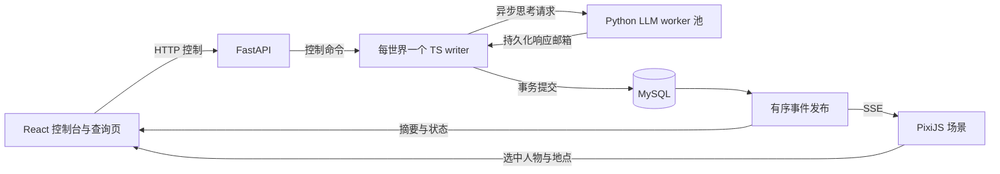

# 连续领地 v2：2.5D 场景与异步 Agent 执行方案

状态：总体设计，2026-09-11。已落地第一阶段的五人连续世界原型，并接入异步 LLM 计划；具体实现范围与启动方式见 `CONTINUOUS_PROTOTYPE.md`。以下完整领地、战斗和人群物理仍有后续阶段。用户确定的运行节奏为游戏一天 = 现实两分钟。

## 1. 对任务的理解

把目前的领地实验升级成可以持续观察的社会模拟游戏：居民沿道路行走，在粮仓领取食物，在田间劳动，在广场交谈，遇到攻击能中断任务、逃跑或反击。动作具有位置、持续时间、进度和可见后果；多个居民同时生活，各自的思考不要求整个世界停下来。

LLM 负责意图、承诺、社交、任务安排和策略；确定性执行器将意图落实为走路、操作和反应。这里的“连续动作空间”采用**连续位置与持续动作**：角色可以停在路径中途，可以边走边说话，交互取决于真实距离。LLM 下达目标和约束，不需要每帧输出方向向量。低层计算仍采用有限精度与离散事件，这是可验证、可回放模拟的实现方式。

继续围绕当前中世纪社会实验：身份来自上下文，钥匙与装备决定物理能力；食物来自农田，家庭和庄园真实储粮；税收依靠实际搬运与交付；使者、国王和王军保留当前机制。地图、动画与调度升级不能顺带改写政治制度。

建议将这次升级视为一个新的模拟版本。它既包含表现层，也包含时间、空间、任务和并发协议的重构。

## 2. 当前实现与需要改变的边界

| 位置                               | 已有实现                                                               | v2 调整                                                     |
| ---------------------------------- | ---------------------------------------------------------------------- | ----------------------------------------------------------- |
| `frontend/src/ecology/engine.ts`   | `startEco` 扣劳动时间、写 pending；`stepEco` 在完成时提交；日末恢复 AP | 保留启动/结算概念，增加运行中轨迹、部分劳动、打断与跨日动作 |
| `frontend/src/sim/scheduler.ts`    | 同 readyAt、连续 ID 前缀；潜在五格互动会阻止同批                       | 每人独立思考槽；只有物理资源争用进入短提交队列              |
| `scripts/simulate.ts`              | 等 `Promise.allSettled` 整批完成，然后严格依次提交                     | 网络响应进入邮箱，writer 在推进边界逐个校验和接纳           |
| `frontend/src/manor/controller.ts` | 四邻接 BFS，返回下一格 move；目标/routine 驱动                         | 目标编译为持久任务图；路径是一段连续轨迹                    |
| `frontend/src/ui/ManorMap.tsx`     | React effect 重画 Canvas 等距地图                                      | 独立渲染循环、摄像机、角色动画、遮挡与选中交互              |
| `frontend/src/ui/App.tsx`          | 外部实验每 3 秒拉全量快照                                              | 初始快照 + 增量事件流，保留历史查询 API                     |
| `scripts/database-journal.ts`      | 50 条事件或日末批量提交与 checkpoint                                   | 时间有界的提交批次；轨迹段代替逐帧位置日志                  |

现有动作的时间不能原样用于游戏尺度：移动一格约 6 分钟起，普通交谈 24 分钟，大声说话和全力观察 240 分钟，来自此前的 AP 换算。v2 应按动作自身语义重新标定。

本文继承 `AGENT_ASYNC_EXECUTION_PROTOCOL.md` 的每人单请求、短资源预留、幂等回执、单 writer 和增量上下文设计；时间、运动、跨日和持久化的具体规则以本文为新版本设计。旧协议仍是未上线的设计稿。

## 3. 技术架构与渲染选型

建议 **PixiJS 8 + React + 独立 Node/TypeScript 模拟进程 + FastAPI + MySQL**。

| 方案                  | 适配情况                                                    | 决策                                                             |
| --------------------- | ----------------------------------------------------------- | ---------------------------------------------------------------- |
| 现有 Canvas 2D        | 可以继续画建筑，但场景管理、动画、选中和优化都要自行维护    | 保留为历史实验视图                                               |
| PixiJS                | 适合等距精灵场景、图集、批次渲染；易于和 React 页面独立配合 | 推荐；任务、导航和碰撞由共享模拟内核实现                         |
| Phaser                | 提供更完整的游戏场景、输入、动画和物理工具                  | 可行备选；本项目仍需独立权威内核，不能直接使用浏览器物理作为真相 |
| Three.js / Babylon.js | 适合旋转镜头、真正高度与三维建筑                            | 当前固定等距视角收益不足以覆盖建模和交互复杂度                   |

PixiJS 是渲染器，不把它误当成后端模拟引擎。不同时维护浏览器和服务器两套碰撞、战斗规则。



模拟在独立进程运行，关掉网页、切换页签或浏览器掉帧都不会影响世界。FastAPI 继续提供模型代理、上下文、新闻、查询和实验生命周期管理。模拟 TS 模块逐步移到 `packages/simulation`，不依赖 DOM、React、Pixi 或 Python 的重复规则实现。

## 4. 三种时间，以及速度的取舍

### 4.1 时间定义

- **模拟时间**：唯一递增的 `simTimeMs`，用安全整数表达。一天 86,400,000 ms；日期从它推导，不再每天把动作时钟清零。
- **墙钟时间**：用于模型网络超时、限流、持久化租约和进程健康；暂停游戏不等于暂停 HTTP 超时。
- **呈现时间**：客户端在已提交时间线内略微延迟播放，用来插值画面。它不能修改角色坐标或库存。

运行比例固定为 720：一天 86,400 游戏秒对应 120 现实秒。UI 直接显示“游戏 1 天 = 现实 2 分钟”；暂停冻结模拟时间，恢复和进程重启不补算离线时间。

历史片段提供 10 倍游戏时间慢放和任意时刻定位，不改变正在运行的世界。正常移动依然按距离、负重和健康计算：一段 150 米步行约 125 游戏秒，在实时地图上仅约 0.17 现实秒，因此需要保存批次内的轨迹中间状态，并通过慢放检查细节。

150 天连续运行理论需 300 分钟，即 5 小时，不计用户暂停和服务故障。模拟独立于浏览器运行；本版不会为了等待模型而自动改变这项时间比例。

### 4.2 模拟步进

采用**事件驱动 + 活跃运动局部固定子步**：

- 长直路按路径与速度解析求位置；只在转弯、到达、进入感知范围等边界生成候选事件。
- 人群避让与近战在活跃区域使用 100 ms 模拟子步作为原型起点；狭窄门口、快速冲刺需要扫掠碰撞检测，不能仅检测子步终点。
- 农活、工艺、等待、能量下降按进度率或下一个阈值时间积分；安静区域直接推进到下一事件。
- 渲染目标 60 fps；网络通常 5–10 次/现实秒批量发送已提交增量。这些频率不等于存储频率。

禁止每个渲染帧遍历整个世界并写数据库。150 天全局 10 Hz 就有 129,600,000 个步进点，空闲世界也会产生浪费。优化后的跳步必须与细步参考执行达到相同的语义结果。

### 4.3 LLM 延迟与实验公平性

同一角色思考时继续旧任务和已授权 routine。附近居民可同时调用 LLM，模型不持有任何空间锁。应急逃跑、自卫与自动进食由已有策略执行，不等待即时聊天补救。

第一版使用固定 720 倍的实时策略。实验公平策略保留为后续可选研究功能，不在当前运行中自动启用：

| 策略     | 行为                                                                                      | 用途                                           |
| -------- | ----------------------------------------------------------------------------------------- | ---------------------------------------------- |
| 实时     | 世界按选定速度前进，迟到提案按当前状态重新校验                                            | 看真实持续生活；模型延迟是可测量影响因素       |
| 实验公平 | 通常自由推进；当有效请求等待超过配置的模拟时间预算，整体减速/暂缓推进，直到回复或墙钟超时 | 长期实验，避免加速过快造成大量来不及思考的角色 |

720 倍下，模型耗时 10 秒，世界经过 2 游戏小时。原型按每人单请求、全局最多五个在途请求运行，原有任务继续推进；计划版本变化时拒绝旧回复覆盖。后续若研究公平模式，需把限速时间与模型延迟作为实验参数和观测指标。

没有按人头收齐回复的每日屏障。公平模式的全局限速是公开的质量/吞吐取舍，有墙钟超时上界；不能让一个永久失败的请求拖住所有人。首次开局可选一次全员并发规划的准备阶段，使用独立阶段标记，不把它当作日常回合。

## 5. 连续空间、路径与场景尺度

当前文档规定每地块约 15 米，24×24 格约为 360×360 米。v2 保留地块作为土地/生产/地址单元，角色坐标使用地块内部的连续平面位置；持久化用整数毫米，显示为米，LLM 多数时候只看到地点名与必要坐标。

建筑是占地多边形，门是明确的可通行入口，粮仓是大厅内部独立交互锚点。到达大厅门口、进入大厅、站到粮箱前是不同的空间条件。大厅屋顶可在选中屋内角色时淡出或剖开，不能用一栋粮仓精灵遮住大厅。

导航拆为三层：

1. 地点/门/道路连通图，包含门锁、破损和钥匙能力。
2. 起点到交互锚点的路径搜索：原型采用细化导航网格与 A*、视线简化；对复杂建筑再评估导航网格多边形方案。
3. 沿路径运动与局部避让：圆形角色碰撞体，门口队列、让路、卡住后重新规划。拥挤不能让居民无限重试，也不能穿墙或把别人弹出地图。

路径规划只使用 Agent 已知的地图与门状态；物理执行校验真实障碍并产生新观察。导航失败给出门或路段、最后可达点、可重试条件。不要把未知门锁状态当成全知情报传进上下文。

长度、交互半径与移动耗时统一用米与秒：建议步行基准 1.2 m/s，一格约 12.5 秒，负重、受伤和路面会调整速度。这里会显著降低当前移动成本，需要单独做经济对照。

普通交谈原型半径 6 m，大声说话保留“五格”的设计意图换算为 75 m 欧氏半径，交付半径约 1.5 m；这是 v2 距离语义，和旧版五格切比雪夫范围不完全相同。门墙可阻挡视线；听觉先采用室内外/穿墙衰减和明确门状态，后续再扩展更复杂声学。

## 6. 任务与动作协议

### 6.1 计划、任务、执行是三个对象

- `Plan`：LLM 决定的目标、条件、优先级、约见、routine 和战斗策略。
- `Task`：可持续执行的流程，如“从家庭粮箱补到 7 天口粮，再去 plot-12 耕作”。包含剩余数量、当前子步骤和阻塞依赖。
- `Action`：物理执行实例，如走到门边、开门、取出 3 kg 粮、吃一餐、挥击一次。

任务图由受控技能模板编译，不运行模型生成的任意脚本。Agent 可取消、替换和配置自动任务；初始依旧只授权自动吃随身粮食至满饱食度，并提示自行设置补粮、工作等计划。

示意协议：

```ts
type PlanPatch = {
  requestId: string;
  expectedPlanVersion: number;
  replaceTask?: {
    skill: 'navigate' | 'supply' | 'farm' | 'deliver' | 'meet' | 'guard';
    target: string;
    amountKg?: number;
    untilSimTime?: number;
  };
  routinePatch?: Record<string, unknown>; // 实现时使用严格、版本化 schema
  speech?: { mode: 'talk' | 'public_speak' | 'shout'; text: string; targetIds?: number[] };
};

type RunningAction = {
  id: string;
  actorId: number;
  taskId: string;
  kind: string;
  startTime: number;
  expectedEndTime: number;
  channels: ('locomotion' | 'hands' | 'voice')[];
  interruptPolicy: 'immediate' | 'safe_point' | 'commit_boundary';
  trajectoryId?: string;
  reservationIds: string[];
  progress: number;
};
```

每个 Agent 可以同时占有不同动作通道：走路+短句说话允许；挥武器+搬箱子不允许；进食与发言按嘴部资源互斥；重体力劳动允许短句，长篇演讲需要暂停劳动。额外的身体资源冲突表比“只能有一个 action”更适合连续世界。原型先做走路+说话、站立交互两类组合。

### 6.2 动作生命周期与打断

`queued → preparing → running → completed / interrupted / blocked / cancelled`。

攻击、明确撤退、死亡、门关闭、库存耗尽、目标离开和新计划可触发不同级别的打断。打断发生在权威模拟时间，保存已经完成的成果，释放未使用预留，给任务明确回执。

- 移动：停在当时真实位置，剩余路径可取消。
- 农活：按实际劳动时间累计到田条，打断不抹去此前工作。
- 搬运：分批取放；已取物品在背包，未取部分仍在源仓。不允许目标取消导致物品蒸发或复制。
- 制作：材料进入工作中的工单，取消按配方规则处理半成品。
- 交付：到达、准备、提交；只有提交才转移物权，双方离开则中止尚未提交的部分。
- 近战：准备、命中判定、恢复；伤害在命中事件发生，动画只展示它。移动与逃跑参与距离判定。

保留当前战斗策略和健康影响逃跑成功率的设计意图，但只在接战脱离尝试时判定，设置冷却；不能每 100 ms 重掷一次逃跑概率。脱离接战成功后还必须实际移动，敌人可以追击。机动、攻击间隔与人数优势需要专门标定。

### 6.3 社交也要有时间和现场

发言拆成有序句段，在句段发出时按距离与可听条件确定听众。走入/走出范围可能只听到部分内容；每句段有唯一 ID，记忆与对话查询合并同次发言，不能重复入账。

接收者收到请求不立即被系统强制答复；可听着继续干活、稍后回复、拒绝或离开。约见需要双方自己的计划。LLM 生成的文字仍受完整动作 schema 校验后才能开口，不把不完整 JSON 流当成已发生的台词。

群体互动依赖聚集空间和共同任务：广场提供驻足点、公开告示板、看得见的工作和搬运过程；同一工单可累加多人劳动。参加集会、接受合作、服从指挥都需要 Agent 的选择。

## 7. 异步模型与权威提交

每人至多一个思考请求和一条上下文写入链；全局并发初值 8、可配置，按照供应商限流调整。压缩、十日深度反思与普通思考不能并发修改同一个人的 context head，新闻使用独立链与预算。

请求携带 `requestId / actorGeneration / baseSeq / planVersion / contextHead / issuedAtSimTime`。响应先持久化，然后进入 writer 邮箱。writer 在短时间边界验证是否仍适用，接纳为计划补丁，绝不覆盖请求发出后已经变化的整份 brain。

社交、物品与移动变化不意味着整份响应作废；执行器可按当前位置重新找路、按剩余库存分批。角色死亡、任务已被新计划替换、交付对象不存在、约见时间过期等情况写入清晰拒绝原因。原始响应与真实费用仍保留。

库存、门与交付使用短动作预留和单 writer 提交：两个居民同时取 8 kg，而仓库只有 10 kg，实际分配总量最多 10 kg。优先级相同按持久化的种子轮转规则处理，避免长期低 ID 优先；同一物理时刻的候选冲突基于同一时刻状态收集。近战应允许同刻互相命中，死亡在该批次伤害汇总后判定。

资源版本不变时不反复启动失败动作，不重复请模型处理相同阻塞。饥饿阈值跨越、目标失效或新消息进入有去抖的决策触发器。思考资格、排队时间、响应时间与计划生效时间分别统计。

上下文继续使用当前的共享 prefix、人格提示、固定知识、增量事件和外部记忆，默认 100k。只追加有意义的变化：到达、受阻、收到话语、取粮结果、任务进度里程碑和身体阈值；不追加坐标帧和每步位移。日常请求合并事件，但危险消息优先入队。请求中不设置截断性输出参数。

## 8. 生理、劳动、日结与数值迁移

建议将 AP 从连续版的硬行动次数限制改为时间与劳动预算：每天实际时间推进，劳动有疲劳成本，休息可恢复。为便于与旧实验比较，UI 可暂时显示“已用劳动分钟”，不让低成本讲话挤掉当天所有生存动作。

以下为原型值和标定依据，不作为已经验证的现实参数：

| 项目      | 初始方案                                          | 标定方式                               |
| --------- | ------------------------------------------------- | -------------------------------------- |
| 步行      | 1.2 m/s，15 m 约 12.5 s                           | 无障碍路线长度/速度；负重分档测量      |
| 说话      | 按文本朗读长度，约 3–5 中文字/s，短句设置最短时长 | 30 字喊话约 6–10 s；不沿用 240 分钟    |
| 吃饭      | 一餐约 5 游戏分钟，可分次补到 100                 | 仍从真实随身库存扣粮，不自动吃仓库库存 |
| 取放粮    | 开箱固定耗时 + 随数量增长的装卸时间               | 从 5 kg 约 30–90 s 的区间做敏感性实验  |
| 农活/制作 | 保留现有总人分钟、材料与月产约束                  | 拆分执行不能改变投入/产出守恒          |
| 饥饿      | 初版仍 2500 kcal/人日，改为按时间积分             | 每小时约 104.17 kcal，与原每日需求一致 |
| 空腹伤害  | 初版 15 HP/空腹日等价积分                         | 0.625 HP/空腹小时，不在午夜突扣        |
| 恢复      | 满足现有条件的 2 HP/日等价积分                    | 以阈值边界积分，防止快进误差           |

当前 1 kg 谷物 3400 kcal，因此每天约 0.7353 kg；31 人每天约 22.79 kg，30 天约 683.82 kg，尚未计王税。现有满额月产为 1800 人日粮，约 1323.53 kg；这些基线先冻结，避免引擎升级同时把税粮压力改没了。连续移动显著节约劳动时间，实际产出可能更接近潜在产出，因此必须比较劳动完成率和盈余，不能只比较存活人数。

地图 15 m 地块继续表示田条入口和外围生产地，不把画面面积直接解释成现实耕地面积。若后续要完整农业地理模拟，需要另一次面积与人口承载校准。

日界线只执行日统计、历法事件、税期检查、新闻素材封口和反思资格更新。移动、生产、在途思考可跨午夜；按跨越的时间分摊劳动、能量和消息日期，不重置正在执行的动作。收成、D40 减产及后续月份的影响仍使用现有配置语义。

国王的连续欠税阈值仍按当前日历检查定义，保留 D35 欠税、限制 7 天时 D50 出兵的边界。领主死亡由使者观察、判断并返回汇报，系统不会通过新的死亡事件自动触发政治判定。

## 9. 精简存储、回放与恢复

持续坐标不意味着保存每帧。保留现有 MySQL 和事件查询能力，新增版本化的紧凑执行记录：

- `world_events_v2`：动作生命周期、路线更改、短事务结果、实际听众、伤害及死亡等语义事件。
- `motion_segments`：起止时间、起点、折线路径/终点、速度曲线与打断点；直线路段只需一段记录。
- `world_checkpoints_v2`：已提交时间、状态、任务、当前轨迹、资源预留、随机流状态与版本。
- `think_requests / plan_proposals`：调用状态、上下文版本、原始回复和接纳结果。
- `agent_daily_stats`：劳动、移动、进食、社交、等待、受阻与思考耗时；基础生存动作保留精简数值结果，统计由同一事件累积。

可以用新的表或版本化 payload 实现，先测量现有表兼容成本再决定 DDL。无论表名如何，传输和存储都用共享字典、数值 ID、整数时间/位置及批次压缩，避免每个位置重复整份 Agent JSON。

关键原则：碰撞避让如果改变了实际路径，就必须记录新的轨迹控制段；随机战斗记录真实结果。回放依据这些已提交事实，不依赖前端重新计算避让，也不重问模型。记录密集区域的轨迹字节量并约束误差；不能以降低精度为由让回放穿墙或伪造命中。

每 100–250 ms 现实时间或达到批次容量时提交一次，日历/控制边界强制封口。提交事务包含事件、投影更新/恢复所需状态、最后 seq 与待发布记录；广播只发送已经提交的序列。数据库变慢则背压减速，不能继续向 UI 发布未落盘世界。单世界 writer 使用持久化租约与 fencing token，避免恢复时两个进程同时写入。

定期完整 checkpoint，间隔由状态大小和随机跳转延迟基准决定，初始可试 6 游戏小时或累计 5000 条语义事件。两次 checkpoint 之间靠精简事件与确定性积分恢复。恢复到任意 `simTime` 时截断当前轨迹和进度，UI 明确是回放视图。

暂停冻结模拟时间、任务进度与资源预留，并提交暂停点；已发模型响应仍持久化，恢复时重新校验。重启从最后已提交边界恢复，未提交推进可以丢弃，但该区间从未对外展示。供应商调用返回与本地落盘之间的崩溃无法保证外部请求恰好一次：保留请求 ID，支持供应商幂等则复用，否则标记结果未知并记录重试费用。

新 SSE 流带 `seq / simTime / rulesVersion`，支持 Last-Event-ID 补拉。慢客户端可丢弃旧的展示更新，但不能跳过影响状态的语义事件；落后过多就重新获取快照。React 只接收低频投影与选中人物信息，Pixi 场景直接更新实体，避免每帧触发整页渲染。

## 10. 地图美术与观察体验

风格建议：固定等距镜头、低饱和中世纪绘本、清晰人物轮廓、材质明确的木石建筑。保持已有庄园、六户住宅、农田、王室道路和广场的社会空间关系。

第一批素材自行绘制 SVG 源文件，构建时生成精灵图集；可混合使用许可清晰的公共素材。统一视角、比例和色板，建立 `assets/manifest.json` 记录作者、来源、许可证及归属要求；不将临时搜索图片直接拼进最终地图。

最低资产集：土地与道路过渡、石墙直段/转角/门、大厅剖面、家庭房屋、粮箱、农作物阶段、井、工棚、告示板、尸体，以及居民 8 朝向的 idle/walk/work/talk/eat/attack/hurt/death 动画。可先用程序化骨架/部件动画降低逐帧绘制量，辨识度通过衣着和装备表现；衣着不赋予政治权限。

场景分层：地面 → 地表细节 → 按脚底纵深排序的角色和建筑遮挡片 → 屋顶 → 气泡/图标 → UI。大建筑拆成墙体、屋顶和遮挡片，避免仅凭整栋的 y 值错误遮住前景人物。加软阴影、田垄、脚印/尘土、搬运姿态和少量季节变化；先确保动作可读再增加天气特效。

交互设计：

- 点击角色直接在地图右侧打开“当前目标—实际动作—正在思考—下一步—最近回执”，附短决策历史；点击历史可定位时间和路径。
- 可打开目标路线、实际轨迹、可听范围、视线、门锁、排队位置与当前阻塞原因。
- 地图上方显示日期时刻、天气、实际倍速和模型在途数量。
- 对话气泡短暂显示摘要，完整内容进入侧栏；现场正在说话与模型正在思考使用不同图标。
- 历史时间轴支持暂停、拖动和片段慢放；回到直播明确切换时钟，不把回放操作当作控制当前世界。
- 统计、个体经历、对话分析、铭文与新闻继续用现有 React 页面，共用日期与选中 Agent。

## 11. 分阶段落地与验收

### A. 连续世界纵向原型

新建 v2 场景：广场、带门大厅、内置粮箱、两块田、3–5 个脚本角色。接上独立 writer、最小事件流与 Pixi 渲染；实现持续移动、开门、取粮、吃饭、耕作、短句发言、打断与回放。不调用付费模型。

验收片段：甲走向大厅取粮；乙同时耕田并听到喊话；门关闭后甲真实停下并显示 blocked；开门后续行；角色走路途中切换目标；暂停和拖动时间轴能还原中途位置与准确库存。

### B. 接入异步 Agent

拆出模型 worker 与响应邮箱，迁移增量上下文，接纳计划补丁，加入并发、重试、过时校验和可见思考状态。用录制回复和故意延迟验证，再进行小规模真实模型验证。

验收：相距很近的 20 人可以同时排队思考；一个 60 秒慢请求不会让其他角色任务冻结；人物收到回复前继续已有任务；死亡/过期/重复响应都不会重复交付或覆盖新计划。

### C. 迁移完整领地规则

迁移 31 位居民、亲属、庄园钥匙、家庭储粮、田条、月产、税期、使者、王军、铭文、账簿、routine、十日反思和新闻。加入连续战斗、逃跑、追击与人群避让。旧世界规则保持独立版本读取。

验收：同仓竞争不超卖；跨午夜农活不丢进度；在途使者只有返回后报告；低饱食度按时间损血；王税与减产边界符合旧制度；动作耗时变化产生的经济差异有单独报告。

### D. 画面与长实验验收

完善材质、动画、室内遮挡、音量范围、侧栏和时间轴，做 31/100/300 人无模型压力测试，再做小规模 LLM 与最终 150 天实验。研究结论用多种子与参数对照；一轮跑通只验证流程。

关键指标与通过标准：

- 守恒与恢复：物资总账闭合、同一交付恰好一次、死亡不可行动、恢复 hash 一致。
- 连续运动：门关闭/追击/拥挤时无穿墙、无瞬移；转向与停止时间和事件一致。
- 并发：记录在途数、排队/响应/生效 p50/p95、迟到率与每人有效思考机会；排查延迟差异是否系统性影响生存。
- 可视化：以目标设备实测 100 人场景主视图 p95 帧耗时 < 20 ms 为原型目标，300 人为压力档，不事先宣称已达标。
- 存储：分别测语义日志、轨迹、checkpoint、模型文本 MB/游戏日。轨迹不能逐子步完整复制实体。
- 速度：报告无模型实际游戏日/秒、含模型游戏日/小时、有效行动/千 token，以及公平模式限速时间占比。
- 数值：比较劳动完成率、取粮时长、饥饿累计时长、储粮、人均社交次数、实际税粮与承诺兑现，识别时间尺度改动带来的制度压力变化。

## 12. 迁移与执行顺序建议

新增 `simulationVersion: continuous-manor-v2` 与独立场景 schema；老实验继续使用原快照、回放器与地图，新版本用于新实验。可以从历史某日导入库存、关系和记忆作为分叉初始状态，但需显式记录来源与坐标转换，不能宣称是无缝续跑。

先完成 A 的纵向原型，确认连续移动、门、粮食交互、回放和视觉尺度，再推进 B/C。这个顺序可以尽早检验“game-like”是否符合预期，并避免先铺完整素材后发现底层时间与交互模型需要返工。

主要待对齐的是观看节奏：本文默认兼顾实时观察和长期实验，分别提供实时与公平模式。推荐先用小场景证明持续生活体验，再迁移完整领地与政治冲突。
