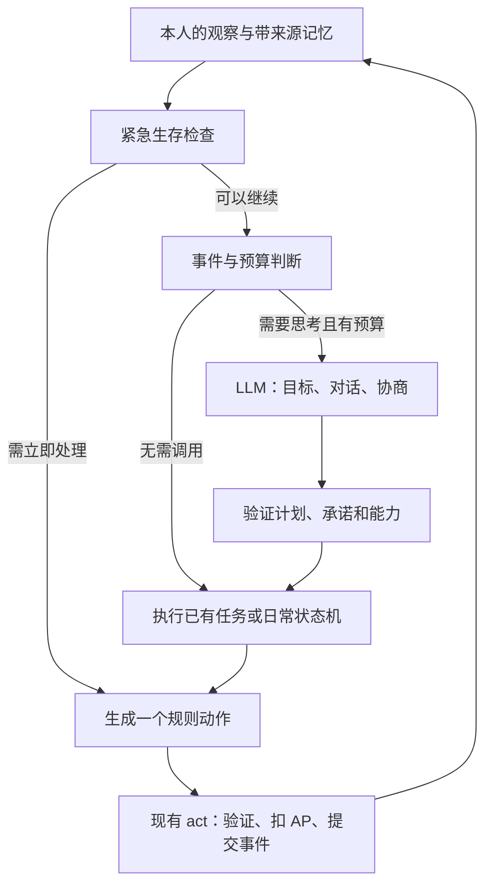

# 混合 Agent 决策架构：把 LLM 调用从行动频率中拆出来

状态：设计稿，待实现。本文不改变正在运行的实验及其存档。

## 1. 建议采用的方案

保留现有世界规则、每日 5 AP、按 ID 提交和局部感知。引入三层控制：

1. **生存控制器**：规则判断身体风险、背包与食物状态，用状态机完成进食、觅食、移动等日常行为。
2. **任务执行器**：把有期限、有条件的目标展开为多个原子动作；每一步检查最新观察，可以暂停、恢复或放弃。
3. **LLM 决策层**：决定社会意图、合作承诺、资源分配、技术探索和长期目标；在需要时生成对话、修改计划或整理重要经历。

LLM 从“每花 1 AP 都回答一次”变成“发生值得思考的事情时回答一次”。一次决定“采够明天的粮食，然后去帮助竹开垦”，可以驱动数天行动；每次移动和采集都照常花 AP、写日志，但不再请求模型。

第一阶段继续使用当前模型和代理。先改变调用结构，再用数据决定是否需要模型分级、额外分类模型或向量数据库。

## 2. 当前成本证据

本次一次性读取 `artifacts/llm-prophet-bag15-shelf4` 的保存记录，以事件序号 **4112** 为边界。记录已覆盖 100 天；这是一次经过多次规则和提示调整的实验，可用于找成本来源，不是新旧策略的严格对照组。

统计只纳入已提交事件对应的决策及其全部请求尝试，按最终动作类型归类；重试和格式修复计入该动作。没有按意图区分移动用途，也没有计入尚未提交的请求。6 次尝试缺少 usage，以下 token 为可读到的供应商 usage 之和，不能当作完整账单。

| 指标 | 已记录值 |
| --- | ---: |
| 决策记录 | 4,012 |
| 模型请求尝试 | 4,210 |
| 输入 token | 23,345,280 |
| 输出 token | 251,775 |
| 输入中的缓存命中 token | 8,853,120（37.9%） |
| 至少有一次决策的角色日 | 748 |
| 每角色日请求尝试 | 5.63 |
| 每角色日总 token | 31,547 |
| 每请求平均输入 token | 5,545 |

“角色日”在本次统计中是去重后的 `(day, agentId)`，包含死亡当天的部分行动日。后续统一评测需同时记录日初存活人数、实际存活时长和行动数，避免分母含义变化。

| 成本来源 | 决策数 | 总 token | 占比 |
| --- | ---: | ---: | ---: |
| 采集、移动、进食 | 2,402 | 14,092,996 | 59.7% |
| 再加丢弃、等待、收获、拾取 | 2,991 | 17,633,009 | 74.7% |
| 聊天、大声说话 | 660 | 4,015,008 | 17.0% |
| 定期反思 | 140 | 561,780 | 2.4% |

前两行是包含关系。74.7% 表示值得转移到规则执行的候选动作，不代表可以直接省掉这些成本：去赴约的移动、共享粮食的拾取等，仍需要上层决策授权。

主要问题有四个：

- 输入占总 token 的 **98.9%**。每个原子动作重复携带完整物理规则、观察、记忆、提案等信息；仅压短输出帮助很小。
- `worker.ts` 和 `simulate.ts` 对每个行动任务都调用 `requestDecision()`，免费丢弃也会再次触发请求。
- `nextTask()` 每 5 天给所有存活角色安排反思，反思仍发送 `observe()` 的通用上下文。
- 语义意图与协议操作混在一起：LLM 不仅决定是否愿意繁衍，还必须反复正确填写接受、提案 ID 和执行动作。

增加并发主要降低等待时间，无法解决请求数量和重复输入。新架构首先针对后两者。

## 3. 控制链与权限边界



控制器只能接收 `AgentObservation` 和本人的 `BrainState`，不能接收可任意查询的 `World`。只有物理引擎和调度器拥有完整世界状态。

| 问题 | 负责者 | 限制 |
| --- | --- | --- |
| 何时吃饭、吃几份 | 规则 | 使用本人库存、到期日和身体状态 |
| 去哪个已知食源、怎么走 | 规则 | 依据可见地块和本人曾见过的地点，不能查询隐藏资源 |
| 为已有目标采料、制作、开垦 | 执行器 | 目标已获授权，制作只能使用本人掌握的配方 |
| 谁值得信任、是否分享或帮助 | LLM | 保存私有判断及其证据，不把判断写成世界真理 |
| 说什么、是否接受合作或繁衍 | LLM | 每个角色独立决定，不能代替对方同意 |
| 接受后填写哪个提案 ID、何时执行 | 执行器 | 消费明确且有期限的授权，逐步检查物理条件 |
| 地权、组织、婚姻、信仰的含义 | LLM 与角色记忆 | 延续 PROJECT_DOC 的社会认知模型 |

规则可以比较粮食的可获取性，但不自行决定占有他人声明的储备。实际引擎仍允许拿地面物品；角色是否尊重某种地权或物权，应受其已形成的社会策略影响。有争议、来源不明或与承诺冲突的资源选择，提升为 LLM 决策，不能因生存自动化而让所有人遵循同一种道德。

## 4. 生存状态机与任务执行器

采用少量状态加优先级评分，避免把每一种社会情况塞进一个巨大状态机。初版状态：`eat`、`forage`、`travel`、`recover`、`execute_task`、`seek_company`、`idle`。

### 4.1 每个行动机会的处理顺序

1. 根据最新自我状态，检查本日剩余 AP 与日末饥饿、抑郁伤害风险；紧急进食可以抢占原任务，抢占原因和恢复点持久化。
2. 检查是否有重要的新事件，例如向本人发来的问题、提案、攻击、明确求助或关键承诺变化。
3. 满足唤醒条件且预算允许时调用 LLM，得到意图及结构化授权。
4. 执行当前任务的下一步；任务不存在时按已保存的生活策略选择觅食、休养或寻找社交对象。
5. 检查动作前置条件，调用原有 `act()`。一次只提交一个原子动作，再观察。

示例初始参数：饱食度低于 40 进入进食状态，恢复到 60 以上退出；普通备粮目标为未来约 1 天消耗，身体稳定且任务需要出行时可增加。这些是可配置的控制参数，使用高低阈值避免状态来回切换，不改变世界的每日食物消耗规则。

身体风险预测同时考虑饱食度、HP、抑郁及可确认的休养条件；不能把“饱食度正常”误当作已满足繁衍所需的 60。对方的精确饱食度仍不能从隐藏状态读取，需要交流或物理引擎在执行时校验。

### 4.2 食物、背包与路径

- 优先吃新鲜且最早到期的食物。计算进食数量以避免无用过量消耗。
- 腐败食物进入显式风险分支：比较可见替代食物、取得它所需的 AP、饥饿风险和吃后 HP；默认拒绝会立刻致死的进食。不能只因饥饿就吃完，也不能一律丢光最后的应急食物。
- 每个行动机会至多尝试一次同类库存清理；成功 `drop` 仍为 0 AP，但必须减少库存或清除已完成目标。没有状态进展时退出清理，防止免费动作死循环。
- 工具、任务材料及已承诺交付物不按“过期垃圾”自动删除。释放背包空间时优先使用当前任务策略；有价值物品的取舍交给 LLM。
- 食源候选来自当前观察及有限的地点记忆，每个地点带 `lastSeenDay`、已知存量、来源。旧存量是估计，抵达后复查；连续空跑将地点降权。
- 使用已知地图寻路、按一步移动提交；探索未知区域采用可复现的局部策略。不能从全局网格挑出隐藏的最佳农田。

### 4.3 有期限的技能

LLM 输出目标和约束，执行器负责可复用的技能。例如：

| 技能 | 可能展开的原子动作 | 完成或中断条件 |
| --- | --- | --- |
| `secure_food` | 移动、采集、收获、进食 | 达到目标储备；地点耗尽则局部重选 |
| `make_known_item` | 收集缺少材料、移动、craft | 物品完成；配方未知则不能开始 |
| `develop_farm` | 准备已知工具、移动、terraform | 农田完成；承诺变更或多次受阻则升级决策 |
| `deliver` | 移动、give 或 place | 授权指定的物品交付；目标不可见则寻找或等待，不读取其全局坐标 |
| `meet_and_talk` | 前往约定地点、chat 或 shout | 实际发言完成或会面过期 |
| `joint_reproduction` | 食物准备、会合、协议动作、reproduce | 本人的同意仍有效，双方执行成功或授权过期 |

技能不能赋予知识：先知可利用已知配方和农耕知识，其他人仍须从听闻或实验获得相应依据。已知配方的机械操作可以自动化，选择未知配方的实验方向仍属 LLM 任务。

每个任务记录目标、优先级、开始和到期时间、前置条件、允许消耗的资源、暂停原因、失败次数及原决策 ID。默认跨日任务最多维持 3 天，稳定的生活策略可持续 5 天；这是初始建议，按评测调整。一次局部重试失败后换候选，连续两次没有进展才触发上层重规划，避免反复问同一个问题。

## 5. LLM 在何时介入

唤醒机制是本设计的关键。仅把动作改为状态机，却仍每天固定向所有人请求长计划，节约会受到限制。

| 触发 | 处理 | 合并与抑制 |
| --- | --- | --- |
| 初始没有目标 | 先执行日常生存，在安全时分散请求首次计划 | 不让所有人的首个动作都等待 LLM |
| 对本人发来的问题、邀请或提案 | 优先决策是否回应及如何回应 | 同一个事件只处理一次 |
| 同一轮听到多条相关消息 | 收集为一个有来源的待处理包 | 最迟下一个本人的行动机会处理 |
| 旁听普通聊天、重复广播 | 保存听闻；仅在与当前任务、承诺有关时提升优先级 | 不对每个听众自动发请求 |
| 新发现、攻击、合作冲突、重要人物死亡 | 按本人可知的信息重新判断 | 危险时先由规则处理直接身体风险 |
| 当前任务完成、受阻或资源条件明显变化 | 先尝试已有生活策略，必要时重规划 | 无变化的失败不重复提问 |
| 长时间没有真正交流、孤单接近阈值 | 寻找可见或记忆中的会面机会，申请一次社交决策 | 同一对象同一天的重复尝试设冷却 |
| 多天无新计划 | 在安全且有新信息时更新 | 建议 3–5 天软期限，错峰执行 |
| 重要经历累计达到阈值 | 反思关系和策略 | 默认至少间隔 5 天，无重要变化则跳过 |

为事件保存稳定的 `triggerId` 和处理状态；收到模型响应不等于已经处理完事件，只有相应决策或放弃原因提交后才完成消费。无效计划最多修复一次，之后冷却并保留待处理事件。

### 避免自动生存后仍然不说话

节省 API 次数不会自动增加社交。需要给社交机会一个明确的优先级：

- 当身体风险可控、近期未交流且附近有合适对象时，默认给当日社交保留 1 AP 的软优先级；可由紧急生存抢占，不能硬保留到饿死。
- 孤单增长或抑郁状态提升社交唤醒优先级，同时检查真实听众可达性。
- LLM 决定对象、内容、是否帮助或建立关系。普通聊天仍花 1 AP，大声说话仍花 2 AP。
- 规则生成的“寻找听众”和简单等待不算聊天，也不降低孤单。不能用固定寒暄模板刷掉孤单条，掩盖社会行为的消失。
- 高外向角色增加社交机会权重，谨慎程度影响备粮和风险偏好，但信任、亲密、组织归属仍由经历与 LLM 判断形成。

一次收到邀请不触发无限追问。初版每个角色在同一天对同一话题最多自动续接两次，重要未解决问题留待后续；预算紧张时优先已有对话的回应，避免大量发起却无人回应。

## 6. 繁衍与合作：分离“同意”和“执行协议”

繁衍是现有版本最适合验证该架构的流程。

1. LLM 决定向谁提出繁衍，产生绑定对象、有效期和事件来源的授权。
2. 执行器生成合法的 `chat.proposal`；对方根据自己的观察，由自己的 LLM 决定接受、拒绝或暂缓。
3. 接受者的执行器填写现有 `acceptProposalId`，避免再创建反向提案。发起者不必重复接受。
4. 双方分别在自己的控制器里安排备粮、会合和 `reproduce`。每一步都花原有 AP，每个人只能代表自己执行。
5. 每次执行前检查：人还活着、本人授权未撤回、提案有效、成年异性、当前位置、妊娠/冷却以及饱食条件。隐私状态由引擎验证，执行器只使用自己知道的信息。
6. 任一方撤回、提案过期、已知对方死亡或出现重大冲突，立即暂停协议任务；新的同意需要新的 LLM 决策。

“我同意繁衍”可以授权后续机械步骤，但不意味着规则可自行选择对象、续期同意或在过期后重新求偶。`deliver` 等合作任务同样绑定物品数量、对象、期限和资源预算；不能把一句模糊友好话解释成无上限的共享承诺。

## 7. 输入、输出与记忆怎么压缩

### 7.1 按决策类型构建上下文

当前 `observe()` 保留为完整的合法感知来源，新增 `buildDecisionContext(kind, observation, brain)`。不能为了省 token 改成拥有全局知识的中央规划者。

| 请求类型 | 必需输入 | 初始总输入目标，含系统提示 |
| --- | --- | ---: |
| `social` | 本人简短状态、当前对话、对象的可见信息、相关关系记忆和有效提案 | 800–1,600 token |
| `plan` | 身体与资源摘要、已有目标、可用技能、少量已知地点、关键承诺 | 1,200–2,200 token |
| `reflect` | 新的重要事件、旧摘要、待更新的关系/策略 | 1,200–2,000 token |

这些是待测预算，不是由字符长度推算出的已实现用量。单次输出以 150–350 token 为初始目标；复杂协商可显式升级预算。

具体措施：

- 按任务保留对应技能 schema，LLM 不再每次阅读全部原子动作规则和数十个无关物理参数。
- 相同地块不再同时作为 `currentTile`、`tiles` 和全力观察的完整副本重复发送。社交输入通常无需整个 7×7 快照。
- 背包保留对当前决策有用的库存与新鲜/腐败摘要；完整食物批次交给规则执行器。
- 记忆按对象、任务、地点、证据引用检索，先用本地结构化索引和关键词，不增加独立的 LLM 检索调用。
- 初版每次请求发送一份自包含的短上下文。不能只发“新增事件”并假设无状态 API 记得上次内容。
- 系统提示保持稳定前缀以利用供应商缓存。缓存命中输入仍有 token 数，按缓存价格计费，不能重复计算节省。

### 7.2 结构化结果

以下是拟议接口，不是允许 LLM 执行任意代码的脚本语言：

```ts
type BrainDecision = {
  intent: string;
  goal?: {
    skill: SkillId;               // 受版本化 schema 限制
    args: SkillArgs;              // 按 skill 区分的参数联合
    expiresOnDay: number;
    resourceBudget: Inventory;
    evidenceIds: string[];
  };
  speech?: {
    targetId?: number;
    channel: 'chat' | 'shout';
    text: string;
  };
  agreement?: {
    operation: 'propose' | 'accept' | 'revoke';
    targetId: number;
    proposalId?: string;
    expiresOnDay: number;
  };
  policyUpdates?: AllowedPolicyPatch;
};

type BrainState = {
  version: string;
  activeTask?: PersistedTask;
  suspendedTask?: PersistedTask;
  policies: PersonalPolicies;
  knownPlaces: DatedPlaceMemory[];
  relationships: SourcedRelationshipMemory[];
  pendingTriggers: Trigger[];
  handledTriggerIds: string[];
  llmBudget: AgentBudget;
};
```

实际实现必须把 `agreement` 做成严格的操作联合：接受和撤回必须有有效提案 ID，创建必须有对象。生成的 `speech` 和 `agreement` 如属于同一句聊天，可编译为一次 `chat`；目标、条件或多种协议相互冲突时拒绝，不能把一个响应中的多项内容当作免费连做动作。

规则负责把结构化结果编译为现有动作，并校验引用、期限、对象、材料和能力；`policyUpdates` 只能修改明确定义的本人偏好，不能修改世界配置、他人意愿或凭空解锁配方。

### 7.3 记忆维护

物理经历保留完整事件日志；给模型看的工作记忆独立控制大小。重复采食事件可以确定性汇总为“最近两天主要在地点 X 采集，三次发现枯竭”，附原事件引用。关系变化、承诺、传授知识与冲突保留原话或精确引用。

高频局部记忆整理使用规则；LLM 反思只处理社会解释和策略变化。区分“亲眼看到”“听某人说”“本人推测”，不能把压缩摘要里的传闻升级为物理事实。旧摘要只覆盖已纳入的事件区间，新事件不能被错误标记为已反思。

## 8. 调度、预算和持久化

### 8.1 复用现在的原子提交顺序

`nextTask → 控制器路由 → 规则结果或 LLM 结果 → act/reflect → commit`。先复用当前连续 ID 安全批次，**规则动作同样参与空间及提案冲突判定**。

不能让较小 ID 的规则角色连续走完多步，同时给高 ID 角色按旧观察请求 LLM。任务执行一步后必须归还调度权。LLM 产生的计划也不能一次跨越多个角色的回合。

全力观察仍在提交时产生冻结快照。当前距离大于 2 的并行条件继续适用于原子动作；技能名叫“旅行”并不扩大单次动作的范围。将来新增远程动作再更新冲突关系。

大规模时再考虑依赖图调度和规则任务批量计算。最先需要减少的是网络请求；复杂调度不作为第一阶段前置条件。

### 8.2 计算不等于行动

调用 LLM、选择目标和更新私有计划不花 AP；行动仍遵守物理规则。计划更新必须与随后动作原子保存，或使用独立的 `brain_updated` 事件保存后继续同一个行动机会。决策序号与动作序号分开，防止免费思考产生无限重入或消耗掉本来用于说话的 AP。

每个行动机会最多一次新的上层请求，加一次有预算的格式修复。若只得到计划没有可执行动作，记录该计划并选择合法的规则动作或 `wait`；不能反复请求直到模型给出理想结果。

### 8.3 预算与失败回退

建议提供 `legacy_llm`、`hybrid`、`rules_only` 三种控制策略，与世界物理配置分开。初始 hybrid 参数：

| 配置 | 建议值或语义 |
| --- | --- |
| 每角色日 LLM 软额度 | 平均 1–1.5 次，允许跨日积累有限余额 |
| 每角色日请求硬上限 | 3 次，包括修复和重试；小范围例外必须显式记账 |
| 常规模型 token 软预算 | 每角色日 3,000 token，按存活角色分配 |
| 关键社交预算 | 从总预算中预留约 30%，优先回应及重要冲突 |
| 任务重规划冷却 | 无新证据时至少间隔 1 天 |
| 无重要变化的反思 | 不调用 |

软预算决定优先级，硬预算约束实际派发；角色日预算、全局预算和本机代理并发必须同时满足。每次派发前预留估算输入加最大输出额度，返回后按 usage 结算；重试也要重新申请，避免并行请求集体越界。

当前 `budgetReason()` 遇到模型预算耗尽就停止整个世界，需要拆成：模型请求准入限制与模拟停止条件。hybrid 可按配置在 LLM 额度用完后继续已有任务和生存规则；页面必须显示“规则回退”，记录社交请求被延迟，不能把这种运行伪装成完整智能实验。旧模式保留原有停止语义。

网络失败采用规则回退、保留待处理问题并退避，不把每个 AP 都用于重试。硬预算耗尽时不自动接受协议、不自行生成新承诺。关键社交不足导致的孤单和合作下降必须计入质量指标。

### 8.4 恢复与可追溯性

- `BrainState` 进入 Agent 的持久化状态、快照、hash 和事件 patch；恢复不能只恢复人物身体而遗失任务或授权。
- 记录决策来源 `rule | llm | plan | fallback`、规则版本、任务 ID、触发原因、父 LLM 决策 ID、最终动作及真实 usage。规则记录的 `attempts=[]`，不虚增 API 调用。
- 模型结果单独保留稳定决策 ID；同一已收到的有效结果恢复时不重复计费或重复应用。所有已发出的请求都应在请求账本计费，包含最终被丢弃及尚未提交的响应。
- 沿用当前 pending 观察一致性校验，并增加任务版本和授权版本。输入改变时重新路由：可能已可以走规则分支，不必机械地重新发一次 LLM 请求。
- 先升级 replay 格式与迁移逻辑，再启用 hybrid；旧实验维持原策略，不在恢复时默认切换。公平对照使用新实验。
- Web UI 展示当前控制策略、任务、下一步、上次唤醒原因、规则接管比例，以及按请求类型拆分的 token；暂停和继续仍走现有后台控制接口。

## 9. 成本目标与 scaling 边界

每角色日成本拆成：

```text
token/day = plan频率 × plan输入输出
          + social频率 × social输入输出
          + reflect频率 × reflect输入输出
          + 修复、失败、失效响应的实际token

费用 = 非缓存输入 × 输入单价
     + 缓存输入 × 缓存单价
     + 输出 × 输出单价
```

下表以当前约 31,547 token/角色日为比较基准。每请求长度包含系统提示、上下文和输出，额外预留 10% 请求开销；**这是容量规划假设，不是测出的优化收益**。

| 场景 | 基础请求/角色日 | token/基础请求 | 含 10% 开销的 token/角色日 | 相对当前降低 |
| --- | ---: | ---: | ---: | ---: |
| 安静、稳定生存 | 0.8 | 1,500 | 1,320 | 95.8% |
| 目标配置 | 1.5 | 2,000 | 3,300 | 89.5% |
| 社交密集或冲突期 | 3.0 | 2,500 | 8,250 | 73.8% |

最后一行是容量压力情景，修复可能超过建议的 3 次硬上限；启用硬上限时应延迟部分请求，而不是承诺同时满足该调用量与上限。

假设整轮维持 1,000 位存活角色、运行 100 天，即 100,000 角色日：当前密度约 31.55 亿 token；目标配置约 3.30 亿，仍然显著但并不便宜。不能以一个大量死亡的 20 人世界的整轮总价，直接证明千人规模可负担。

规模还取决于社交：若每句话唤醒附近所有人，拥挤场景仍可能形成接近两两组合的请求量。必须限制对话扇出、重复广播和同话题续接，并保证对已经发起的对话有回应预算。规则侧还需用空间索引替代反复扫描全图/所有角色，日志使用增量写入；这些属于减少模型调用后的第二阶段 CPU 与存储优化。

验收目标定为 **每角色日总 token 至少降低 80%**，争取达到 90%；同时考察非缓存输入与实际费用。不能只报调用数、缓存率或模拟跑得更快。

## 10. 实现顺序与评测

### P0：建立可比计费和来源统计

给现有模型请求、规则动作、重试及未提交请求建立统一账本。新增控制策略配置和对照实验记录，不改动作行为。产出每角色日 token、按动作/请求类型分摊、失败调用占比、真实缓存用量。

### P1：低风险日常动作接管

实现局部感知的进食、觅食、走路、库存清理及防振荡状态机；保留 LLM 的全部社交输出和重要决策。引入共同的 `decideTask()` 路由，CLI 与浏览器调用同一实现。此阶段还不能宣称已经实现完整长期规划。

### P2：持续任务、结构化同意和事件唤醒

实现 `BrainState`、任务执行器、技能 schema、计划寿命、事件去重及社交 AP 软优先级；用繁衍和共同开垦作为贯穿案例。LLM 决策一次，规则完成协议和劳动步骤，受阻时再请求。

### P3：按任务压缩上下文并削减反思

拆分 social/plan/reflect 提示及输入，确定性汇总物理经历，基于重要事件反思；实现全局 token 预留、角色配额、社交预算和规则回退显示。达到质量门槛后再试千人容量。

建议代码落点：

| 文件或目录 | 工作 |
| --- | --- |
| `frontend/src/brain/`（新增） | observation 类型、needs、router、skills、planner schema、memory、budget |
| `frontend/src/runtime/model.ts` | 多种请求类型、上下文构建入口、统一请求账本 |
| `frontend/src/runtime/worker.ts`、`scripts/simulate.ts` | 复用同一个任务路由，保留原子提交顺序 |
| `frontend/src/sim/types.ts`、`engine.ts` | 认知状态、私有计划事件、可选反思阶段、回放兼容 |
| `frontend/src/runtime/store.ts`、`scripts/journal.ts` | 认知状态、请求账本和 pending 的持久化 |
| `backend/app/main.py` | social/plan/reflect 请求校验与分开的提示模板 |
| `frontend/src/ui/App.tsx`、配置页 | 控制策略、成本拆分、规则回退与当前任务 |
| `scripts/benchmark-hybrid.ts`（新增） | 同物理配置、多 seed、按角色日归一化报告 |

### 评测矩阵

使用固定物理规则与初始知识，比较 A：全原子 LLM，B：只接管生存，C：完整 hybrid，D：纯规则基线。每组建议 5 个 seed × 20 人 × 30 天，再为候选方案跑 100 天。真实 LLM 结果会有采样差异，不能要求新旧策略轨迹完全一致。

成本之外必须测：

- 生存：每角色日死亡/中毒、饥饿时长、存活角色日，不能靠让角色更早死或更少行动省钱。
- 社交：实际有听众的发言数、独立交流对象、回应率、孤单/抑郁时长；报告重复寒暄比例。
- 合作：承诺兑现率、知识传授后实际掌握、共同建设、有效繁衍提议的接受及完成率。
- 自主性：关系和观点是否随经历变化，是否出现不同的资源分配与合作策略；抽查高价值事件中的原话和决策来源。
- 系统：每角色日 token 与费用、请求等待、规则耗时、日志量、重复请求和暂停恢复一致性。

初始质量门槛：相比 A，存活角色日不降低超过 5%；每角色日有效交流、回应率和合作完成率不降低超过 10%，孤单/抑郁占比不明显恶化。小样本的低频繁衍和合作不能只看比例；同时列出分子/分母，并用确定性场景补足验证。阈值是发布前的初始标准，应依据多 seed 分布检验。

必要场景包括：只有腐败粮且进食会致死、仅有过期地点记忆、相邻角色先拿走食物、任务中途死亡或撤回同意、背包工具保护、孤单抢占、两人按同一提案完成繁衍、暂停发生在模型响应返回后和计划保存前。测试规则重放的确定性、所有控制器只能使用本人信息，以及修复请求确实计入硬预算。

第一版优先交付 **P1 + P2 的最小闭环**：让角色能低成本活下去、主动寻找真正的交流机会，并稳定执行 LLM 做出的合作决定。随后通过 P3 达到 token 目标，以社会行为质量决定是否扩大运行规模。
