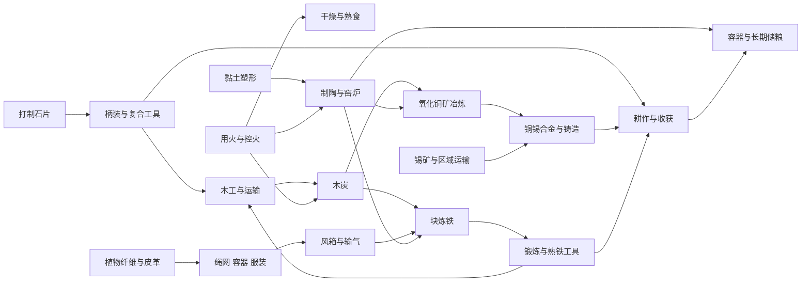
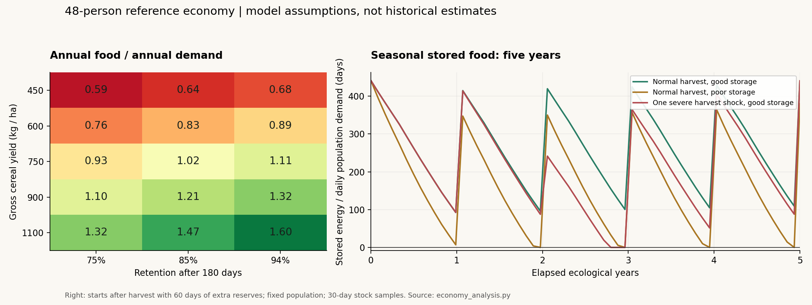

# 从采集营地到早期铁器聚落：生态、季节与产业系统设计

状态：设计稿，尚未修改游戏。与 [混合 Agent 决策架构](HYBRID_AGENT_ARCHITECTURE.md) 配套。

本方案的目标是让运输、储粮、季节协作和熟练劳动具有足够收益，使分工与交换值得发生。**不能只增加配方数量，也不能保证复杂配方必然生成社会。**采集狩猎群体本来就有社会组织；游戏真正需要增加的是持续承诺、劳动互补、公共投资与分配争议，而不是把农业设为“有社会”的唯一条件。

## 1. 世界基准与设计边界

采用温带欧亚河谷作为第一种完整生态模板：林地、草甸、河漫滩、湿地、丘陵与河流相连。技术覆盖石片工具、复合工具、编织、陶器、农业、畜养、铜与青铜，直到块炼铁及早期锻造。

这是一套区域化技术网络，不是全球统一的时代升级表。陶器可以出现在定居农业之前；早期铜不一定胜过优质石器；铁冶炼不要求某个角色先做出全部青铜工具。技术发展时间采用游戏压缩，材料、生产过程和生态后果尽量保持现实关系。旋转水磨、高炉炼铁、铸铁农具、普及的钢制品、现代化肥不进入首版范围。

默认不设置职业锁、阵营、税收、货币或土地所有权。角色可以自行成为农作者、制陶者、运输者或组织者，也可以季节性换工；这些名称是对行为的描述。土地声明、借粮、劳动交换和公共仓储的规则继续属于角色的认知与协商。

### 1.1 三种数值来源

- **资料约束**：人体能量需求与活动量有关；粮食储存受湿度、温度与虫霉影响；木炭存在干木得率；块炼铁需要还原气氛、持续供料和锻炼。这些有外部资料支持，见第 15 节。
- **候选校准值**：750 kg/ha 的谷物毛产量、单位面积野食、每公顷劳动等，用于建立可计算的初版。它们不是从考古记录中直接测出的普遍常数，需要范围扫描与实验修正。
- **游戏选择**：地图尺度、技能学习曲线、质量分档、事件可见性和控制接口。

本稿以质量、能量、面积、劳动和库存平衡约束候选值，给出敏感性与失败条件。可重算不等于已有史实验证；缺少地区数据的生态产量明确保留为待校准参数。

### 1.2 单位与时间必须先统一

| 概念 | 新定义 | 对现版本的影响 |
| --- | --- | --- |
| 1 生态日 | 1 天，365 天为一年 | 100 天只能观察一个季节附近的变化，年度产业评测至少 3–5 年 |
| 季节 | 春 92 天、夏 92 天、秋 91 天、冬 90 天 | 分别为年日 60–151、152–243、244–334，其余为冬 |
| 地块 | 250 m × 250 m，6.25 ha | 15×15 地图为 14.06 km²，不把一格等同一块小菜地 |
| 耕地子单元 | 0.25 ha，地块内有面积账本 | 同格可同时有田、路、屋与未开发地，总面积不可超额 |
| 食物日 FD | 2,500 kcal 的能量计量，不是一种物品 | 实际背包仍装 kg 谷物、肉、鱼、豆等 |
| 1 AP | 120 分钟主动劳动/行动预算 | 5 AP 对应每天 10 小时可分配活动；另有睡眠等非行动时间 |
| 基础生产预算 | 每位劳作者平均 3.5 AP/天 | 其余 1.5 AP 预留个人照料、饮水、烹饪、交往等；实际需显式记账，不再额外重复扣一份“家务税” |
| 重量与容积 | kg、L，分别检查 | 当前背包容量 15 可迁移为基础 15 kg；容器和运输工具改变承载，不再“矿石、木头、食物各算一个” |

250 m 移动不能继续固定扣 2 小时：平地轻载建议 6 分钟，背负 15–25 kg 约 9–12 分钟，林地、坡地、泥泞另乘阻力。全部用整数分钟记账，界面再换算 AP。每一步更新局部观察；远行任务不能直接跳过隐藏地块。

这要求升级调度器。小动作不能仍受每天固定 5 个原子动作槽的限制；使用日内时间和剩余分钟调度，完成时间相同才按 ID 排序。LLM 运算不消耗生态时间，实体行动、炉窑占用和成熟过程有明确时间。前版的 5 AP 可保留在界面，但底层必须支持不同动作时长。

妊娠、成长、工具腐坏与作物生长也须共享生态时钟。建议人类妊娠约 280 天，成年约 16–18 生态年；保留“成功交配必定受孕”作为可选实验规则。原来的 5 天妊娠/20 天成年只能留在旧版快速实验预设，不能一面使用真实年度作物周期，一面让人口每月倍增。技术发现可加速，生物时间不得悄悄混用。

## 2. 地形区、资源分布与区域交换

### 2.1 单河谷的参考面积分配

| 地形 | 格数 / 面积 | 主要资源与用途 | 局限 |
| --- | --- | --- | --- |
| 混合林 | 96 / 600 ha | 木材、坚果、果实、树皮纤维、鹿、野猪、薪炭 | 砍伐影响野食、栖息地、侵蚀及运输距离 |
| 草甸/稀树地 | 48 / 300 ha | 野谷、可食根茎、牧草、草料、草绳 | 夏季缺水、冬季枯草；采籽会减少次年更新 |
| 湿地 | 20 / 125 ha | 芦苇、根茎、鱼、黏土、局部沼铁 | 潮湿、虫害、道路不稳；排水会损失湿地资源 |
| 河漫滩 | 24 / 150 ha | 肥沃耕地、灌溉水、砂砾、野食 | 洪灾、涝害、储粮选址风险 |
| 丘陵/露头 | 24 / 150 ha | 燧石、砾石、建筑石材，条件性铜/铁矿 | 土薄、运输慢；矿脉有限且并非每种山都有矿 |
| 河道/水面 | 13 / 81.25 ha | 渔业、饮水、独木舟/筏运输 | 流速、渡河、枯水与结冰风险 |

这是参考模板，不强制每个 seed 完全相同。按流域、坡度、母岩与地下水生成相关分布，而不是每格独立抽资源。黏土依赖沉积环境；石灰岩、燧石、铜矿和锡石服从不同地质节点；露头只代表可接近的矿体，不代表采一遍后五天补满。

资源点的“存在”和“被某人知道”分开。角色只能通过观察、勘探、带来源的听闻与地图记忆发现资源。世界生成器可为实验筛选有生存路径的地图，但不能把全部矿点坐标送给控制器。

### 2.2 金属贸易不应挤在一个小村口

锡是区域稀缺节点，不能为了每种科技都可用而保证每张 15×15 地图都有锡。建议在地方地图外连接 2–3 个同样真实模拟的地区，距离约 10–30 km，以路线、旅行时间、货物和人员表示。

河谷可有农地、林木、黏土和少量沼铁；邻区出现较好的铜矿；更远区域才有锡或盐源。跨区旅行耗时、耗粮、有季节通行条件，交易必须由双方角色达成，不能用无限供应的系统商店补齐资源。

单地图模式依然可走石器、陶器、农业和本地块炼铁路线；青铜可能依赖外来锡，也可能暂时不可行。紧凑演示可压缩矿区距离，但应标记为压缩地理预设。

## 3. 资源分类与守恒

### 3.1 最小但完整的资源集合

| 层级 | 资源 |
| --- | --- |
| 自然食物 | 可食坚果、鲜果、已识别根茎、野谷、活鱼、野生动物 |
| 种养产物 | 谷粒、豆粒、种子批次、秸秆、牧草/干草、奶、畜体 |
| 可食加工物 | 去壳谷、粗粉/粥、熟豆、鲜肉、熟肉、干肉、干鱼、盐藏肉、可食干坚果 |
| 植物材料 | 生木、干木、枝条、树皮/韧皮纤维、芦苇、树脂、木炭 |
| 动物材料 | 生皮、处理皮革、骨、角、筋腱、动物脂、毛纤维 |
| 非金属材料 | 燧石结核、石片、磨石料、砾石、建筑石、黏土、砂/熟料、石灰石、盐/卤水 |
| 金属链 | 氧化铜矿、锡石、铁矿/沼铁、焙烧矿、铜锭、锡锭、青铜料、海绵铁、熟铁条、金属废料、炉渣 |
| 农业回流 | 粪便、堆肥、灰、覆盖物、生活有机残余 |

水具有质量和位置，可饮用性与污染状态独立。河流有流量输入；井有含水层回补；提水与运输花时间。沸煮改善部分微生物风险但耗燃料，不能把水变成无限可携带的抽象值。

### 3.2 物品批次而非单一数量

每批物品保存 `massKg`、含水率、可食比例、能量/营养、加工状态、质量、来源和储存位置。谷物还需有种类和发芽率；矿石有品位；木材用干物质量追踪燃料能力；工具有用途相关的磨损。

- 干燥减少水，不增加能量。100 kg 整鱼若可食率 55%，加工前可食部分约 60,500 kcal；干制保留 95% 能量，最终无论是 18 kg 还是 20 kg，都只能含约 57,475 kcal。
- 骨、皮、肉来自同一只动物的质量分配，不能各自按整只动物产量重复发放。
- 金属输出受矿石所含元素质量约束；炉渣、烟气和残余物是损失去向。冶炼涉及空气中的氧，不能简单要求“矿石质量等于金属加炉渣”而遗漏气体反应。
- 灰能回流部分磷钾和碱性物质，不等于制造出新氮肥。粪肥通常是营养元素转移，不是免费资源。
- 工具修复消耗材料、劳动及部分寿命；废金属回收有氧化损失，不能无限循环增殖。

## 4. 季节、生态更新与农业

### 4.1 季节通过物理变量起作用

季节不是给所有产出统一乘一个数字。首版至少有温度、日照、降水、土壤水分、冻土/积雪与河流状态。

可用的参考气候：年均温 12°C、年振幅 13°C、年降水约 650 mm；这是温带模板的初值，不代表整片欧亚。天气由空间相关的过程产生，同一流域共享主要旱涝风险，而非每格独立投骰子让风险自动抵消。

```text
T(day) = 12 + 13 × sin(2π × (day - 109) / 365) + 天气扰动
soilWater_next = clamp(soilWater + 入渗 + 灌溉 - 蒸散 - 径流 - 深层渗漏, 0, 持水量)
GDD += max(0, T - 作物基温)
```

砂质地、壤土、黏土地的根层有效持水量可先扫描 80/150/200 mm。春播谷物参考播种日 90–110、成熟日约 200–220；成熟实际由积温、水分和生育阶段决定。基温、积温需求需逐作物校准，不能只凭月份自动产粮。

| 季节 | 生产机会 | 主要压力 |
| --- | --- | --- |
| 春 | 修沟、备地、播种、采嫩根、放牧恢复 | 去年库存接近最低点；洪水、倒春寒 |
| 夏 | 除草、灌溉、捕鱼、晒草、部分早熟收获 | 干旱、鲜食腐败快、饮水需求 |
| 秋 | 主收获、脱粒、干燥、储粮、采坚果、修屋 | 有限收获窗口与全村劳动力冲突 |
| 冬 | 制作、修理、纺织、传授、有限狩猎与捕鱼 | 储粮和燃料下降，冻土、结冰、衣屋需求 |

在固定年份中，具体作物收获可以跨夏秋边界；上表是劳动结构，不是禁止反季任务的规则。

### 4.2 自然资源按生物类型更新

- 果实、坚果、野谷：按物候生成年度批次，未采部分被动物取食、发芽或腐烂。不是采后 N 天自动回复。
- 根茎、芦苇、牧草：有活体库存、年度生长与采收残留率；挖走繁殖体会降低后续生产。
- 鱼和猎物：有种群/生物量与繁殖期，允许迁移。简化模型用 `dB/dt = rB(1-B/K)-H`；可持续捕获量和捕获速度不是同一回事。
- 林木：保存蓄积、生长年龄和更新。萌芽林轮伐按 7–15 年管理，成熟木构材需要更长时间，砍完不能日恢复。
- 矿物：有限矿体、品位和开采深度。容易的露头耗尽后劳动、排水和支护成本上升。沼铁以多年尺度重新形成，不作为每日矿场。

气候承载量、可见资源、采收效率、更新速度分别建模。资源总量足够，也可能因远、季节不对、不会加工或来不及收而挨饿。

### 4.3 土地改造与作物

| 改造 | 输入和持续投入 | 收益与代价 |
| --- | --- | --- |
| 清灌/清林 | 斧、火、根除劳动；按面积计费 | 得到土地和部分木材，损失野食与栖息地；失控火有扩散风险 |
| 开垦/松土 | 掘棒、锄或犁；初次比年度备地更贵 | 改善播种床，不能在几次动作后变为永久粮食机器 |
| 排水沟 | 土方、沟道连通、维护 | 改善涝地，但影响下游和湿地渔采 |
| 引水沟/小堰 | 土石木、坡降、持续清淤 | 转移真实水量；上游取水影响下游 |
| 篱笆/田界 | 木桩、枝条、维护 | 降低动物损害；边界本身不构成系统强制所有权 |
| 休耕/豆科轮作 | 占用一个生长季，管理覆盖物 | 恢复部分肥力、减少病虫与侵蚀，不能凭时间无条件回满 |
| 堆肥/施肥 | 收集运输有机物、熟化 | 回流养分，生粪与饮水污染存在风险 |
| 简易梯田 | 很高初始土石劳动、排水维护 | 降低坡面侵蚀，失修可冲毁 |
| 牧草地/干草地 | 控制放牧、割草与冬储 | 与粮田、林地竞争面积 |
| 道路/渡口 | 清障、铺垫、维护 | 降低运输时间，暴雨或洪水会破坏 |

首版作物用两个谷类（如大麦与小麦）加一个豆类（豌豆或小扁豆），再加亚麻。它们具有不同熟期、耐旱性、种子需求和加工负担。种子是有来源的活物：野生种群选择与驯化是长期过程，不能“实验一次得到现代高产种”。

为避免模拟几千年才进入农业，场景可以从已有早期栽培种或不同知识起点开始；必须记录这是初始条件。所谓石器、农业、青铜、铁器预设，改变的是开局知识、种群与设备，不是给全部角色自动升级。

### 4.4 保鲜是一个产业，不是一条统一倒计时

| 食品 / 条件 | 初始风险时间尺度，用于校准 | 所依赖的产业 |
| --- | --- | --- |
| 温暖环境的鲜肉、鲜鱼 | 约 1–2 天就明显升高；寒冷条件另算 | 当日分食、运输、火、盐和干制 |
| 熟食 | 温暖环境约 1 天起明显升高 | 家庭批量与及时食用，不能一次煮全年粮 |
| 未受损根茎 | 阴凉条件约 1–3 周，品种差异大 | 挖掘质量、地窖、通风和防冻 |
| 干谷物 | 适当低含水率、干燥防虫条件可按 6–12 个月校准 | 收获后的干燥、陶器、粮仓和看护 |
| 干肉、干鱼、盐藏 | 合格加工条件下按数周至数月校准 | 切分、烟/盐、空气湿度、容器 |
| 干坚果 | 按数月至一年以内校准，关注霉变与脂肪酸败 | 干燥、剥壳策略、阴凉储藏 |

表中范围不是安全食用承诺。每批通过水分/水活度、温度、害虫和加工状态更新风险；食品安全与剩余卡路里分开计算。腐坏食物可能仍有能量，但有独立的致病风险，不能用“到第 4 天统一变毒、统一扣血”表达全部食品。

谷物参考含水率可先在 12–14% 附近测试，但安全阈值依作物与温度而变 [S3]。干燥和储藏设施降低的是风险与损耗，并非给物品盖上永久不坏的标记。发霉谷物煮熟也不能默认清除全部毒素 [S3b]。

## 5. 工具、工艺与产业网络

### 5.1 技术依赖图



图中的箭头表示工艺条件，不是必须由同一个角色亲手完成。可以购买木炭、借用炉窑、请人锻造、换取种子或学习技能。

### 5.2 配方表的读法

下表是首版候选批次。质量用 kg，劳动用 AP（1 AP=2 人时）；“等待”不占满劳动，但可能需要定期看护。除单列上游步骤外，劳动不含原料采集和长途运输，成本核算必须把它们补回。质量损失要落入碎屑、灰、烟气、蒸发水等去向。

工具需求用能力表达，例如 `cutting`、`boring`、`grinding`、`airflow`、耐热容器和温度范围。不同材料可替代，效率与耐用性不同。配方输出、设备、技能、质量和时间都有版本，不能把“铁工具”设为全动作万能增益。

### 5.3 石器、复合工具、纤维与运输

| 工艺 / 产品 | 一批材料 | 主动劳动 / 等待 | 用途与关键约束 |
| --- | --- | --- | --- |
| 石片/刮削片 | 燧石结核 1.0 → 可用片约 0.35，余为碎屑/石核 | 0.6 AP | 基础切割；原料质量影响合格片比例 |
| 手斧/重型石器 | 石核 1.5 → 工具约 0.8 | 1.5 AP | 分割、挖掘和重打击，不等于高效伐木斧 |
| 磨制斧头 | 合适石料 1.5 → 斧头 1.0 | 3 AP | 更适合木工，需磨料与水 |
| 柄装石斧 | 斧头 1.0、木柄 0.6、绳 0.05、树脂 0.05 | 1 AP | 柄、刃分开磨损，坏柄可更换 |
| 掘棒 | 直木 1.2 → 约 0.8 | 0.5 AP | 低成本开挖，硬地效率低 |
| 骨锥/骨针 | 合适骨 0.2 → 约 0.03 | 1 AP | 制衣、修皮与穿孔 |
| 木矛与石矛头 | 木 1.0、石尖 0.15、筋/绳 0.03、胶 0.02 | 1 AP | 改善狩猎；大型猎物仍有合作收益与受伤风险 |
| 弓与箭组 | 韧木 1.0、弦 0.05；另用木杆、石尖、羽毛制箭 | 3 AP + 干燥 | 需要木料质量与练习，不是点配方后必中 |
| 手钻 / 弓钻 | 木 0.5、绳 0.05、钻尖 0.03 | 1 AP | 穿孔、起火、木工；钻尖和弦会磨损 |
| 韧皮纤维 | 鲜树皮/茎 5 → 干净干纤维约 1 | 1 AP + 3–10 天 | 浸沤受温度与水影响 |
| 绳索 | 干纤维 1 → 绳约 0.9 | 1 AP | 捆扎、网具、建屋和运输通用中间品 |
| 编筐 | 藤/条 2、绳 0.1 → 约 1.8 | 2 AP | 基础承载 15 kg 可提高到约 25 kg，但仍受体力和容积限制 |
| 捕鱼网 | 细绳 2、坠石 0.5、浮木 0.2 | 5 AP | 有面积、网目、破损；提高捕获率，也加速过捕 |
| 生皮处理 | 生皮 5、脂 0.2、水及烟处理 → 柔韧皮约 2 | 3 AP + 2–5 天 | 不把所有早期皮革加工都写成成熟植物鞣革 |
| 皮衣 / 鞋组 | 处理皮 2、筋线 0.1 | 3 AP | 御寒与步行保护，尺寸、湿度和修补影响寿命 |
| 亚麻纱 | 洁净干纤维 1 → 纱 0.85 | 4 AP | 纺线通常比简单“纤维变布”更费劳动 |
| 织布 | 纱 1 → 布约 0.95 | 4 AP；先建织架 | 高熟练度收益来自速度与疵品减少 |
| 独木舟 | 合适原木约 300 → 舟约 100 | 35 AP + 干燥 | 大量刨削/烧凿；约 200 kg 有效载荷，受河道限制 |
| 木筏 | 干木 180、绳 5 | 12 AP | 建造更容易但笨重，顺逆流差异大 |
| 拖橇 | 木 25、绳/皮 1 | 6 AP | 约 80–100 kg 货物；路况影响牵引劳动 |
| 简单牛车 | 木 100、轮轴构件、皮绳 3 | 30 AP | 较晚技术支线，需牛、饲料、车路与轴维护；不是石器开局运输 |

铁、铜、骨、石都保留细分优势。例如锋利石片适合切割但脆；铜可反复加工但较软；早期低碳铁不一定有优质青铜的刃口性能，铁的优势包括矿源、维修和材料规模。

### 5.4 食物加工、容器与农业设备

| 工艺 / 产品 | 一批输入与输出 | 主动劳动 / 等待 | 产业作用 |
| --- | --- | --- | --- |
| 坚果处理 | 含壳原料按品种取可食部分；橡实另需脱涩与水 | 约 5–10 kg 原料/AP | 识别、加工知识与容器决定是否可食 |
| 谷物干燥、脱粒、扬场 | 收获谷穗 → 谷粒、秸秆、颖壳，按批次分配 | 面积劳动账另列 | 阴雨会造成积压；不能收获即成为干面包 |
| 磨盘 / 鞍形磨 | 石坯 20 → 可用磨具约 15 | 6 AP | 谷粒参考处理率 4 kg/AP；磨耗产生石粉风险 |
| 磨粉 | 干谷粒 10 → 人食粗粉约 9.6，余为可用麸屑 | 2.5 AP | 碎屑可喂养/堆肥，不能同时算成人口粮 |
| 煮粥 / 熟豆 | 谷/豆、真实水量、燃料 | 炉具允许家庭批量烹饪 | 加水增重不增加卡路里；烹饪时间计入家庭活动预算 |
| 干肉 / 干鱼 | 去骨鲜肉/鱼 → 干品，按水分和 90–95% 能量保留计算 | 约 10 kg 鲜料/AP + 2–4 天 | 有天气、虫害、盐和烟条件；干燥架容量有限 |
| 盐藏 | 鲜肉 20、盐约 1，另需容器 | 1 AP + 数天 | 盐可重复的程度受污染限制；保鲜并不永久 |
| 盐提取 | 卤水依盐浓度蒸发/日晒 → 盐、水蒸气、苦卤 | 依水量与热需求 | 优先太阳能/天然盐；低浓度卤水靠烧木蒸发可能极不经济 |
| 复合镰 | 木柄 0.5、石片 0.1、胶绳 0.05 | 1 AP | 降低收割劳动，但嵌片频繁更换 |
| 锄 | 木柄 0.8、石/金属头 | 1 AP 装配 | 作用于备地、除草，提升幅度按任务不同 |
| 木制浅耕犁 | 木 20、连接绳皮 0.5 | 5 AP | 需畜力与已清理土地；不能立刻深翻黏重生地 |
| 手工陶器：一只约 2 kg 器 | 黏土、砂/熟料按干固体配比，塑形加水 | 单件塑形约 1 AP + 3–7 天干燥 | 干燥不充分时爆裂，生坯不是防水成器 |
| 陶器：12 件批量 | 同样的总坯料；共享一次约 3 AP 看火，熟手每件成形 0.65 AP；干木约 24 kg | 共约 10.8 AP + 干燥/冷却 | 质量与装窑决定合格率；失败品变陶片，不返还完整黏土 |
| 土坯 | 干土 100、水 25、秸秆 10 → 干坯约 110 | 2 AP + 7–14 天 | 耐雨性依屋顶和基础，不能当永久砖石 |
| 石灰及灰浆（可选） | 石灰石 100 → 理论生石灰 56 + CO₂ 44；再加水 18 → 熟石灰 74 | 烧制需窑、约 80 kg 干木的候选燃料量及看护 | 实际转化率另计；燃料与工艺使其不会免费替代泥土 |

首次出现在某个时代的具体年代因地区而异。本表不是要求把每项都塞进单个首发版本；第 14 节给出分阶段范围。

### 5.5 金属与燃料链

| 工艺 | 参考批次 | 主动劳动 / 条件 | 产物与损失 |
| --- | --- | --- | --- |
| 干木 | 生木按含水率折算为干物质，存放通风 | 搬运、堆垛；等待数周至数月 | 失去水，热值按干物质量与残余水分计算 |
| 土坑/土堆木炭 | 总干木 80 kg | 约 2 AP 装卸看护 + 2–4 天占用 | 参考木炭 20 kg；实际总得率扫描 18–30% |
| 铜矿预处理 | 采出矿破碎、拣选、可选焙烧 | 约 2 AP/10 kg 候选矿 | 品位提升要付出丢弃低品位部分的质量损失 |
| 氧化铜矿冶炼 | 矿 10 kg、含铜 15%；木炭约 7 kg（含预处理燃料分摊） | 炉/耐热容器，控温与还原；约 5 AP | 金属回收 75% 后约 1.125 kg，精炼 95% 后约 1.069 kg 铜 |
| 锡石还原 | 矿 5 kg、SnO₂ 30%，炭约 4 kg | 耐热容器与还原工艺 | SnO₂ 中锡约 78.8%，回收 60% 后约 0.709 kg 锡 |
| 青铜熔配 | 铜 1.08 kg、锡 0.12 kg，炭约 2 kg | 约 2 AP，坩埚与合格干燥模具 | 以 90:10 合金为一个配方；95% 金属收得约 1.14 kg，余为损失/可回收渣料 |
| 铸造与整修 | 合金料、模具、木柄等 | 约 2 AP，冷却、去浇道、磨刃 | 浇道可回收但每次再熔炼有损失 |
| 铁矿预处理 | 矿 10 kg，模型含铁 45% | 破碎、焙烧与分选 | 氧化/失水改变总质量，铁元素账连续 |
| 块炼铁 | 上述矿、木炭 16 kg；另预留后续锻炼木炭 4 kg | 约 8 AP 的装料/送风/照料总劳动，连续数小时；需风箱、风口、炉体 | 铁回收 40% 得约 1.8 kg 铁元素，夹渣海绵铁的总质量更大 |
| 锻炼与锻件 | 海绵铁；使用预留 4 kg 炭 | 约 3 AP 锻炼与整形，砧锤 | 锻炼保留 80%、成形保留 90%，最终约 1.296 kg 可用金属 |
| 废料再加工 | 已登记的铜/青铜废料，或适合的铁料 | 再加热、分选、锻/铸 | 铜合金可重熔，熟铁主要锻接再加工；不能统一放进“熔铁锅” |

矿石、木炭比及劳动为候选工艺参数。块炼过程参考温度约 1,100–1,300°C，产生海绵铁再锻炼，不要求把纯铁全部熔化 [S4]。青铜熔配温度依合金变化，不能用熔锡温度代替整个流程。

风箱本身依赖皮革、木工、绳与耐热风口；炉窑依赖黏土选择、干燥、耐火性与修补。锻造还需要石砧/金属砧和合适锤具。皮匠、制炭者、制陶者、矿工、运输者与锻工由此存在持续交易机会。

## 6. 建筑、设备与公共工程

建筑在同一大地块内有占地、容量、维护和位置，不能一格只容纳一个“棚屋”。建造投入按设计面积增长，质量依材料、工艺与维护；下面只列可实现的初始规格。

| 建筑 / 设备 | 参考规模 | 主要投入与劳动初值 | 物理作用与维护 |
| --- | --- | --- | --- |
| 遮蔽营棚 | 12 m²，约 4 人 | 木杆 60 kg、草/皮覆盖 20 kg、绳 1 kg；12 AP | 减少风雨暴露；覆盖物季节性更新 |
| 木骨泥墙屋 | 24 m²，约 6 人 | 木 400 kg、干土料 1,000 kg、茅草 120 kg、绳 5 kg；90 AP | 保温、干燥；地基、屋面与火灾风险 |
| 大型共居屋 | 60 m²，约 15 人 | 依面积、跨度核算，不直接线性复制小屋 | 共享屋顶/炉火节约燃料，但烟害、火灾和修缮责任集中 |
| 炉灶 | 家庭一组 | 石土约 80 kg；5 AP | 烹饪、取暖，需通风和持续燃料 |
| 晒架 / 烟熏棚 | 50 kg 鲜料批次 | 木 80 kg、绳 2 kg、屋面 20 kg；15 AP | 干燥/烟熏的容量瓶颈，不直接免费变成干肉 |
| 小粮仓 | 12 m²，约 4 t 干谷 | 木 250 kg、干土 500 kg、草 80 kg；50 AP | 离地、防雨、防鼠；门、容器与日常检查 |
| 聚落粮仓 | 36 m²，约 12 t 干谷 | 木 600 kg、土 1,500 kg、草 180 kg；120 AP | 批量储存；不预设公有、税收或免费访问 |
| 工棚 / 织架 | 12–20 m² | 木料、绳、织架构件；20–40 AP | 遮雨并安置设备，提高可工作天数 |
| 陶窑 | 12 件参考批次 | 耐火土约 200 kg、石基 100 kg；20 AP | 温度与气流可控；内衬按批次磨损 |
| 炭堆场 | 80–400 kg 干木批次 | 清场、土覆盖、排水；8 AP 起建 | 多天占地、看护；雨水、走火和漏气影响得率 |
| 块炼炉 | 10 kg 矿参考批次 | 耐火土 120 kg、石基、风口与风箱；25 AP | 炉次后修补，损耗不可忽略 |
| 锻工棚 | 炉、砧、锤、水桶 | 木土与加工工具；20 AP，不含工具上游 | 可维护工具与制作金属部件 |
| 围栏畜圈 / 草棚 | 10 只小牲畜 / 约 2 t 干草 | 木 150 kg、草 100 kg；30 AP | 约束放牧、储草；有清粪、水与修篱劳动 |
| 井 / 汲水点 | 服务约 40–60 人 | 依深度和土质计土方，浅井参考 50 AP | 水源有补给、污染和排队能力；不是永远安全的水 |
| 沟渠 / 小堰 | 按 m³ 土方、m 长度结算 | 候选人工开挖 0.5–1.5 m³/AP，按土质校准 | 水量守恒、需要清淤，上下游利益冲突 |
| 道路 / 简桥 / 码头 | 按路线和跨度结算 | 木石、绳、土方；按实长核算 | 降低部分运输成本，冬季/洪灾需要维护 |

房屋不直接“每天回 8 HP”。它改变寒冷、潮湿、休息、感染和燃料需求，身体恢复由健康系统统一计算。燃料也不应被木炭生产与炉火分别重复计为“免费热源”。

## 7. 数值分析一：采集承载量与农业为什么值得出现

### 7.1 从可食质量而不是“每格 4 食物”开始

参考河谷的野生植物年度潜在能量为：林地 3,000 FD、草甸 1,500、湿地 1,500、河漫滩 1,200、丘陵 300，共 **7,500 FD**。

一个可用于初始化的质量拆分如下。都是年度可食部分、采集与储存损失之前的量，不是整个生态系统初级生产力：

- 林地：900 kg 干坚果 × 5,500 kcal/kg；2,550 kg 鲜果 × 500；1,275 kg 可食根茎 × 1,000，合计 3,000 FD。
- 草甸：800 kg 野谷 × 3,400，加 1,030 kg 根茎 × 1,000，合计 1,500 FD。
- 湿地：3,750 kg 根茎 × 1,000，合计 1,500 FD。
- 河漫滩：1,500 kg 根茎，加约 441.2 kg 野谷，约 1,200 FD。
- 丘陵：约 136.4 kg 干坚果，约 300 FD。

这些总量沿适合植物的斑块分配，大部分林地不会每平方米都长可食坚果。实际产量先验要按植物种类、有效生境面积与气候校准；上述数值是在给定地图和开局规模下反推的候选量，不是采自真实河谷的调查数据。

水域若用年度 6,000 kg 整鱼的潜在可持续捕获量，55% 可食、可食部分 1,100 kcal/kg，得到 **1,452 FD**。对应 81.25 ha 水面约 74 kg/ha/年，是待校准渔业参数。示例 logistic 模型可用 K=48,000 kg、r=0.5/年，使 `rK/4=6,000 kg/年`；这只是中等库存附近的理论最大持续产量，不能保证每天按它捕鱼。

猎物参考：每年鹿 10 只 × 25 kg 可食、野猪 10 × 35、兔类 300 × 0.5，共 750 kg 可食肉；按 1,600 kcal/kg 为 **480 FD**。可分别以鹿 K=80/r=0.5、野猪 K=40/r=1、兔类 K=1,200/r=1 的种群模型检验最大持续捕获。实际猎获还受季节、成功率和动物年龄结构限制，不能因为给出这个上限就自动发肉。

```text
潜在野食 = 7,500 + 1,452 + 480 = 9,432 FD/年
参考实际取得率 82%，加工/跨季保留率 90%
可供食 = 9,432 × 0.82 × 0.90 = 6,960.8 FD/年
对应约 19.1 个成年食物当量
```

因此 20 人开局若有 16 名成人、4 名儿童，按儿童 0.6 当量算是 18.4 AE，可在有组织、会储藏的采集体系下勉强持续。48 人聚落则不能仅靠这片河谷野食满足全年需求。改善渔具、季节迁移和储粮仍可能维持一个更富裕的采集群体，不强制人人转农业。

这是承载量的上界分析，不是行为模拟结果。82% 的取得率对不会协作和储藏的角色可能偏高。评测必须扫描取得率 50–90%、坏年气候和地图可达性；不应为了剧情在后台实时按人口调低食物。

### 7.2 48 人聚落的口粮账

参考人口：32 名劳作者、8 名儿童、8 名老人；食物当量分别为 1、0.6、0.85。

本次劳动容量保守地只计入 32 名劳作者；这不是禁止老人制作、传授或照料的规则。实际人物的劳动能力由健康、经验和任务决定，年龄组只用于这组汇总预算。

```text
AE = 32 + 8×0.6 + 8×0.85 = 43.6
年需求 = 43.6 × 365 = 15,914 FD
```

2,500 kcal 是本模型的平均成年当量，不是每人不论体型和活动都固定吃这么多。重体力、寒冷和妊娠应调整个体需求；这里另测总需求增加 15% 的情景。

谷物采用：毛产 750 kg/ha，收获与初处理后保留 92%，预留种子 120 kg/ha，再经 96% 可食加工和参考储存保留率 94%。谷粒按 3,400 kcal/kg。

```text
每公顷净谷物 FD = (750×0.92 - 120) × 0.96 × 0.94 × 3,400/2,500
                = 699.54 FD/ha/年
```

种子从实际回收的谷粒中预留，不能先吃再无中生有。120 kg 是含一定种子损耗余量的储备要求；完整模型仍需检查发芽率，灾年可能连种子都留不够。

豆类采用毛产 500 kg/ha、初处理保留 90%、种子 100 kg/ha、可食加工 95%、参考储存保留 93%、3,300 kcal/kg，净产 **408.18 FD/ha/年**。

| 来源 | 面积 / 规模 | 年净能量 |
| --- | ---: | ---: |
| 谷物 | 20 ha | 13,990.8 FD |
| 豆类 | 4 ha | 1,632.7 FD |
| 定向渔采补充 | 从剩余生态系统获得 | 1,800 FD |
| 少量畜产品 | 不是主要热量来源 | 180 FD |
| 合计 | 另配 12 ha 休耕，共 36 ha | **17,603.5 FD** |
| 人口需求 | 43.6 AE | **15,914 FD** |
| 余量 | 不含新增人口和额外强劳动需求 | **1,689.5 FD，约 10.6%** |

耕地占用的原生食物面积必须从野食计算中扣除；表里的 1,800 FD 只从剩余生产力分配，不能再另取整个地图的 9,432 FD。谷物、秸秆、牧草之间也不能重复结算土地面积。

该配比是一个**偏脆弱的诊断场景**，适合检验协作失败，不适合默认长期生存。建议稳定农业预设采用谷物 22 ha、豆类 6 ha、休耕 14 ha，并把两类谷物安排为不同熟期：年供食约 19,819 FD，约为基础需求的 124.5%，在需求增加 15% 后仍有约 8.3% 余量。不能拿“正常年有余量”替代灾年储备。

### 7.3 畜养必须吃草而不是生成肉

10 只小型反刍家畜按每只每天约 1.2 kg 干物质的候选维持量，一年需要约 4.38 t；120 天冬期需要 1.44 t，若干草损失 20%，入冬前至少收好 1.8 t。还要有水、圈舍和照料。

5 只泌乳母畜 × 每天 0.6 L × 150 天，按 700 kcal/L 约为 126 FD；少量淘汰肉等补足约 180 FD 的参考畜产品额度。家畜在早期聚落中的价值还包括皮、毛、粪、育种和后续畜力，不能用很小一片草地无限生成高热量肉食。

养牛、牵引和更多乳产属于扩展分支，必须重新核算冬草、耕地与劳动。驯化种群依赖初始设定、交换或长期繁育，不能把抓到的一只鹿点一下变成耕牛。

## 8. 数值分析二：季节劳动峰值比全年平均更能促成合作

在 20 天的主收获窗口内，32 名劳作者每天生产活动 3.5 AP，同时全村仍需约 40 AP/天用于食物加工、关键物资运输、燃料、照看生产等不可完全停下的生产任务。这 40 AP 不含已经从 5 AP 中预留的个人活动。

```text
可用于收割 = (32×3.5 - 40) × 20 = 1,440 AP
20 ha 生手收割 = 20×90 = 1,800 AP
20 ha 熟练收割 = 20×67.5 = 1,350 AP
```

结果：按此候选劳动率，全部生手最多及时收下 **80%**；熟练收割队、后方运输/脱粒人员的分配可以完成。熟练度带来的 25% 节省是待测参数，必须由累积劳动或学习获得，不是系统检测到“组队”就凭空加成。

稳定预设 22 ha 谷物需要熟练收割 1,485 AP。通过不同作物/品种把有效工作窗口分散到 26 天，可用劳动约 1,872 AP；天气若让熟期重新重叠，仍会形成压力。灌溉与品种多样性既影响均产，也影响劳动日历。

年度参考劳动也要核算：谷物每公顷备地 100、播种 15、除草 75、熟练收割 67.5、脱粒 40、田间运输 20、维护 20 AP，另对需人食的谷物按 4 kg/AP 计磨粮。它们是约束完整账的初值，仍需实验考古和游戏测量校准，不能说成已知统一古代劳动率。

48 人参考聚落谷物链约 9,429 AP/年；再算豆类约 948、休耕 144、养分回收运输约 512、渔采 1,800、畜养 900、薪柴与搬运 2,500、工具陶器纺织 1,500、住房维护 900、道路水利 600、额外交换运输 700，总计约 **19,933 AP/年**。生产活动理论上限是 `32×3.5×365=40,880 AP`。

这意味着并非全年都缺劳动；忙季缺人与冬季可制器可以同时成立。剩余时间用于疾病、天气中断、学习、扩建、社交或休息，不能为制造紧张感自动全部扣掉。此年度账是粗预算，不含所有产业需求，后续应由实际任务日志替换。它也说明不应把全村永久锁成“80% 农民、20% 工匠”。

## 9. 数值分析三：库存、灾年和敏感性

完整分析代码：[economy_analysis.py](economy_analysis.py)。结果：[data/economy_analysis.json](data/economy_analysis.json)。运行 `python3 docs/economy_analysis.py`，不调用模型，不修改实验。



左图为食物供需比，1 是年口粮平衡线；右图展示正常储存、较差储存和一次严重减产下的库存，每 30 天取样。图表使用参考 20 ha 谷物 / 4 ha 豆类配置，可用 `python3 docs/plot_economy_analysis.py` 重建；绘图额外依赖 matplotlib/numpy，核心数值脚本只用 Python 标准库。

### 9.1 先看均值敏感性

下表保留同一人口、20 ha 谷物、4 ha 豆类和补充食物；只改变谷物毛产与参考储存保留率。表中数值为年食物/年需求，低于 1 表示平均年也无法维持。

| 谷物毛产 kg/ha | 保留 75% | 保留 85% | 保留 94% |
| ---: | ---: | ---: | ---: |
| 450 | 0.589 | 0.637 | 0.680 |
| 600 | 0.759 | 0.830 | 0.893 |
| 750 | 0.928 | 1.022 | 1.106 |
| 900 | 1.098 | 1.215 | 1.319 |
| 1,100 | 1.325 | 1.471 | 1.603 |

750 kg/ha 不是可随意复制到所有地块的默认产量。表明即使田间产量不变，储存从差变好，就可能跨过维持人口的临界线。盲目提高到 1,100 kg/ha 会给这组人口带来 60% 的正常年余量，从而改变压力结构。

### 9.2 按日库存而不是只看年末总产

数值模型以收获后开始，一次性库存中已包含正常收获和 0/30/60/90 天战略余粮；模拟固定人口的 5 年需求。

```text
日损耗率 = 1 - R180^(1/180)
库存下一日 = max(0, min(库容, 库存+本日入库)×(1-日损耗率) - 当日需从库存支取的口粮)
```

本日鲜食优先满足消费；缺口单独累计，不通过让人口死亡来降低后续需求。模型把豆粮收获简化为同一次入库，并用统一 R180 近似其储存、忽略具体食品差异，是**能量可行性与缓冲的诊断模型**。它没有实现 Agent、真实病害、热量营养差异或逐地块水文。

模型还没有把极端绝收导致的种子不足反馈到下一年种植面积，因而不能评估这类连锁崩溃。现有压力场景仍能留出设定的种子额度；完整模拟必须按实际种子批次扣除播种量。

静态表用 180 天代表平均存放时间；动态模型逐日损耗，不能再同时乘一次年度保留率。粮仓、种子储备与在库粮按实重占容量。60 天战略余粮是额外约 2,616 FD，不能误把秋收后本来就要吃到下一次收获的全部粮食都叫“战略储备”。

| 五年情景，除注明外额外备粮 60 天 | 累计口粮缺口 | 出现缺口的天数 |
| --- | ---: | ---: |
| 正常收获、良好储存 R180=94% | 0 FD | 0 |
| 正常收获、较差储存 R180=75% | 5,257 FD | 145 |
| 一次谷物收成降至 55%，豆类/野食受部分相关冲击 | 3,072 FD | 82 |
| 连续两次收成降至 55%、65% | 7,874 FD | 207 |
| 一次 55% 收成、无额外战略余粮 | 5,185 FD | 136 |
| 每年只能完成 80% 谷物收割 | 3,214 FD | 88 |

缺口天数不是预测死亡天数，也不是现实世界饥荒概率。它是在当前参数、相同需求和未进行适应性迁移/交易时的压力测试，说明储粮、跨地区风险分散、作物多样性与临时劳动调动都有价值。

### 9.3 随机气候压力测试

固定随机种子 20260910，生成 1,000 条五年路径。年度共同收成因子服从均值 1、对数标准差 0.2 的对数正态分布；豆类冲击为 `0.6×因子+0.4`，野食冲击为截断的 `0.5×因子+0.5`。这种相关性和分布是模型假设，并非历史频率估计。对不同仓储和储备使用相同天气路径。

| 180 天储存保留率 | 额外储备天数 | 五年内至少一次口粮缺口的路径占比 |
| --- | ---: | ---: |
| 75% | 0 / 30 / 60 / 90 | 100% / 100% / 99.8% / 98.9% |
| 94% | 0 / 30 / 60 / 90 | 63.8% / 49.1% / 35.4% / 25.2% |

不能把这组数字包装成“真实饥荒概率”。它揭示的是：**在低余量方案下，单纯加库存不一定能抵消持续损耗；改善储存也不能完全替代冗余产量和风险分散。**稳定预设的均值更好，但仍需单独跑动态和行为验证，不能沿用此表声称已经验证安全。

## 10. 数值分析四：肥力、森林与金属成本

### 10.1 养分不能无限循环生粮

对 20 ha 谷物、4 ha 豆类、12 ha 休耕的参考系统，先只做氮收支账：

| 项目 | 候选计算 | kg N/年 |
| --- | --- | ---: |
| 谷粒和移走秸秆的氮输出 | 20×(750×1.8% + 900×40%×0.5%) | −306 |
| 豆科净输入 | 4×(固定 35 − 豆粒 500×3.5%) | +70 |
| 含豆科覆盖的休耕净输入 | 12×8 | +96 |
| 粪肥净转移回田 | 收集、贮存损失后 | +80 |
| 沉降等外部输入 | 36×1.5 | +54 |
| 合计 | 未含极端侵蚀、淋失 | **−6** |

固氮和粪肥数值为需要扫范围的候选量。普通裸地休耕不能自动获得同样固氮量；只有存在合适植物群落才成立。粪肥的 80 kg 必须从家畜食物、人的食物与实际收集记录中追溯，不能免费生成。若来自外部牧场，应在牧场账上扣除。

这个简化收支已经能表达：全种谷物、不归还秸秆、不施肥，会让土壤库存逐年下降。完整模型还要有有机质、磷钾、侵蚀和可利用态；本稿没有声称单靠氮平衡就能预测真实产量。

### 10.2 一批铁的资源链

```text
10 kg 矿 × 45% Fe × 40% 回收 = 1.8 kg 回收铁
1.8 × 80% 锻炼保留 × 90% 成形保留 = 1.296 kg 可用金属
20 kg 总木炭 / 25% 实际总得率 = 80 kg 干木
```

1.2 kg 的铁斧头还要木柄、皮绳等；约 0.096 kg 剩余金属可入废料账。以下成本按每件分摊一参考炉次、不抵扣残料价值计算。20 kg 炭含 16 kg 冶炼和 4 kg 后续加工，不能锻造时再悄悄使用免费炭。原木含水量、窑效率、冶炼失败、工具寿命会继续改变成本。

若全村每年制作 40 把这类斧头级别的金属件，基准需要约 3.2 t 干木用于炭、约 400 kg 矿和其他材料。假设生活、房屋维护与炊暖另需 24 t 干木，则年度至少约 27.2 t；在集中管理的 20 ha 薪柴区、候选净增量 1.5 t 干物质/ha/年下，上限约 30 t，余量很小。

若炭得率降到 18%，或金属生产扩到每年 100 件，压力显著增加。整张地图 600 ha 林地并不代表这 600 ha 都离家近、都适合砍伐、都能每年投入燃料；过度使用近林会把燃料问题转为道路、运输与土地争议。20 ha 管理区与增量值需要按林型、轮伐年限和立地校准。

### 10.3 铁工具并非人人立即值得自制

参考全链劳动：石斧约 5 AP、铁斧约 22.5 AP；后者包含采矿 2、矿处理 2、制炭 2、炉前操作 8、锻造 3、供木 4、短运及炉材分摊 1.5 AP。实际远距离运输另算。

若石斧处理干木 20 kg/AP，铁斧 35 kg/AP：

```text
额外投资 = 22.5 - 5 = 17.5 AP
每 kg 节省 = 1/20 - 1/35 = 0.02143 AP
劳动回本量 = 17.5 / 0.02143 ≈ 817 kg 干木
```

这是忽略不同磨损和修理的第一阶比较，需用实际耐久曲线修正。偶尔收一点柴的人可能继续用石器；高频木工更愿意换铁斧，从而产生专业工具需求与交换。不能把“拥有铁器”直接设为所有动作产出翻倍。

## 11. 为什么这套结构有分工收益

### 11.1 批量经济来自设备和工序

以 12 个家庭各需一件陶器为例：若每家单独成形 1 AP、为自己的小批量看火 3 AP，总计 **48 AP**，燃料若每次 12 kg 则 **144 kg**。一个熟练制陶者集中做 12 件，成形 `12×0.65` 加同一次 3 AP 看火，约 **10.8 AP**、候选燃料 **24 kg**。

这不是“合作加成”：同一个独居角色也可以批量做 12 件，但需要有其余 11 件的用途、库存空间或交换对象。统一批量生产后，其他人可以通过粮、木炭、绳、劳动或信用获得陶器。独居者依然能小批量生活，效率较低而非被系统禁止。

类似收益出现在烧炭、金属炉次、集中磨粮、修理、运输装载和收割技能上。规模过大也有反作用：粮仓失火、传染、公共设施拥堵、信任失效和劳动争议，不能只给聚集红利。

### 11.2 熟练度要有机会成本，但不能变成职业锁

每个工艺族保存 `practiceHours`，而不是角色拥有一个全能“技术等级”。候选学习曲线：

```text
skill = 1 - exp(-practiceHours / τ)
timeMultiplier = 1 - 0.35×skill
合格率、维护效率和复杂工序成功率也在有限范围内改善
```

石片/编织的 τ 可从 40–80 小时扫描，陶窑/锻工从 150–300 小时扫描。它们是游戏校准值；教学可提高练习效率，但不把听过一句话直接变成熟练工。收益递减，长时间不用有缓慢退化，防止一步获得永久全能优势。

日常切换任务不收人为“换职业罚款”。真正的设置成本来自点炉、布置磨具、搬运材料和准备场地，按物理工序计。

### 11.3 社会层仍然由 Agent 创造

可出现的议题包括：谁先用窑、以粮换斧是否公平、欠收后是否兑现借粮、谁维护公共沟渠、允许谁进入粮仓、上游应留多少水、谁负担冬草和照护、有人囤锡时如何应对。

系统只记录已发生的交付、劳动、访问、争执和协议，及角色各自的认知。配方复杂和资源互补提供社会问题；LLM 决定如何回应。不能把“公共仓库”写成自动把每个人食物搬进去再均分的全局机制。

## 12. 和低 token 架构如何接合

几十个资源与工艺不应全部塞进每一次模型请求。

- 规则控制器负责饮食、保温、库存轮换、路径和已授权任务的下一步。
- 任务执行器理解技能及工序图，例如“交付 20 kg 木炭”“收完这 0.5 ha 田”“替某人锻两把镰”；一次授权展开多步，并逐步检查材料、观察和承诺。
- LLM 处理目标、生产取舍、合作条款、工艺探索和社会解释。它只看当前相关的 3–8 个技能选项、瓶颈摘要、关联库存和有效协议。
- 工艺分为认知线索、已知步骤、亲手验证、熟练度。先知可带有限的工艺知识，不附送原料、地点坐标、驯化种群和熟练劳动。提供“先知知道全部路线”的研究开关时，明确它改变了知识扩散实验。
- 产业进度不由 LLM 宣称完成。炉温、看护、质量、肥力与库存由引擎计算；角色可能误判，但世界结果独立。
- 长期约定要能打断和撤回。丰收后分粮、借用牲畜、排班看炉等均绑定对象、数量、时限和授权来源。

## 13. 数据结构与调度改造

建议增加下列版本化实体，而不是继续扩展一个 `resources: {food, wood, ore}`：

```ts
TileEnvironment { areaHa, elevation, slope, substrate, soil, water, vegetation, deposits }
ResourcePopulation { speciesId, biomassKg, carryingCapacity, growth, season, cohort }
FieldPlot { areaHa, crop, sowDay, stage, thermalTime, soilWater, nutrients, labourProgress }
ItemBatch { itemId, massKg, moisture, edibleFraction, energyKcal, quality, provenance }
Equipment { capabilities, workCapacity, temperature, wear, fuelStore, operatorSlots }
ProductionJob { recipeId, phase, reservedInputs, workDone, elapsedTime, operators, outputs }
Storage { volumeL, dryMassLimitKg, temperature, humidity, pestState, contents }
```

`owner` 不作为世界强制社会产权；为并发而存在的短期材料预约、炉窑占用是技术执行锁，必须有期限，不能被当成合法地权。谁能否阻止别人拿取或使用，需要真实阻拦行为与双方认知。

长工序在开始时验证并预约一批材料，按阶段消耗，结束只发一次产物；中断会保留半成品、退还尚未消耗的材料、结算已经烧掉的燃料。不能暂停后再恢复时重复得到一批铁。

天气、成熟、饲喂与炉窑过程使用日内/日级离散事件。连续过程可批量推进，但必须在影响角色可见状态的边界产生事件。每个 Actor 的原子动作仍在合法观察下提交；不能把跨几格的运输压成一个会绕过感知的瞬移。

经济报表只对玩家可见：热量收支、存粮可支撑天数、种子储备、季节劳动力缺口、土壤/森林变化、设备利用率、产业物流和 token。Agent 的上下文只包含自己可知的摘要。

## 14. 分阶段实现与验收

### V1：季节化生存与储藏

先实现真实质量/能量、水分、冬季衣屋燃料、植物物候、种群更新、粮食批次与日内劳动。开放石器、绳筐、火、干制、基本陶器。验证采集群体可以有组织地过冬，独居也有可行但有限的生存路径。

### V2：农业与季节协作

加入子地块、种子、耕作、不同熟期、磨粮、粮仓、休耕、土壤账、小型畜养与沟渠。先用 20 人采集开局和 48 人农业开局两种场景，避免要求刚出生的空手群体在第一次秋收前靠不存在的粮活半年。

农业开局应在收获后初始化上一季合法产出、种子及设备，完整记录初始库存；不能只发 3 天粮再要求春播等到秋收。石器开局则给符合物候的环境和有限生活知识，不发成熟农业库存。

### V3：区域原料与铜青铜产业

加入多地区物流、矿品位、批量炉窑、木炭、风箱、铜锡与铸造。先验证小批量自制可行、专业批量更经济，且区域缺锡能产生交换/替代路线。

### V4：块炼铁与长期生态后果

加入海绵铁、锻炼、修理、废料、炉材、技能与耐久，观察长期燃料压力和工具回本。金属工具应改善某些生产效率，但不能消除谷物生长季或所有疾病风险。

### 验收要同时检查“能活”和“值得合作”

1. **账目**：质量、铁铜锡元素、热量、土地、水量和养分没有复制漏洞；工具修理和产物回收不增殖。
2. **季节**：有年余粮也可能春荒；正确储藏确实改善结果；关闭 LLM 不影响物候与粮食质量计算。
3. **基线可行性**：纯规则的合理采集策略能维持参考 20 人混合年龄群体；合理农业策略能维持稳定 48 人预设。若理性上界都活不了，应改生态/预算，不能先责怪模型。
4. **劳动日历**：记录每季每工序所需与实际劳动，确认收获、加工、冬草与炉次之间有真实冲突。
5. **分工**：追踪工艺集中度、角色技能分布、跨人交付比例、互惠劳动与设施共用率；人数少时，季节性兼职也算有效分工。
6. **因果对照**：同 seed 对比完整系统、无技能差异、无设备设置成本、均匀资源、无季节四种消融；观察交换与合作是否因这些机制变化，而不只是“大家刚好聊天了”。
7. **质量与自主性**：抽样查看借粮、工期、分配、地权和水权事件，验证制度是角色提出的，系统没有预先强制。
8. **稳健性**：至少 5 个 seed × 5 年，报告每人年营养缺口、死亡、工作与社交时间、累计贸易、森林/土壤趋势和 token。再跑 20 年生态测试；完整现实人生的代际变化需更长场景，不能在五年内宣称已验证。

先用本稿的数值模型筛掉明显不可能的配置，再做无 LLM 的生产调度测试，最后让 hybrid Agent 面对这些选择。当前蒙特卡洛只验证简化库存方程，尚未证明上述技术树会在多 Agent 运行中自发形成分工。

## 15. 资料依据、参数台账与后续校准

### 已读取的资料

- **[S1] FAO/WHO/UNU, Human energy requirements，成人能量需求章节**：解释按基础代谢、活动水平与时间分配估计能量，支持本稿用活动修正而非所有人固定口粮。[原文](https://www.fao.org/4/y5686e/y5686e07.htm)
- **[S2] FAO, Simple technologies for charcoal making，第 4 章**：约 500°C 时，按被炭化的绝干木计，木炭得率约 33%，且明确不计为过程供热而烧掉的木。本稿使用总干木 25% 的实践候选得率，不能把 33% 直接当全流程效率。[原文](https://www.fao.org/4/x5328e/x5328e05.htm)
- **[S3] FAO, Grain storage techniques，Biodeterioration**：储粮霉变取决于温度、水活度、含水率和虫害。文中玉米温湿条件只是机制例证；本方案不引入玉米作为温带欧亚史前作物，也不把其数值直接套在小麦上。[原文](https://www.fao.org/4/t1838e/T1838E08.htm)
- **[S3b] 同书 Mycotoxins**：为霉变食物风险提供依据，不能把所有霉粮都视为煮熟即可完全安全。[原文](https://www.fao.org/4/t1838e/T1838E09.htm)
- **[S4] Hurstwic, Iron Production in the Viking Age**：块炼炉、预焙烧、约 1:1 的持续矿炭加料、1,100–1,300°C、海绵铁与后续锻炼的实验说明。它讨论较晚的北欧工艺且实验使用现代供气设备；本文只借用工艺机制作参照，不把它当早期铁器时代的劳动或产量实测。[原文](https://www.hurstwic.org/history/articles/manufacturing/text/bog_iron.htm)
- **[S5] Bronze Age，区域年代与技术概览**：仅用于校对时代分布与合金背景，不作为田间产量或劳动参数依据。[原文](https://en.wikipedia.org/wiki/Bronze_Age)

历史产量和劳动率对地区、土壤、作物、工具与记录方式很敏感，目前资料不足以把本稿参数称为考古复原。

### 优先校准台账

| 参数族 | 本稿中心 / 范围 | 下一步独立校准方法 |
| --- | --- | --- |
| 成年能量当量 | 2,500 kcal；总需求 +15% 压测 | 体型、活动、寒冷与年龄能量模型 |
| 谷物毛产 | 750；450–1,100 kg/ha | 选定地区早期农业资料、无现代肥料试验，分清播种量/净产/毛产 |
| 豆类毛产 | 500；300–800 kg/ha | 同上，并明确固氮与籽粒输出 |
| 田间劳动 | 工序单列，收割 90→67.5 AP/ha | 实验考古、采收测试；按人时和实际面积记录 |
| 自然食物 | 潜在 9,432 FD/整个参考流域 | 物种、有效生境、年度可食质量与捕获上限的独立生态资料 |
| 取得率 | 82%；扫描 50–90% | 规则策略在局部感知和运输约束下的实际取得量 |
| 储存 | 180 天保留 75/85/94% | 温度、湿度、容器和虫鼠条件；校准日损耗及食安风险两套量 |
| 木炭 | 总干木 25%；18–30% | 区分绝干木理论产率和包含供热燃料的总得率 |
| 铁回收 | 铁元素 40%；扫描 20–60% | 以输入矿品位、铁元素回收、后续锻损分别记录 |
| 土壤 | 氮收支约 −6 kg/参考系统/年 | 输入输出质量账与多年产量，不以单一“肥力条”代替验证 |
| 森林 | 管理区 1.5 t 干物质/ha/年 | 林型、林龄、地力及轮伐资料，区分蓄积和年净增量 |
| 气候风险 | 年因子对数标准差 0.2 | 用选定流域气候资料校准相关性、连续灾年和空间分散效应 |
| 熟练度与批量效率 | 有限收益、明确工序设置成本 | 无社会奖励的确定性工艺测试，再做多 Agent 消融 |

所有中心值进入统一参数表并带来源、单位、适用阶段、范围与版本；策划不能绕过模型只在配方里临时加一个产量倍数。最终是否需要更紧张或更宽松的世界，应通过人口承载量、季节缺口、劳动回报与灾年概率解释清楚。
