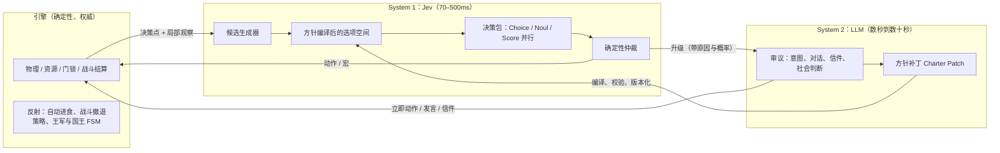
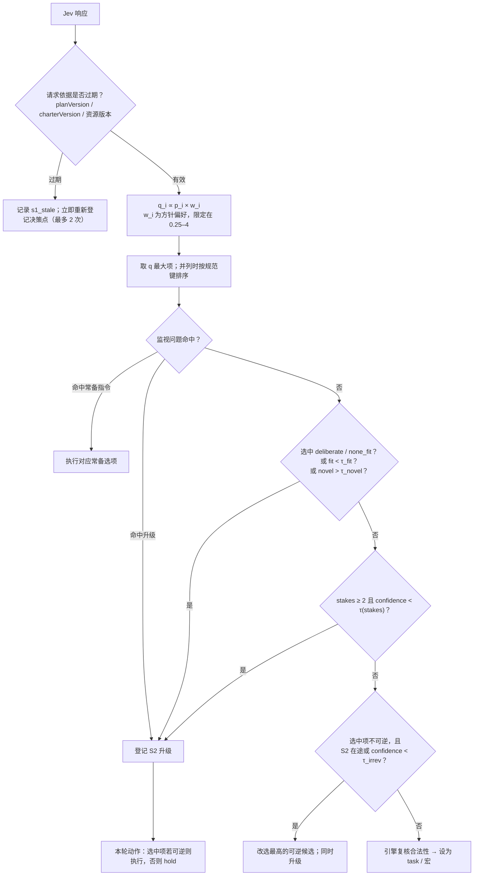
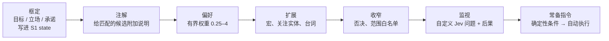
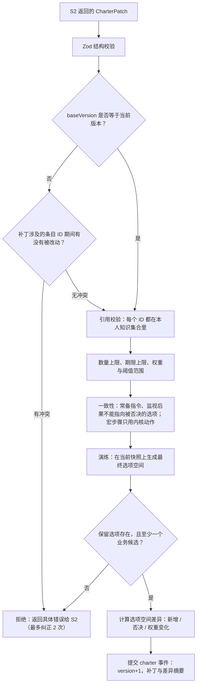
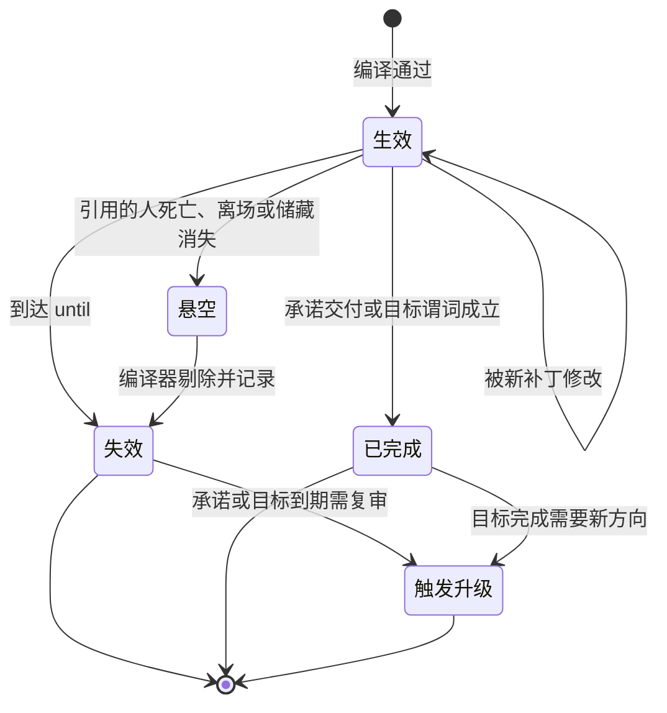
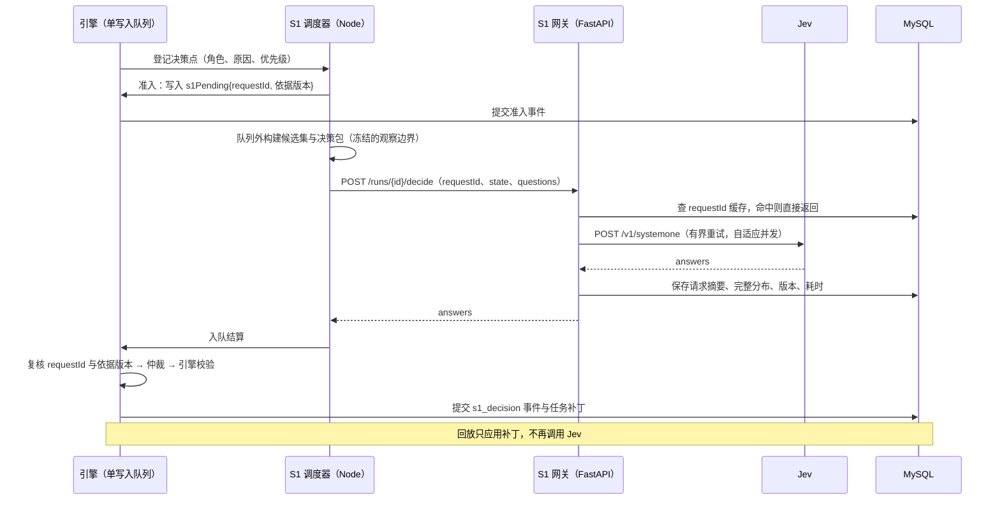

# System 1 / System 2 分层认知架构（设计稿）

状态：设计稿，未实现。适用于连续领地的新实验；已有实验继续使用保存的设置与单 LLM 规划器。本文不改变离散引擎。

Jev 相关事实截至 2026-09-23，来源见文末。Jev 仍处 early access，接口和限额可能变化，实施前须重新核对。

## 0. 摘要

角色的每一个低层行动选择都交给 **System 1（S1，Jev）**：代码从角色的局部观察中枚举出当下合法、可执行、参数已算好的候选动作，Jev 在几百毫秒内给出概率分布，确定性仲裁规则挑出一项交给引擎执行。

**System 2（S2，生成式 LLM）** 不再逐步下达任务，而是 S1 的可选升级项：只在 S1 自己判断“这里需要慢思考”、置信度不足而后果严重、需要生成文字，或 S2 预先设置的触发器命中时才被调用。S2 的主要产出不是一个任务，而是一份 **方针（Charter）**：它用受限的声明式语言改写本角色 S1 的选项空间，包括增加组合动作、否决选项、调整偏好、注入台词、定义新的判断问题和自动执行条件。

引擎仍是唯一的物理事实来源。S1 与 S2 都只产生意图，经过同一套校验后才结算。



## 1. 为什么要拆

当前连续模式下，一次 LLM 规划同时承担“理解局势、决定社会立场、说什么话、下一步具体动作是哪个参数”四件事，而且以固定节拍触发。这带来几类可以从代码和既有记录直接看到的问题。

**时间尺度不匹配。** 游戏一天等于墙钟 120 秒，墙钟 1 秒等于游戏内 12 分钟。一次规划含重试的截止时间是 150 秒，即游戏内 30 小时；即便单次规划只用 20 秒，也相当于游戏内 4 小时。Jev 的 70–500 毫秒约为游戏内 0.8–6 分钟。对“被砸门时要不要出战”“对方刚说完话要不要回应”这类需要即时反应的判断，LLM 的延迟本身就会改变结局。

**高频低层判断占用昂贵调用。** 攻击和破锁每次任务只打一击，每一击之后都要重新下达；取放粮的数量要由模型写进 JSON。旧离散领地分析（`docs/EXPERIMENT_ANALYSIS_20260911.md`）里，同一个超重取粮请求连续失败 46 次、占去当天 92% 的时间，模型还多次弄反了给粮方向。这些都是“选哪一个合法动作、参数取多少”的问题，适合由代码算数、由快模型选择。

**固定节拍唤醒。** 现在规划开始后至少半天、结束后至少四分之一天才会再思考，除非信件送达或听到破门声。模型往往在没有新信息时被叫醒，又在真正需要时来不及。

**单一接口让职责混在一起。** 输出一旦格式错误，整份计划作废，发言与动作一起丢失。社会判断与机械参数共享一次失败。

拆分之后，S2 只负责它不可替代的部分：社会意图、谈判、价值取舍、文字。

## 2. 设计原则

1. **引擎权威不变。** S1 和 S2 都只提出意图；距离、门锁、存量、负重、人物状态和耗时仍由引擎在结算时校验。发言、信件和账簿承诺不等于实物交付。
2. **S1 永远不生成开放内容。** 所有候选由代码从合法动作枚举，数量由代码计算成离散档位，描述中的事实由代码写出。Jev 只做选择、打分和是非判断。它不擅长算术、计数和日期比较，这些不交给它。
3. **S2 是升级项，不是默认路径。** 没有升级时，角色完全由 S1 与引擎驱动；S2 在需要时介入，改变的是 S1 未来如何选择。
4. **选项空间可被本人的 S2 改写，但只能在边界内改写。** 不能创造新的内核动作、不能引用本人不知道的实体、不能读取隐藏状态、不能改别人的选项空间，也不能删除通往 S2 的出口。
5. **自愿行为保持自愿。** 领主的命令对农民只是一条感知，在农民自己的 S1 里变成“遵从 / 拒绝 / 协商”等候选；没有任何规则把服从写死。初始方针不预置社会结果。
6. **信息边界不因批处理而破坏。** 一次 Jev 请求的所有问题共享同一份 state，因此每个请求只包含一个角色的局部信息，不跨角色合并。
7. **失败显式可见。** Jev 或 S2 不可用时，角色保持当前动作和已有日程，并记录可查询的失败状态；不用另一个模型或随机选择悄悄替代，也不补造结果。
8. **全部可回放。** 每次 S1 选择、每次方针变更都以带版本号的事件提交；回放应用补丁，不重新调用 Jev 或 LLM。

## 3. 组件

| 组件       | 位置（建议）                                                       | 职责                                                                                    |
| ---------- | ------------------------------------------------------------------ | --------------------------------------------------------------------------------------- |
| 决策点探测 | `frontend/src/continuous/engine.ts`                                | 在动作完成、受阻、感知变化、方针更新时登记决策点，替代固定 `nextThink` 节拍             |
| 候选生成器 | 新增 `frontend/src/continuous/cognition/affordance.ts`             | 从局部观察和本人知识枚举合法候选，计算数量档位与事实描述                                |
| 方针编译器 | 新增 `cognition/charter.ts`                                        | 校验 S2 方针补丁，应用到候选集，输出最终选项空间及差异                                  |
| 决策包构建 | 新增 `cognition/packet.ts`                                         | 组装 Jev 的 `state` 与 `questions`，与 `scripts/continuous/observation.ts` 共享观察来源 |
| 仲裁器     | 新增 `cognition/arbiter.ts`                                        | 把 Jev 概率、方针偏好、风险闸门合成一个确定性选择，或决定升级                           |
| 宏执行器   | 引擎内                                                             | 按步骤执行组合动作，每步重新校验，维护失败记忆                                          |
| S1 调度器  | `scripts/continuous/server.ts`                                     | 独立于 S2 的准入、限速、在途跟踪与结算                                                  |
| S1 网关    | 新增 `backend/app/continuous_system1.py`                           | 持有 Jev 密钥，调用 `/v1/systemone`，按 requestId 缓存和持久化结果                      |
| S2 审议    | `backend/app/continuous_planning.py`、`continuous_manor_prompt.py` | 保留现有上下文、压缩与格式修复；输出从计划改为审议结果                                  |
| 状态合并   | `backend/app/continuous_state.py`                                  | 与 TypeScript 一致地应用方针补丁与 S1 决策补丁                                          |

## 4. 决策点与节拍

S1 由事件驱动，每个角色同一时间最多一个 S1 请求在途，与 S2 请求互不阻塞。

| 决策点         | 例子                                                    | 最小间隔                     |
| -------------- | ------------------------------------------------------- | ---------------------------- |
| 动作结束       | 显式任务完成、宏完成、到达目的地                        | 无                           |
| 受阻或失败     | `door_locked`、库存不足、负重不足                       | 无，但同原因失败进入失败记忆 |
| 听到话语       | 结束时本人是实际听众的 talk / public_speak / shout      | 同一说话者 10 游戏分钟内合并 |
| 人物进入 12 米 | 税收官走到门口                                          | 同一人物 30 游戏分钟内合并   |
| 信件送达       | 私人信箱新增可读信件                                    | 无                           |
| 危险           | 破门警报、受到攻击、亲见尸体                            | 无，优先级最高               |
| 方针变化       | S2 返回的补丁通过编译                                   | 无                           |
| 巡检           | 以上都没有发生时，每 2 游戏小时评估一次方针里的监视问题 | 2 游戏小时                   |

同一角色在请求在途期间产生的新决策点合并进下一次请求，不排队重放。宏执行中途的普通感知（非危险）只触发“继续 / 中断”的轻量决策包。

吞吐预算以 Jev 公布的限额为边界：每分钟 1200 次请求（约每秒 20 次），每秒 25 万输入 token。32 名角色如平均每人每游戏日 30 个决策点，相当于每秒约 8 次请求；危险时段会集中爆发，因此调度器按优先级（危险 > 被直接说话 > 动作结束 > 巡检）排队，并使用自适应并发：收到 429 / 529 时减半，成功后逐步恢复。

## 5. 把原子动作编译成 Jev 可选的候选

### 5.1 从开放计划到封闭候选

现在的 LLM 输出一份开放 JSON：`task.kind` 加任意 `target`、`amount`、`item`、`text`。S1 反过来：代码先列出此刻所有合理的具体动作，每一项都已经是完整、可执行的 `Task`（或宏），Jev 只需要选。

| 内核动作                           | 候选如何生成                                                               | 参数来源                                 | 标签             |
| ---------------------------------- | -------------------------------------------------------------------------- | ---------------------------------------- | ---------------- |
| `navigate`                         | 本人住处与田、可达的公共地点、方针关注的实体最后已知位置、当前可见人物附近 | 地图与本人记忆，不读取他人实时位置       | `move` 可逆      |
| `farm`                             | 本人熟悉或方针指定、仍需劳动或待收获的田                                   | 田状态仅在可见范围或本人田地             | `work` 可逆      |
| `supply` / `take`                  | 本人有权限且当前可见或记得的储藏                                           | 数量档位（见 5.2）                       | `resource` 代价  |
| `put` / `deliver` / `tribute`      | 同上                                                                       | 数量档位                                 | `resource` 代价  |
| `give`                             | 12 米内的活人                                                              | 数量档位，描述写明方向“从你身上交给对方” | `resource` 代价  |
| `craft`                            | 在工坊且随身材料满足配方的物品                                             | 配方表                                   | `work` 代价      |
| `attack`                           | 可达范围内的可见活人                                                       | 无                                       | `violent` 不可逆 |
| `break_lock`                       | 本人附近的锁门或储藏                                                       | 无                                       | `violent` 不可逆 |
| `unlock` / `lock` / `grant_access` | 本人持钥匙且在门边的门；授权对象为 12 米内的人                             | 无                                       | `access` 代价    |
| `write` / `show`                   | 持有的账簿、现场告示板                                                     | 文本只能来自台词卡                       | `record`         |
| `write_letter` / 审信              | 见第 10 节                                                                 | 文本来自 S2 或台词卡                     | `letter`         |
| 发言                               | 台词卡中可用的台词 × 当前在范围内的听众                                    | 发言方式由听众距离决定                   | `speech`         |
| `rest` / `guard` / 等待            | 当前位置及方针指定的驻留地                                                 | 无                                       | 可逆             |

每个候选有稳定的规范键，例如 `take:grain@home-3#reserve(3)`、`give:grain>agent:2#commitment(C1)`、`attack:agent:2`。键用于失败记忆、偏好规则、日志和校准统计，所以同一动作在不同时刻应得到相同的键。

生成时已剔除引擎能确定不合法的项：没有钥匙、没有库存、背包已满、目标不存在。剔除原因不丢弃，留在 state 的“不可用动作”摘要里，让 Jev 和之后的 S2 知道为什么不能做。

### 5.2 数量：代码计算，Jev 选档

Jev 不做算术，所以一个“取粮”动作展开成若干档位，每档的公斤数由代码按当前库存、负重和承诺算好：

| 档位表达式                       | 含义                                           |
| -------------------------------- | ---------------------------------------------- |
| `reserve(d)`                     | 补足到 d 天口粮（d 取 1、2、3、5、方针设定值） |
| `carried(item)`                  | 身上该物品的全部                               |
| `carriedAbove(item, reserve(d))` | 身上超过 d 天口粮的部分                        |
| `capacityLeft`                   | 取到负重上限                                   |
| `commitment(C).remaining`        | 某项承诺尚未交付的数量                         |
| `fixed(kg)`                      | S2 在方针中写定的固定数值                      |
| `min(a, b)`、`max(a, b)`         | 以上表达式至多两层组合                         |

每档实际数值会先按库存和负重截断，截断后与其他档相同的合并为一项。候选描述写明截断后的真实数值和剩余量，例如“从 home-3 取 2.21kg 粮，补足到 3 天口粮；取后仍剩 11.4kg；负重余量 18.3kg”。这就从生成源头消除了“请求超过负重再反复失败”一类问题。

### 5.3 描述：事实由代码写，判断交给 Jev

Jev 的 Choice 选项描述接受 JSON。每个候选的描述包含：

```json
{
  "动作": "把身上 15.00kg 粮放进 reeve-chest",
  "方向": "从你身上转出",
  "为什么可行": "你在 reeve-chest 旁，粮箱未上锁",
  "之后": "你身上剩 2.21kg，约 3 天口粮",
  "关联": "承诺 C1：答应村长 #7 在 D35 日落前交 15kg",
  "性质": "代价：粮食离开你的控制"
}
```

所有数字、方向和因果都由代码生成；“关联”和额外注解可以来自方针（第 9 节）。这样 Jev 在判断时依据的是明确事实，不需要自己推算。

### 5.4 系统保留选项

Choice 的概率必须加总为 1，没有弃权能力；只提供业务选项，它就会把“其实都不合适”的概率压到最不差的那一项上。因此每个决策包都注入三个不可删除的选项：

| 保留选项     | 含义                                                     | 结果                   |
| ------------ | -------------------------------------------------------- | ---------------------- |
| `hold`       | 继续当前动作或宏；空闲时按已有日程行事                   | 不产生新任务           |
| `deliberate` | 这里需要停下来认真想，例如新情况、道德冲突、要谈判或写字 | 升级给 S2，同时 `hold` |
| `none_fit`   | 候选里没有符合此人目标与处境的动作                       | 升级给 S2，同时 `hold` |

另外用一个独立的 Noul 问“至少有一个候选符合此人当前目标与承诺吗”。Choice 是相对判断，Noul 是绝对判断，两者可以不一致；TypeSafe 自己的 jaggedness 说明里就有这样的例子。这里把这种不一致当作信号：Choice 选中业务项、而这个 Noul 很低时，同样升级。

### 5.5 超过 255 项：一次往返内的分层选择

候选超过 200 项（为保留选项和余量留空间）时，不做两次往返。同一请求里同时发出：一个“类别”Choice（移动、劳动、资源、社交、冲突、记录……），以及每个类别内部的 Choice。仲裁器先取类别的最大项，再取该类别内的最大项。问题数量只受 token 预算限制，同一请求内的问题并行计算，延迟与单个问题接近。

## 6. 决策包：一次 Jev 请求的结构

### 6.1 state

state 以结构化 JSON 发送，键用英文，值用简短中文。Jev 的长上下文会随无关材料增多而降低准确率（官方称 context rot），且官方说明中日韩文字效果弱于英文，所以 state 刻意保持短，目标 1.5k–3k token，硬上限远低于 32k。

```ts
type S1State = {
  now: { day: number; clock: string; seq: number };
  self: {
    id: number;
    role: string;
    bio: string; // 背景的压缩版，由 S2 维护
    hp: number;
    satiety: number;
    grainKg: number;
    loadLeftKg: number;
    doing: string;
    blocked?: string;
  };
  charter: {
    // 方针摘要，第 9 节
    goals: string[];
    stance: string[];
    commitments: { id: string; text: string; due?: string; remaining?: string }[];
  };
  nearby: { people: string[]; audibleTalk: number[]; audibleShout: number[]; stores: string[] };
  news: { seq: number; text: string; toMe?: boolean }[]; // 自上次决策以来本人实际经历，最多 12 条
  inbox: { id: string; from: number; act: string; text: string }[]; // 未处理的请求、命令、提议
  unavailable: string[]; // 被引擎剔除的动作及原因，最多 8 条
  recentFailures: string[]; // 失败记忆
  s2: { pending: boolean; lastIntent: string };
  treasuryReport?: string; // 仅财政官
};
```

`news` 只包含本人是实际听众或亲历的事件，与现有 `observation()` 的过滤口径一致；财政报表仍然只有财政官能看到。

### 6.2 questions

| 问题键    | 类型        | 用途                                                                                 |
| --------- | ----------- | ------------------------------------------------------------------------------------ |
| `next`    | Choice      | 下一步动作；候选 + 三个保留选项                                                      |
| `fit`     | Noul        | 至少有一个候选符合目标与承诺                                                         |
| `stakes`  | Score，5 级 | 这一步做错的后果：无所谓 / 小损失 / 明显损失 / 伤及生存或关系 / 不可挽回             |
| `novel`   | Noul        | 当前局面是否超出方针所预期的情况                                                     |
| `act_k`   | Choice      | 每条新听到的话属于哪类言语行为：请求、命令、提议、承诺、威胁、提问、信息、闲谈、其他 |
| `to_me_k` | Noul        | 这句话是否针对本人                                                                   |
| `map_k`   | Choice      | 若是请求或命令，它对应当前哪个候选；可选 `not_actionable`                            |
| `watch_*` | 方针定义    | S2 自定义的监视问题，最多 12 个                                                      |

`act_k`、`to_me_k`、`map_k` 的结果在结算时写入本人的 `inbox`，下一次决策中生成“回应”“遵从”“拒绝”一类候选（第 10 节）。

### 6.3 请求与响应示例

示例中的角色和储藏 ID 为说明用途。

```json
{
  "model": "jev-1.13.0",
  "state": {
    "now": { "day": 35, "clock": "11:04", "seq": 48213 },
    "self": {
      "id": 14,
      "role": "农户",
      "bio": "四口之家的父亲，谨慎，和邻居有田界纠纷",
      "hp": 100,
      "satiety": 72,
      "grainKg": 2.21,
      "loadLeftKg": 26.1,
      "doing": "在 plot-27 耕作"
    },
    "charter": {
      "goals": ["保住全家到下次收获的口粮"],
      "stance": ["对领主表面顺从，但不愿多交"],
      "commitments": [{ "id": "C1", "text": "答应村长#7交15kg到村仓", "remaining": "0kg，已完成" }]
    },
    "nearby": {
      "people": ["税收官罗兰#2 活着 距离4米，佩剑"],
      "audibleTalk": [2],
      "audibleShout": [2, 15],
      "stores": []
    },
    "news": [
      {
        "seq": 48210,
        "text": "罗兰#2 对你说：你家还欠10kg，今天交出来，不然我破门。",
        "toMe": true
      }
    ],
    "inbox": [],
    "s2": { "pending": false, "lastIntent": "按村长说的交一半，保留三天口粮" }
  },
  "questions": {
    "next": {
      "type": "choice",
      "instructions": "这个人此刻最可能采取哪一个动作？只依据 state 中的事实与此人的方针。",
      "criteria": {
        "hold": "继续在 plot-27 耕作",
        "say:L2@agent:2": {
          "动作": "对罗兰说（台词L2）：今年歉收，我已经交了15kg到村仓，家里只够吃到收获。"
        },
        "navigate:home-3": { "动作": "走回家（约140米）", "之后": "可以在家门口与罗兰对峙或锁门" },
        "attack:agent:2": { "动作": "攻击罗兰", "性质": "不可逆；对方持剑着甲" },
        "deliberate": "需要停下来认真考虑怎么应对",
        "none_fit": "以上都不符合此人的处境"
      }
    },
    "fit": { "type": "noul", "instructions": "候选动作中是否至少有一个符合此人的目标与承诺？" },
    "stakes": {
      "type": "score",
      "instructions": "此刻做错选择的后果有多严重？",
      "criteria": ["无所谓", "小损失", "明显损失", "伤及生存或重要关系", "不可挽回"]
    },
    "act_0": {
      "type": "choice",
      "instructions": "news seq=48210 这句话属于哪类言语行为？",
      "criteria": {
        "request": null,
        "order": null,
        "offer": null,
        "promise": null,
        "threat": null,
        "question": null,
        "information": null,
        "smalltalk": null,
        "other": null
      }
    },
    "watch_W1": {
      "type": "noul",
      "instructions": "是否有武装随从正在威胁要强行拿走此人家里的粮食？"
    }
  }
}
```

一个可能的响应（数值为示意）：

```json
{
  "answers": {
    "next": {
      "choice": "say:L2@agent:2",
      "confidence": 0.61,
      "probabilities": {
        "say:L2@agent:2": 0.58,
        "deliberate": 0.21,
        "navigate:home-3": 0.12,
        "hold": 0.05,
        "attack:agent:2": 0.02,
        "none_fit": 0.02
      }
    },
    "fit": { "noul": 0.83 },
    "stakes": { "score": 3.1, "confidence": 0.7 },
    "act_0": { "choice": "threat", "confidence": 0.74 },
    "watch_W1": { "noul": 0.91 }
  }
}
```

这次的结果是：先说台词 L2；监视问题 W1 命中，同时升级给 S2（第 7、8 节）。

## 7. 仲裁：从概率到一个确定的选择



几点细节：

- **偏好 `w_i` 有界。** S2 可以让某类动作更可能或更不可能，但不能用权重把某个选择钉死；要强制某件事，必须用否决（收窄）或常备指令（自动执行），这两者受更严格的数量和期限限制（第 9 节）。
- **阈值按问题键分别标定。** `τ_fit`、`τ(stakes)`、`τ_irrev` 等在第 16 节的离线阶段按问题标定，不在不同问题之间共用，也不在 Noul 与 Choice 之间搬用。模型版本固定为具体版本号（如 `jev-1.13.0`），升级版本时重新标定。
- **不可逆动作守卫。** 攻击、破锁、交出大部分口粮等标记为不可逆或高代价的动作，在 S2 正在审议时，需要更高置信度才会执行；否则先做可逆动作并等待 S2。这避免“慢思考还没回来，快思考先动了刀”。
- **选择是确定的。** 仲裁对同一份 Jev 响应总得到同一个结果；Jev 响应本身连同请求一起持久化，回放不重新调用。

## 8. System 2：作为升级项

### 8.1 升级触发

| 触发         | 来源                                         | 说明                             |
| ------------ | -------------------------------------------- | -------------------------------- |
| S1 主动请求  | 选中 `deliberate` / `none_fit`               | 快思考自己认为需要慢思考         |
| 选项不合适   | `fit` 低于阈值，或 `novel` 高于阈值          | 方针没有覆盖当前局面             |
| 高风险低把握 | `stakes` 高且置信度低                        | 按风险等级分段阈值               |
| 需要文字     | 选中“写信”“回应某人”而台词卡里没有合适台词   | S1 不生成文字                    |
| 方针触发器   | `watch_*` 命中且绑定到升级                   | S2 事先决定“遇到这种事叫我”      |
| 确定性到期   | 承诺到期未完成、目标完成或失败、方针条目过期 | 代码判断，不经 Jev               |
| 连续失败     | 同一宏连续 3 次失败                          | 执行层问题上报                   |
| 初次审议     | 开局                                         | 角色的第一份方针由本人的 S2 写出 |

没有固定节拍的全员规划。实验可选开启“每日晨间反思”（每人每游戏日至多一次，错峰），默认关闭，以便测量纯升级模式下 S2 的实际频率。

### 8.2 调度

- 每个角色最多一个 S2 请求在途，沿用现有的请求 ID、计划版本和结算复核。
- 在途期间新增的触发合并进同一个待处理包；S2 返回后，这些触发一起标记为已处理或写明放弃原因。
- 升级队列按 `风险等级 × 等待时间` 排序；危险触发优先。全局并发沿用实验配置的规划并发上限。
- 不重新引入全局调用次数或 token 预算这类停机条件；上下文窗口、并发、超时和有限重试仍然是独立机制。
- S2 在途时 S1 继续工作：依据旧方针、不可逆守卫更严格。

### 8.3 S2 的输入

保留现有的稳定前缀、个人背景、追加历史与窗口压缩（`continuous_memory.py`、`continuous_planning.py`）。每次审议追加三块新内容：

1. **升级原因**：触发列表，以及触发时的 S1 概率和置信度摘要。
2. **S1 行动摘要**：自上次审议以来 S1 替本人做了什么、结果如何、哪些失败。没有这一块，S2 就不知道“自己的身体”做过什么。
3. **当前方针与可用候选目录**：S2 能看到 S1 此刻面对的选项（规范键 + 简述），以便引用。

### 8.4 S2 的输出

```ts
type Deliberation = {
  intent: string; // 给 UI、历史和 S1 state 的简短意图
  now?: { option: string } | { task: Task }; // 立即执行：引用候选键，或给出一个内核任务
  speech?: { mode: 'talk' | 'public_speak' | 'shout'; text: string };
  charter?: CharterPatch; // 第 9 节
  resolved?: string[]; // 处理掉的触发 ID
};
```

`now` 与 `speech` 在结算时优先于 S1 的当前选择，但仍经过版本复核和引擎校验。`charter` 经编译器校验，整份补丁要么全部生效，要么全部拒绝；拒绝时把具体错误返回给 S2，沿用现有“最多纠正两次”的格式修复流程，并保留原始回复供诊断。

### 8.5 运行模式

| 模式            | 说明                                              | 用途                           |
| --------------- | ------------------------------------------------- | ------------------------------ |
| `legacy`        | 现有单 LLM 规划器                                 | 已有实验；对照组               |
| `s1s2`          | 本文架构                                          | 目标模式                       |
| `s1-only`       | 关闭 S2；方针为空；没有台词卡，因此不说话、不写信 | 物理与后勤基线，不代表社会行为 |
| `legacy+shadow` | 规划仍由 LLM 执行，S1 同时计算但不执行            | 评估与标定                     |

S1 的决策提供者也显式配置：`jev`，或 `llm-choice`（用生成式模型在同一份候选上输出选择与概率，用于对照实验，或在 Jev 不可用的地区使用）。这是实验设置的一部分并写入保存的配置，不是运行中的自动替补。

## 9. 方针：S2 如何改变 S1 的选项空间

这是本架构的核心。S2 不直接“指挥身体”，而是改写本人快思考所面对的选项、所知道的立场和会触发慢思考的条件。

### 9.1 七种杠杆，由弱到强



| 杠杆     | 作用                                            | 典型用法                                       | 强度与限制                                                       |
| -------- | ----------------------------------------------- | ---------------------------------------------- | ---------------------------------------------------------------- |
| 框定     | 把目标、立场、承诺写进 S1 state                 | “对领主表面顺从但不愿多交”                     | 最弱：只影响 Jev 的判断语境；目标最多 5、立场最多 6、承诺最多 10 |
| 注解     | 给匹配选择器的候选附加一段说明                  | 给交粮动作注明“这是我答应村长的”               | 不改变候选集合；每条注解最多 80 字                               |
| 偏好     | 给匹配的候选乘以权重                            | 收获前一周“耕作 ×2”                            | 权重限定在 0.25–4；多条规则相乘后再截断；必须带期限              |
| 扩展     | 增加宏、把记忆中的实体加入候选生成、增加台词    | 定义“交税”宏；把“去找 #9”加入候选              | 宏最多 24 个、台词最多 16 条、关注实体最多 8 个                  |
| 收窄     | 否决匹配的候选；或进入范围白名单模式            | “不攻击领主家人”；戒严时只保留守卫、攻击和撤退 | 必须带期限（最长 5 游戏天）；不能删除保留选项                    |
| 监视     | 定义新的 Noul / Score / Choice 问题，并绑定后果 | “若随从威胁强征我家粮食 → 叫醒我”              | 最多 12 个；后果只能是升级、临时偏好或触发一个已有选项           |
| 常备指令 | 确定性条件满足时直接执行某个选项，不经 Jev      | “身上粮少于 1 天且在家 → 从家里补足到 3 天”    | 最强：最多 6 条，必须带期限；条件只能用确定性谓词                |

现有的 `routine`（自动补粮、农活、存粮、闲暇去处）在新架构里就是几条预定义的常备指令，因此可以平滑迁移：`hold` 且没有任务时，行为与现在的自动日程一致。

### 9.2 边界：能做与不能做

| S2 可以                              | S2 不可以                                                               |
| ------------------------------------ | ----------------------------------------------------------------------- |
| 用内核动作和数量表达式组合出宏       | 创造新的内核动作，或改变耗时、距离、伤害、容量等物理参数                |
| 引用本人知道的地点、人物、储藏、承诺 | 引用本人从未见过或听说过的实体；谓词读取他人库存等隐藏状态              |
| 改写本人的选项空间                   | 改写他人的选项空间；命令只以感知形式进入他人的 S1                       |
| 否决、偏好、监视，均带期限           | 删除 `hold` / `deliberate` / `none_fit`，或把自己的升级阈值调到永不升级 |
| 写固定数量 `fixed(kg)`               | 让 Jev 计算数量或比较日期                                               |
| 写台词供 S1 在合适时说出             | 让 S1 生成新的文字                                                      |

“本人知道的实体”由一个知识集合维护：地图地点（所有人已知）、亲眼见过的人和储藏、从话语和信件中听说的人名 ID、本人持有的物品与账簿。知识集合随经历增长，并随状态一起持久化；编译器用它校验方针里的每个引用。

### 9.3 数据结构

```ts
type Selector = {
  kind?: Task['kind'] | 'macro' | 'say';
  target?: string; // 精确 ID，或前缀，如 'agent:'
  item?: string;
  tag?: 'move' | 'work' | 'resource' | 'violent' | 'access' | 'record' | 'letter' | 'speech';
  key?: string; // 精确候选键
};

type Quantity =
  | { q: 'fixed'; kg: number }
  | { q: 'reserve'; days: number }
  | { q: 'carried'; item: string }
  | { q: 'carriedAbove'; item: string; days: number }
  | { q: 'capacityLeft' }
  | { q: 'commitment'; id: string }
  | { q: 'min' | 'max'; of: [Quantity, Quantity] }; // 至多两层

type Predicate =
  // 常备指令与宏前置条件，只读本人可知的事实
  | { p: 'grainBelow'; days: number }
  | { p: 'satietyBelow'; value: number }
  | { p: 'at'; site: string }
  | { p: 'timeBetween'; from: string; to: string } // 游戏钟点
  | { p: 'before'; day: number }
  | { p: 'present'; agent: number; withinM: 12 | 75 }
  | { p: 'commitmentOpen'; id: string }
  | { p: 'inboxHas'; act: string; from?: number }
  | { p: 'all' | 'any'; of: Predicate[] }; // 至多两层

type Macro = {
  id: string;
  label: string;
  note?: string;
  steps: { task: Omit<Task, 'amount'> & { amount?: Quantity } }[]; // 最多 6 步
  requires?: Predicate;
  abortIf?: Predicate;
  reversibility: 'reversible' | 'costly' | 'irreversible';
};

type Watch = {
  id: string;
  question:
    | { type: 'noul'; instructions: string }
    | { type: 'score'; instructions: string; criteria: string[] }
    | { type: 'choice'; instructions: string; criteria: Record<string, string | null> };
  when: { gt?: number; lt?: number; is?: string }; // 阈值由 S2 给出，编译器检查取值范围
  then: { escalate: true } | { prefer: Selector; w: number; forMin: number } | { run: string };
  cooldownMin: number; // 触发后的冷却，游戏分钟
};

type Charter = {
  version: number;
  goals: { id: string; text: string; until?: number }[];
  stance: { id: string; text: string }[];
  commitments: {
    id: string;
    to?: number;
    text: string;
    quantity?: Quantity;
    dueAt?: number;
    status: 'open' | 'done' | 'dropped';
  }[];
  annotate: { id: string; match: Selector; note: string; until: number }[];
  prefer: { id: string; match: Selector; w: number; until: number }[];
  forbid: { id: string; match: Selector; until: number; why: string }[];
  scope?: { allow: Selector[]; until: number; why: string };
  macros: Macro[];
  focus: { id: string; entity: string; why: string; until: number }[];
  lines: {
    id: string;
    text: string;
    to?: number[];
    mode?: 'talk' | 'public_speak' | 'shout';
    until?: number;
    maxUses: number;
  }[];
  watches: Watch[];
  standing: { id: string; when: Predicate; run: string; until: number }[];
  escalation: { stricterFor?: Selector[]; minStakes?: 1 | 2 | 3 }; // 只能比默认更敏感
};

type CharterPatch = {
  baseVersion: number;
  ops: (
    | {
        op: 'put';
        section: keyof Omit<Charter, 'version' | 'scope' | 'escalation'>;
        value: { id: string } & Record<string, unknown>;
      }
    | { op: 'remove'; section: keyof Omit<Charter, 'version' | 'scope' | 'escalation'>; id: string }
    | { op: 'setScope'; value: Charter['scope'] | null }
    | { op: 'setEscalation'; value: Charter['escalation'] }
  )[];
};
```

补丁以条目 ID 为单位增删改，不整体覆盖方针，这样补丁可以与代码自动产生的更新（承诺状态变化、条目到期）并存。

### 9.4 编译与校验



编译器错误不会被吞掉或静默修正。纠正次数用完后，方针保持原版本，升级触发保持未处理状态并进入冷却，失败原因在 UI 和 S2 下一次输入中可见。

### 9.5 生命周期



到期、悬空和完成都由代码确定性判断，并作为事件提交。承诺到期未完成、主要目标完成或失败时会触发升级；普通偏好到期只是恢复默认，不叫醒 S2。

### 9.6 防退化

| 风险                                   | 措施                                                                             |
| -------------------------------------- | -------------------------------------------------------------------------------- |
| S2 用常备指令把角色写成脚本，S1 被架空 | 常备指令最多 6 条、必须带期限；统计“常备指令执行占比”，高于设定值时在 UI 标记    |
| 否决过多导致无路可走                   | 演练阶段要求至少一个业务候选；运行中候选为空时升级而不是静默等待                 |
| 权重叠加形成事实上的强制               | 多条规则相乘后截断在 0.25–4                                                      |
| 方针与现实脱节                         | 条目带期限；引用失效即悬空；S1 的 `fit` 与 `novel` 随时把问题推回 S2             |
| 升级太少，S1 在关键时刻独断            | 升级阈值只能被 S2 调得更敏感；不可逆动作守卫；抽样用 S2 离线复核 S1 的高风险选择 |
| 升级太频繁，退化成现有架构             | 统计每角色日的升级次数与原因；同一触发冷却；合并在途期间的触发                   |
| 选项顺序影响选择                       | 候选按规范键固定排序；离线阶段用打乱顺序测试位置偏差                             |

### 9.7 示例：一次 S2 审议返回的方针补丁

背景：D34 傍晚，农户 #14 听到村长 #7 在广场公开说“明天各家把粮交到村仓”。S1 选择了 `deliberate`。S2 决定按惯例交一半，但保留三天口粮，并预判税收官可能上门。

```json
{
  "intent": "明天按村长说的交15kg到村仓，家里至少留够吃到收获",
  "charter": {
    "baseVersion": 3,
    "ops": [
      {
        "op": "put",
        "section": "commitments",
        "value": {
          "id": "C1",
          "to": 7,
          "text": "答应村长#7在D35日落前交15kg到村仓",
          "quantity": { "q": "fixed", "kg": 15 },
          "dueAt": 3002400000,
          "status": "open"
        }
      },
      {
        "op": "put",
        "section": "macros",
        "value": {
          "id": "pay_tax",
          "label": "从家里取粮交到村仓",
          "steps": [
            {
              "task": {
                "kind": "take",
                "target": "home-3",
                "item": "grain",
                "amount": { "q": "commitment", "id": "C1" }
              }
            },
            {
              "task": {
                "kind": "put",
                "target": "reeve-chest",
                "item": "grain",
                "amount": {
                  "q": "min",
                  "of": [
                    { "q": "commitment", "id": "C1" },
                    { "q": "carriedAbove", "item": "grain", "days": 3 }
                  ]
                }
              }
            }
          ],
          "abortIf": { "p": "grainBelow", "days": 3 },
          "reversibility": "costly"
        }
      },
      {
        "op": "put",
        "section": "prefer",
        "value": { "id": "P1", "match": { "key": "macro:pay_tax" }, "w": 2, "until": 3002400000 }
      },
      {
        "op": "put",
        "section": "lines",
        "value": {
          "id": "L2",
          "to": [2],
          "text": "今年歉收，我已经交了15kg到村仓，家里只够吃到收获。",
          "maxUses": 2
        }
      },
      {
        "op": "put",
        "section": "watches",
        "value": {
          "id": "W1",
          "question": {
            "type": "noul",
            "instructions": "是否有武装随从正在威胁要强行拿走此人家里的粮食？"
          },
          "when": { "gt": 0.7 },
          "then": { "escalate": true },
          "cooldownMin": 120
        }
      },
      {
        "op": "put",
        "section": "stance",
        "value": { "id": "S1", "text": "对领主表面顺从，但不愿多交" }
      }
    ]
  }
}
```

`3002400000` 是内部时间 `34 * DAY + 18h`，即 UI 上的 D35 18:00。编译器会检查：`home-3`、`reeve-chest`、#2、#7 都在 #14 的知识集合中；宏只有两步且只用 `take`、`put`；偏好权重和期限在范围内；数量都是表达式，没有让 Jev 计算。

## 10. 语言与社交

S1 不生成文字，而这个实验的核心是社会行为。文字的来源和使用时机因此分开设计。

**台词卡。** 台词全部由 S2 写出，附带适用对象、发言方式和最多使用次数。只有当台词的对象在对应范围内时，才生成 `say:Lk@agent:x` 候选；发言方式按听众距离自动取 talk 或 shout。每条台词对同一听众重复使用受 `maxUses` 限制，避免鹦鹉学舌。代码不生成寒暄模板，以免用机械话语掩盖社会互动的消失。

**言语行为分类与收件箱。** 每条新听到的话都在当次决策包里分类（`act_k`、`to_me_k`、`map_k`）。针对本人的请求、命令、提议、提问进入收件箱，带来源事件序号和期限。收件箱条目生成三类候选：

- `comply:<条目>`：只有 `map_k` 把请求对应到某个具体候选时才出现，执行的就是那个候选；
- `reply:<条目>`：有合适台词时直接说，否则升级给 S2 写回应；
- `decline:<条目>`：有拒绝台词时直接说；没有时标记为“未回应”，同样可以升级。

这让“服从”始终是本人从几个候选中选出来的，而不是被规则执行的。

**信件。** 写信只能由 S2 完成：S1 选中 `compose_letter:agent:x` 时升级。管家的审信是典型的 S1 任务：对每封待审信件生成 `forward_letter:<信件>`、`hold`，以及需要理由的 `reject_letter:<信件>`；理由来自台词卡或升级。

**公开讲话与喊话。** 与台词卡相同处理；听众集合以发言结束时的实际范围为准，沿用现有规则。

## 11. 执行层：宏与失败记忆

- 宏按步骤执行，每一步开始时重新计算数量表达式，并调用引擎现有的 `validateOperation`、`accessible`、负重与库存校验。中断移动从真实位置继续，中断劳动保留已完成部分，预留的取放粮按现有路径释放。
- 宏执行期间的非危险感知只触发“继续 / 中断”决策包；危险感知触发完整决策包。
- **失败记忆**：记录 `(候选键, 失败原因码, 资源版本)`。同一候选在资源版本未变化、且 2 游戏小时内不会再次出现在候选集中；失败原因写进 state 的 `recentFailures`。同一宏连续失败 2 次形成决策点，3 次升级给 S2。这直接对应旧实验里“同一取粮请求连续失败 46 次”的问题。
- 现有反射保持不变：自动进食、战斗撤退策略、税齐后使者自动离场、王军与国王的确定性规则。它们不经 S1。

## 12. 异步、持久化与回放



**状态字段。** `Agent` 新增 `s1Pending`、`charter`、`knowledge`、`inbox`、`macro`（执行进度）、`failures`。这些字段都会影响后续行为，因此都必须能从事件补丁回放：TypeScript 类型、Python `continuous_state.py` 的合并语义、观察、提示词和 UI 同步修改。

**补丁形态。** 方针变更使用独立的 `patch.charter = { agentId, baseVersion, version, ops }`，快照中保存完整方针；不在每个事件里重复整份方针，也不能被无关的 `meta.manor` 补丁覆盖。`s1_decision` 事件只携带决策 ID、选中键、仲裁原因码和少量摘要，完整概率分布放在网关的 `s1_decisions` 表里，按 requestId 查询。

**MySQL 表（建议）。**

| 表                 | 内容                                                                                                  |
| ------------------ | ----------------------------------------------------------------------------------------------------- |
| `s1_decisions`     | requestId、实验、角色、依据版本、选项空间哈希、选中键、仲裁原因、各问题的概率与置信度、耗时、模型版本 |
| `s1_option_sets`   | 按内容哈希去重的候选描述集合，便于复盘“当时 Jev 看到了什么”                                           |
| `charter_versions` | 每个角色每个版本的补丁、差异摘要、来源（S2 请求 ID 或代码到期）                                       |

**失败处理。** Jev 请求对超时、网络错误、429 / 529 做有界退避重试，401 等明确错误直接返回。重试用完后提交 `s1_failed` 事件，角色保持当前动作与已有日程，决策点带退避重新登记。若最近 5 分钟墙钟内 S1 成功率低于配置值，实验自动暂停并在 UI 显示原因，避免实验在 S1 失效的情况下连续运行数小时而不被察觉。持久化失败沿用现有规则：停止推进，不让世界与数据库分叉。

## 13. 信息边界与安全

- 每个 Jev 请求只包含一个角色的局部信息；不跨角色合并请求，即使这样更便宜。
- 候选生成器只读取观察中可见的库存和本人记忆中的位置；不可见储藏只出现“去现场查看”的候选，不附带数量。
- 常备指令和宏的谓词只读取本人身体、背包、可见现场、本人承诺与收件箱。
- 财政官的精确报表只进入财政官的 state。
- `TYPESAFE_API_KEY` 只由 Python 网关从 `.env` 读取，不进入前端、日志或报告。state 会发送给第三方服务，需在实验说明中注明。
- Jev 不作为安全边界使用；所有安全和合法性判断由引擎和编译器执行。

## 14. 完整案例：D35 交税日

以下为说明性的时间线，数值为示意。农户 #14 使用第 9.7 节的方针；税收官罗兰 #2 有他自己的 S1 与方针（例如“按领主命令收齐各户应缴粮”）。

| 游戏时间        | 墙钟间隔  | 发生了什么                                                                                                                                                                 | 由谁决定  |
| --------------- | --------- | -------------------------------------------------------------------------------------------------------------------------------------------------------------------------- | --------- |
| D34 18:20       | —         | 听到村长公开讲话；S1 选 `deliberate`                                                                                                                                       | S1 → 升级 |
| D34 18:20–21:40 | 约 17 秒  | S2 审议，返回方针补丁（承诺 C1、宏 `pay_tax`、台词 L2、监视 W1）                                                                                                           | S2        |
| D35 07:10       | —         | 回到家，动作结束；S1 在 41 个候选中选 `macro:pay_tax`（偏好 ×2 后 q=0.71，`fit`=0.93，`stakes`=1.2）                                                                       | S1        |
| D35 07:40       | —         | 宏第二步把 15kg 放进村仓，承诺 C1 标记完成；S1 选去 plot-27 耕作                                                                                                           | 引擎 + S1 |
| D35 11:02       | —         | 罗兰走到 4 米内并说“你家还欠10kg……不然我破门”；言语行为判为威胁，W1=0.91 命中                                                                                              | S1        |
| D35 11:03       | 约 0.3 秒 | 仲裁：先说台词 L2（可逆），同时升级给 S2                                                                                                                                   | S1        |
| D35 11:40       | —         | 罗兰开始砸 home-3 的门，#14 听到破门警报；候选中 `attack:agent:2` 被不可逆守卫拦下（S2 在途、置信度 0.44），S1 选 `navigate:home-3` 并对邻居 #15 喊话（台词来自上一轮 S2） | S1        |
| D35 约 14:30    | 约 17 秒  | S2 返回：决定交出 5kg 换取不再破门，写一句新的谈判台词并立即说出；更新立场                                                                                                 | S2        |

在现有架构下，从 11:02 到 S2 回复的这段游戏时间里，#14 只能继续执行旧任务。拆分之后，即时反应由 S1 完成，关键的社会取舍仍由本人的 S2 做出。

## 15. 容量与成本估算

以下是按公开价格与限额的估算，不是实测：

| 项               | 假设                               | 估算                                                       |
| ---------------- | ---------------------------------- | ---------------------------------------------------------- |
| S1 请求量        | 32 人 × 每游戏日 30 个决策点       | 每游戏日 960 次，约每秒 8 次                               |
| 单次输入         | state 2.5k + 候选与问题 1.5k token | 约 4k token                                                |
| 每游戏日 S1 输入 | 960 × 4k                           | 约 384 万 token，约 $0.16                                  |
| 150 天实验       | —                                  | 约 5.8 亿 token，约 $24                                    |
| token 吞吐       | 每秒 8 次 × 4k                     | 约 3.2 万 token/秒，低于每秒 25 万的上限                   |
| 高峰             | 冲突时决策点可能翻倍               | 约每秒 16 次，接近每秒 20 次的上限，需要优先级与自适应并发 |
| S1 延迟          | 70–500ms，外加跨境网络往返（未测） | 游戏内约 1–6 分钟以上                                      |
| S1 存储          | 14.4 万条决策，每条压缩后约 1–2 KB | 约 150–300 MB                                              |

S2 的节省幅度取决于升级率，不在此预先承诺；第 16 节把“每角色日 S2 调用次数和输入 token”作为主要指标，与 `legacy` 同配置对照测量。

## 16. 评估与上线路线

| 阶段           | 做法                                                                                                                                                                              | 通过条件                                                                           |
| -------------- | --------------------------------------------------------------------------------------------------------------------------------------------------------------------------------- | ---------------------------------------------------------------------------------- |
| P0 离线影子    | 扩展 `scripts/continuous/rewind-observations.ts`（目前只从单个快照为全员构建观察）：按已保存决策的观察边界回放出快照，生成候选集并调用 Jev；把当时 LLM 实际下达的任务映射到候选键 | 前 1 / 前 3 一致率；各问题的可靠性曲线；中文与英文描述对比；打乱候选顺序后的稳定性 |
| P1 在线影子    | `legacy+shadow` 新实验，S1 只记录不执行                                                                                                                                           | S1 请求成功率、延迟分布、阈值初步标定（每个问题至少约 100 条标注）                 |
| P2 低风险接管  | 耕作、运输、补粮、战斗逐击反应、管家审信、言语行为分类交给 S1；社会决策仍由 LLM 规划                                                                                              | 动作失败率、同因连续失败次数、资源守恒、回放一致性                                 |
| P3 完整 `s1s2` | 同配置、多个随机种子与 `legacy` 对照                                                                                                                                              | 见下表                                                                             |

注意：P0 的参照是 LLM 过去的选择，不是真实答案。一致率低不一定说明 S1 更差，需要人工抽样复核分歧。

P3 指标：

| 类别       | 指标                                                                                                                           |
| ---------- | ------------------------------------------------------------------------------------------------------------------------------ |
| 成本与延迟 | 每角色日 S2 调用次数与输入 token；S1 请求数；危险事件到首次反应的游戏时间                                                      |
| 执行       | 动作失败率；同因连续失败次数；承诺按时兑现率（以实物转移计，不以发言计）                                                       |
| 社会行为   | 每角色日发言数与实际听众数；收件箱请求的回应率；遵从 / 拒绝 / 协商比例；不同角色在相似处境下的选择差异（防止 S1 让所有人趋同） |
| 升级       | 升级率及原因分布；升级后 S2 改变 S1 原选择的比例；不可逆守卫拦截次数                                                           |
| 方针       | 每角色日方针变更次数；常备指令执行占比；悬空与到期条目数                                                                       |
| 校准       | 每个问题键的可靠性曲线与高置信度区间的实际准确率；随模型版本变化                                                               |
| 一致性     | 粮食守恒；事件序号与时间顺序；回放一致性                                                                                       |

## 17. 风险与开放问题

- **中文效果未知。** 官方说明中日韩文字效果较弱。P0 必须对比中文、英文和中英混合描述；可能需要把 state 的结构字段全部英文化，只保留原话为中文。
- **校准依赖数据分布。** 独立测试显示 Jev 在一些数据集上校准良好，在另一些上系统性过自信。阈值只能在本实验数据上标定，且随版本漂移，必须固定版本号。
- **Choice 与 Noul 不一致。** 这是官方公开的特性。本设计把它当作升级信号，但也意味着 `fit` 等绝对判断的阈值需要单独标定。
- **早期服务的可用性与地区延迟。** Jev 仍在 early access，服务位于美国西海岸；从本地调用的实际往返需要实测。第三方托管（OpenRouter、Vercel AI Gateway 等）会改变延迟和数据路径。
- **行为趋同。** 同一套候选描述和同一个模型可能让不同角色做出相似选择。state 中的个人背景、人格和立场是主要的差异来源，需要用指标监控。
- **社交减少。** 文字只能来自 S2，S1 只能在台词卡范围内说话，自发交流可能下降。若指标显示明显下降，可考虑让 S1 选择“想和某人说话”，从而升级给 S2 生成对话，而不是用模板填补。
- **方针语言的表达力。** 7 种杠杆和有限的谓词可能不够表达某些策略。扩展谓词集合需要同步更新编译器、回放与提示词，不能开放任意代码。
- **研究问题的改变。** 新架构下的社会结果来自“S2 方针 + S1 快速选择”的组合，与单 LLM 实验不能直接比较。报告中须标明认知架构、S1 模型版本和阈值版本。

## 18. 需要改动的代码位置

| 范围       | 文件                                                          | 改动                                                                                   |
| ---------- | ------------------------------------------------------------- | -------------------------------------------------------------------------------------- |
| 类型与配置 | `frontend/src/continuous/types.ts`、`config.ts`               | 新字段、运行模式、S1 提供者与版本、阈值版本                                            |
| 引擎       | `frontend/src/continuous/engine.ts`                           | 决策点登记、宏执行、失败记忆、方针补丁应用、S1 结算                                    |
| 认知模块   | 新增 `frontend/src/continuous/cognition/`                     | 候选生成、方针编译、决策包、仲裁                                                       |
| 观察       | `scripts/continuous/observation.ts`                           | 抽出与 S1 state 共享的观察来源                                                         |
| 服务       | `scripts/continuous/server.ts`                                | S1 调度器、限速、在途跟踪；S2 触发改为升级队列                                         |
| 解析与校验 | `scripts/continuous/plan.ts`                                  | `Deliberation` 与 `CharterPatch` 的规范化和校验；网关经 `/internal/validate-plan` 复用 |
| 网关       | 新增 `backend/app/continuous_system1.py`；`continuous_api.py` | Jev 客户端、requestId 缓存、持久化、决策查询接口                                       |
| 提示词     | `backend/app/continuous_manor_prompt.py`                      | 说明方针语言、升级原因与 S1 行动摘要                                                   |
| 状态合并   | `backend/app/continuous_state.py`                             | 方针补丁与新字段的合并语义                                                             |
| 存储       | `backend/app/storage.py`                                      | 三张新表与索引                                                                         |
| UI         | `frontend/src/continuous/`                                    | 角色面板显示方针、S1 决策与概率、升级原因、方针差异                                    |
| 测试       | `frontend/tests/`、`backend/tests/`                           | 候选生成的合法性与信息边界、编译器边界、仲裁确定性、回放一致性、过期结果不覆盖新任务   |

## 参考资料

- TypeSafe：[Introducing System One Models & Jev](https://typesafe.ai/blog/introducing-system-one-models-and-jev)（2026-09-15）
- Learn Jev：[Noul, Choice and Score](https://learnjev.com/tutorials/three-primitives)、[Calibration, honestly](https://learnjev.com/concepts/calibration)
- Jev API 参考与限额：[jevtypesafeai.com/docs](https://www.jevtypesafeai.com/docs)、[How to use the Jev API](https://www.jevtypesafeai.com/how-to-use)、[Jev API: Endpoint, Request Format and Responses](https://jevaiguide.com/jev-api/)
- Langfuse：[Using TypeSafe's Jev for evals](https://langfuse.com/blog/2026-09-18-using-typesafes-jev-for-evals)
- System One Models：[Jev architecture: what is known and what is not](https://systemonemodels.org/guides/jev-architecture/)
- 本仓库：`docs/HYBRID_AGENT_ARCHITECTURE.md`（离散引擎的混合架构设计稿）、`docs/EXPERIMENT_ANALYSIS_20260911.md`（资源动作失败与重试问题）、`docs/CONTINUOUS_FORMAT_RELIABILITY.md`（格式修复与重试边界）
